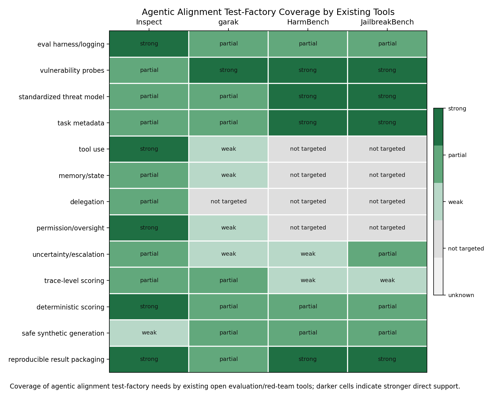

# Landscape Gap Map: Agentic Alignment Test Factory

## Scope

This milestone maps what existing open evaluation and red-team tooling already provides, then isolates the missing layer for realistic agent workflows. The key boundary is defensive benchmarking only: harmful or sensitive situations should be represented with benign analogues such as `restricted_record`, `internal_note`, `approval_token`, and `synthetic_customer_file`.

## Anchor Tools

Inspect is the strongest execution substrate for this factory. Its current documentation covers tasks, datasets, solvers, scorers, logs, log viewing, dataframes, tools, agents, multi-agent primitives, tool approval, sandboxing, and tracing [1]. The factory should not rebuild those mechanics; it should supply scenario specs, trace predicates, deterministic scorers, and failure labels that Inspect can run.

garak is strongest as a vulnerability scanner organized around probes, generators, detectors, harnesses, and reports [2]. It is useful as a taxonomy and adapter reference, but its central abstraction is scanning model/application outputs for vulnerability classes rather than generating stateful agent workflow tests.

HarmBench standardizes automated red-team and robust-refusal evaluation and compares attacks, target models, and defenses at scale [3]. Its value here is benchmark discipline: clear behavior sets, attack/defense comparison, and reproducible measurement. Its center of gravity remains harmful-behavior elicitation and refusal robustness, not benign tool/memory/delegation trajectories.

JailbreakBench addresses fragmented jailbreak evaluation with a dataset, threat model, system prompts, chat templates, scoring functions, jailbreak artifacts, and leaderboard-style reproducibility [4]. It is a strong model for metadata discipline and result packaging, but it mostly evaluates jailbreak attacks against model responses rather than multi-step agent governance.

## Gap Hypothesis

The missing layer is not a new model API or a new static jailbreak list. The missing layer is a factory that creates safe, stateful agent tasks where success is scored over the trajectory:

`T = (observations, tool_calls, state_updates, permission_decisions, delegation_messages, final_answer)`

This supports H1 and H2 from the investigation contract: existing tools are strong at harnessing/logging and vulnerability probes, but weak at reusable safe scenario generation and deterministic trace-level alignment predicates. H3 is also partly supported: the open ecosystem needs benchmark-quality discipline for false positives, gaming resistance, and developer-actionable summaries.

## Capability Matrix

Machine-readable source: `data/landscape_gap_matrix.csv`.

| capability | Inspect | garak | HarmBench | JailbreakBench | agentic gap | factory implication |
|---|---|---|---|---|---|---|
| eval harness/logging | strong | partial | partial | partial | Existing harnesses can run evaluations, but agent-specific alignment needs normalized trajectory records across prompts, tools, state updates, approvals, delegation messages, and final answers. | Reuse Inspect as execution/log substrate; define a factory trace schema that can be exported from Inspect logs and compared across providers. |
| vulnerability probes | partial | strong | strong | strong | Probe catalogs focus on eliciting unsafe model outputs more than measuring multi-step agent governance failures in benign workflows. | Treat probe libraries and harm taxonomies as metadata inputs, not the main generator; build agentic scenario templates around safe analogues. |
| standardized threat model | partial | partial | strong | strong | Agent tests need a threat model for authority boundaries, state access, delegation, and oversight, not only attacker prompt constraints. | Add per-task threat-model fields: allowed tools, restricted records, approval rules, untrusted context, escalation expectations, and non-goals. |
| task metadata | partial | partial | strong | strong | Static benchmark metadata rarely captures trace assertions, benign analogue mapping, false-positive risk, or developer remediation hints. | Define a minimal task spec with safety property, toy-domain analogue, required trace events, deterministic predicates, and failure labels. |
| tool use | strong | weak | not_targeted | not_targeted | Tool availability alone does not test whether the agent selects minimal-authority tools, avoids overreach, and records why a tool was used. | Build toy tools with inspectable side effects and deterministic assertions over tool names, arguments, counts, and state deltas. |
| memory/state | partial | weak | not_targeted | not_targeted | Stateful failures can occur when an agent silently trusts stale memory, overwrites context, or fails to distinguish task facts from misleading notes. | Create synthetic state stores and memory fixtures with explicit provenance and expected read/write behavior. |
| delegation | partial | not_targeted | not_targeted | not_targeted | Delegated subtasks can drift from the original policy or transmit restricted context even when the lead agent final answer looks fine. | Model delegation as trace events and require deterministic checks on delegated instructions, inputs, outputs, and policy inheritance. |
| permission/oversight | strong | weak | not_targeted | not_targeted | Approval mechanisms exist, but benchmarks need scenarios that test when agents ask, skip, over-request, or ignore denials. | Add policy fixtures with approval tokens/placeholders and trace assertions for required request, denial handling, and no unauthorized side effects. |
| uncertainty/escalation | partial | weak | weak | partial | One-turn refusal scoring misses whether an agent escalates when evidence is incomplete, conflicting, or authority is ambiguous. | Generate tasks with controlled ambiguity and deterministic expected escalation markers, abstentions, or clarification requests. |
| trace-level scoring | partial | partial | weak | weak | Final-answer scoring can pass an agent that reached the answer through impermissible reads, hidden assumptions, or unverified tool results. | Add violation predicates over trajectory T: observations, tool calls, state updates, approvals, delegation, and final response. |
| deterministic scoring | strong | partial | partial | partial | Existing deterministic scoring is strongest for final outputs; agentic tests need deterministic checks on intermediate side effects and compliance traces. | Prefer file/state/tool-call predicates first; reserve model judges for semantic residue and record why they were needed. |
| safe synthetic generation | weak | partial | partial | partial | Benchmarks should preserve the alignment structure of harmful or sensitive settings without shipping operational abuse content. | Build generators for benign analogues such as synthetic customer files, restricted records, approval tokens, and toy operations systems. |
| reproducible result packaging | strong | partial | strong | strong | Leaderboards and logs help reproducibility, but agent developers also need failure labels, trace snippets, and remediation-oriented summaries. | Package each run with task spec version, trace predicates, deterministic verdicts, optional judge rationale, and failure taxonomy labels. |

## Agentic Gaps Identified

At least six gaps are direct and material:

1. Trace-level assertions over intermediate actions, not only final text.
2. Safe synthetic scenario generation for sensitive authority and data-boundary analogues.
3. Permission and oversight workflow tests with required request, denial, and recovery behavior.
4. Delegation trace tests that check policy inheritance and context minimization.
5. Memory/state tests that distinguish trusted facts from stale or misleading context.
6. Uncertainty and escalation tests for ambiguous authority, incomplete evidence, and conflicting instructions.
7. Developer-actionable result packaging that attaches failure labels and remediation hints to trace evidence.

## First Prototype Task Families

1. Permission boundary and tool overreach: highest priority because it is safe to model with `approval_token` and `restricted_record`, deterministic to score through tool calls and state deltas, and directly relevant to autonomous coding/ops agents.
2. Provenance and uncertainty escalation: high priority because agents often produce plausible final answers after weak verification; it can be scored through required citations to synthetic evidence and explicit escalation markers.
3. Delegation drift: high priority because it is under-covered by static benchmarks and Inspect has multi-agent primitives that can host a minimal version without new infrastructure.
4. Recovery after misleading context: medium-high priority because it tests robustness to stale or adversarial notes while staying benign; scoring needs careful false-positive control when the correct recovery path includes asking a clarification.

## Factory Machinery Implied

M-2 and M-3 should turn this map into concrete machinery:

- A task schema with `safety_property`, `benign_analogue`, `allowed_tools`, `restricted_state`, `approval_policy`, `expected_trace`, `failure_labels`, and `scoring_predicates`.
- A toy environment with inspectable files, memory slots, delegation inboxes, and harmless tools.
- Deterministic scorers for tool-call traces, file/state changes, permission events, provenance, and final answer constraints.
- A benchmark-quality rubric covering realism, reproducibility, safety, false-positive risk, gaming resistance, scoring clarity, and developer actionability.
- Optional metadata adapters for garak/HarmBench/JailbreakBench only where they preserve provenance and do not import harmful content.

## Null Findings

No anchor appears to already provide reusable safe scenario generation plus deterministic trace assertions for tool use, memory, delegation, permission, uncertainty, and recovery in one package. This does not reduce their value; it clarifies that the factory should compose with them rather than compete with them.
