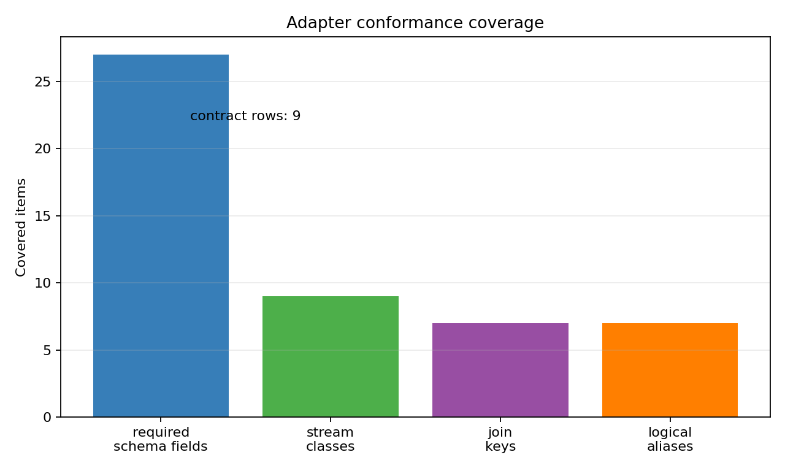
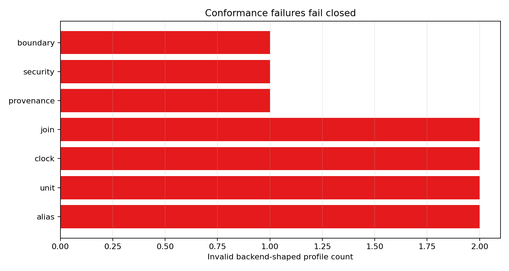
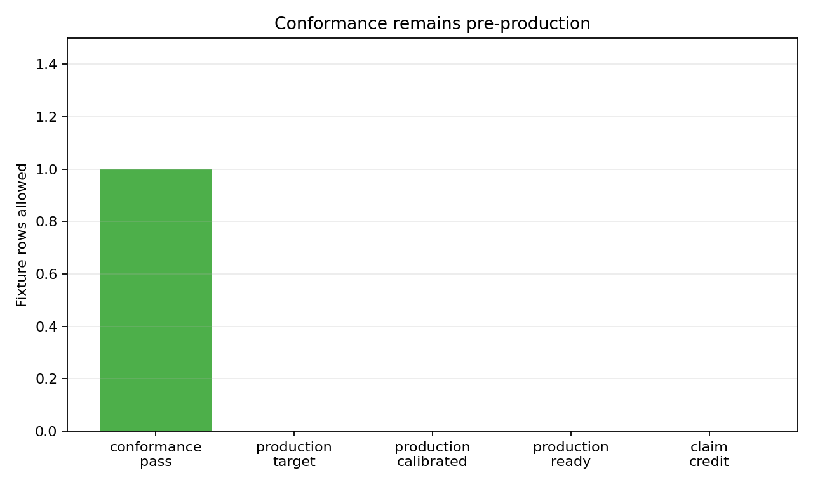

# Adapter Conformance Kit

M-PORT-1 turns the M-ADAPTER-1 boundary into a pre-ingestion portability check for deployment teams. It does not collect production telemetry and does not calibrate any memory-centric architecture claim.

## Canonical Fields And Aliases

The production telemetry schema remains authoritative. Logical join names from the deployment contract are accepted only through `data/adapter_join_alias_map.csv`; the important ambiguity is resolved as `run_id -> measurement_run_id`. A backend profile may present `run_id` as an input alias, but the conformance runner must construct the canonical `measurement_run_id` field before any production-shaped row can be tested. Unknown aliases and alias use that does not canonicalize fail closed.

## Required Checks

The conformance command is:

```bash
python3 scripts/build_adapter_conformance_fixtures.py
python3 scripts/run_adapter_conformance.py
```

The runner checks required stream-class coverage, canonical join-field mapping, unit declarations for power, energy, bytes, latency, and timestamps, clock-domain presence, interval alignment, schema version, tenant labels, security context, provenance freshness, and fixture evidence boundaries. Invalid backend-shaped profiles receive named `blocked_reason` values in `data/adapter_conformance_results.csv` and category counts in `data/adapter_conformance_failure_modes.csv`.

## Backend-Shaped Fixture Limits

The valid profile is shaped like an operator adapter output, but it is still synthetic conformance evidence labeled `adapter_conformance_fixture`. The invalid profiles exercise alias, unit, clock, interval, tenant, security, provenance, missing-stream, and attempted production-target promotion failures. These fixtures are portability probes, not vendor collector implementations and not measured target telemetry.

## Deployment Use

Deployment teams should run conformance before wiring an operator-specific adapter to the production ingestion path. A pass means the adapter output can be interpreted consistently enough for the existing production ingestion gate to evaluate it later. A fail means the adapter team should fix the named category before any row is allowed near threshold replay or claim-update logic.

## Evidence Boundary

Passing conformance is only a shape check. Production calibration still requires trusted real deployment provenance, `evidence_label=production_target`, joined counters, above-noise measurements, security/provenance/retention/verifier gates, and the M-PRODTELEM-1 ingestion thresholds. The conformance boundary report keeps every fixture at `production_calibrated=false`, `production_ready=false`, and `claim_credit_allowed=false`.

## Figures






