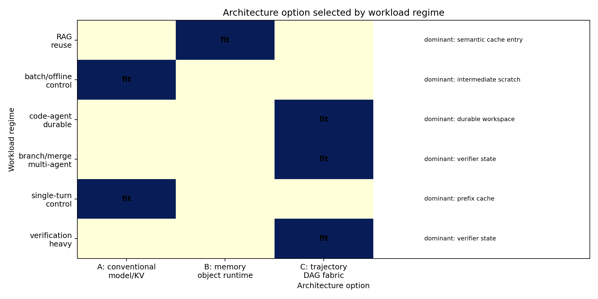
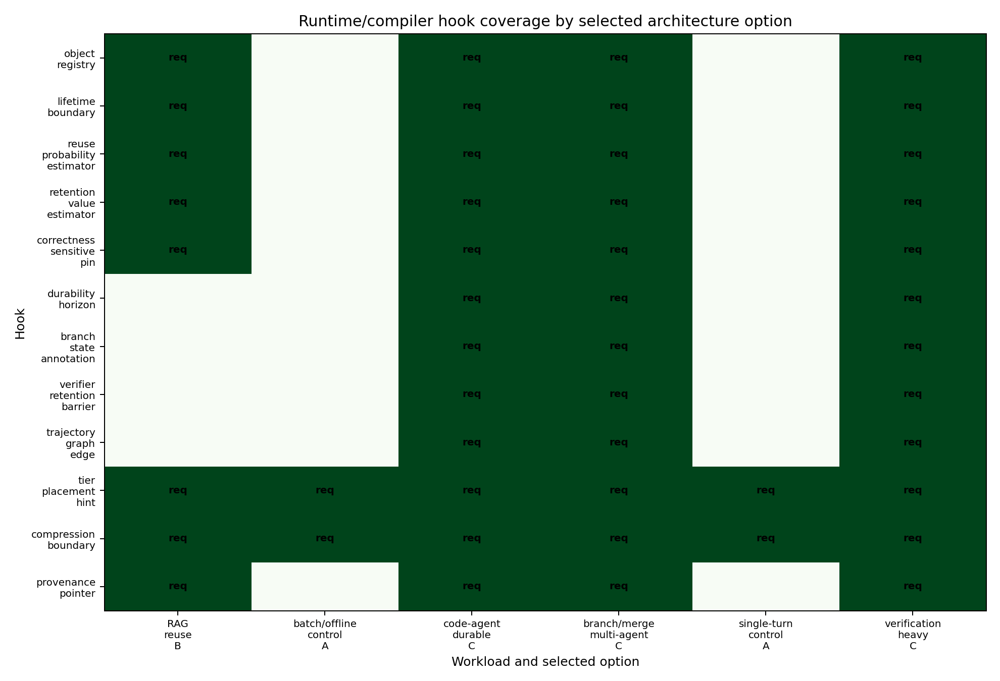

# Memory-Centric Architecture Proposal for Agentic LLM Inference

## Executive Thesis

`derived` Future agentic inference infrastructure should expose memory objects and their lifetimes as first-class runtime state when useful state crosses a single request boundary. The design is intentionally narrowed: ordinary single-turn and batch/offline controls should keep a conventional request/model/KV serving path, while RAG-style reuse benefits from memory-object visibility and branch/verifier/durable agentic runs justify trajectory/DAG visibility.

`derived` The architecture is not "everything needs a trajectory manager." It is a tiered design space:

1. Conventional request/model/KV-centric serving remains the compatibility baseline for weights, KV, prefix cache, and transient scratch.
2. A memory-object-aware runtime is justified when retrieved context, semantic cache entries, or tool outputs have reusable value, provenance, and invalidation needs.
3. A trajectory/DAG-aware memory fabric is justified when branch survival, verifier delay, trajectory logs, and durable workspace state determine whether retaining an object prevents correctness loss or expensive replay.

## Evidence Base

`derived` `M-TAX-1` established that agentic memory is not a single prompt-length scalar. It includes weights, KV cache, prefix cache, retrieved context, tool output, intermediate scratch, branch state, verifier state, trajectory log, durable workspace, and semantic cache entries, each with different lifetime, mutability, reuse, compression, placement, and eviction-failure behavior.

`derived` `M-LIFE-1` modeled live bytes and retained value as object intervals and reuse/loss terms. The important architectural implication is that durable workspace state and branch/verifier state can persist independently of a context-window cap.

`derived` `M-COST-1` reduced the retention decision to a symbolic inequality: keep or tier an object when expected recompute and correctness-loss avoidance exceed residency, transfer, and bandwidth-delay costs. The model uses synthetic placeholders for tier costs and does not claim measured hardware constants.

`simulated` `M-SIM-1` generated synthetic workloads and policy results. Controls selected the HBM-first baseline, RAG selected reuse-aware tiering, and code-agent, verification-heavy, and branch/merge workloads selected branch/verifier/durable-aware placement.

`simulated` `M-SCHED-1` evaluated scheduling units as information boundaries. Current winners are `model` for both controls, `memory_object` for RAG, and `agent_trajectory_dag` for code-agent, verification-heavy, and multi-agent branch/merge regimes.

`speculative` The production architecture value depends on real trace frequencies, hardware constants, queueing, compression overheads, and coordination overheads. Those are deferred; this proposal defines what must be measured.

## Architecture Options

### Option A: Conventional Request/Model/KV-Centric Serving

`derived` Option A is the default path for workloads whose valuable state is mostly model weights, active KV, prefix cache, and short-lived scratch. It schedules at the request, model, or cache-page boundary and keeps object/DAG hooks optional.

`simulated` The validated controls selected `model` scheduling and did not require trajectory visibility. This makes Option A a required compatibility layer, not a legacy path to delete.

Primary responsibilities:

- Keep weights and active KV hot when they are on the critical path.
- Use prefix or KV cache-page policies where exact continuation or prefix reuse is visible.
- Avoid per-object or per-trajectory coordination unless non-KV object value is observed.

Failure if overextended: Option A becomes a disguised KV-cache optimization and misses durable workspace, verifier, tool-output, and trajectory-log value.

### Option B: Memory-Object-Aware Runtime

`derived` Option B adds a memory-object registry and object-local retention policy. It is the recommended boundary for RAG, semantic cache entries, retrieved context, and reusable tool outputs when object identity, provenance, reuse probability, recompute cost, and correctness sensitivity matter but branch/DAG structure does not.

`simulated` RAG selected `memory_object` scheduling and was labeled `ambiguous`, not `strengthened`, because the winning mechanism is context/object reuse rather than branch/verifier/durable trajectory value.

Primary responsibilities:

- Register memory objects with class, size, lifetime boundary, provenance pointer, reuse estimate, recompute cost, and correctness-sensitive loss.
- Place objects across HBM/GPU memory, CPU DRAM, pooled memory, NVMe, remote object stores, durable workspace stores, and semantic caches according to retained value.
- Evict, summarize, compress, or recompute by object class rather than by raw byte pressure alone.
- Track source version, invalidation signal, and confidence for retrieved context and semantic cache entries.

Failure if overextended: Option B can still miss cross-object branch/merge dependencies; object-local value is not enough when future reuse depends on a trajectory graph.

### Option C: Trajectory/DAG-Aware Memory Fabric

`derived` Option C treats the agent run as a graph of actions, branches, verifier loops, merges, durable artifacts, and state dependencies. It is the recommended boundary for code-agent loops, verification-heavy agents, and multi-agent branch/merge runs.

`simulated` The scheduling evaluator selected `agent_trajectory_dag` for code-agent, verification-heavy, and branch/merge workloads because dominant value depended on durable workspace, verifier state, branch state, trajectory logs, and correctness-sensitive retention rather than KV alone.

Primary responsibilities:

- Maintain trajectory graph membership for objects and edges across branch, verify, merge, discard, replay, and resume events.
- Retain verifier traces, counterexamples, test logs, and durable artifacts behind correctness-sensitive barriers.
- Use branch fanout, branch survival, verifier delay, merge probability, and durability horizon in placement and eviction policy.
- Integrate with durable workspace storage so summaries keep raw pointers and replay remains possible.

Failure if overextended: Option C can become metadata-heavy infrastructure with negative net value for simple workloads. It must be opt-in by workload/object signals.

## Runtime Responsibilities

`derived` The runtime owns the object registry, retention-value estimator, tier placement, eviction/recompute policy, correctness-sensitive pinning, provenance tracking, and durable workspace integration. The generated hook matrix in `data/runtime_compiler_hook_matrix.csv` defines the concrete fields and failure if each hook is missing.

`derived` Retention policy should estimate:

`NetArchitectureValue(A,w) = RetainedValueVisible(A,w) + MovementAvoidance(A,w) + CorrectnessRiskAvoided(A,w) - CoordinationOverhead(A,w) - IntegrationComplexity(A,w)`

`synthetic` Current simulations approximate this value through normalized retained-value, movement, energy-proxy, dollar-proxy, and correctness-risk scores. They are not calibrated cost, latency, or power measurements.

## Compiler and Planner Responsibilities

`derived` The compiler/planner should emit memory annotations when it can do so reliably:

- Memory-object annotations for object class, size driver, mutability, compression candidates, and provenance.
- Context budget plans for KV, prefix, retrieved context, and summaries.
- Prefix and retrieval reuse plans with invalidation boundaries.
- Branch-aware state plans for forked candidates, merge/discard events, and branch-local KV.
- Verification-aware retention barriers for test results, counterexamples, proof traces, and audit checklists.
- Durable workspace dependency edges so archive, compaction, and replay policies can preserve correctness.

`speculative` Planner annotations may be incomplete or wrong in real systems. The runtime should treat them as hints with conservative fallbacks rather than as trusted ground truth.

## Tier Hierarchy Mapping

`derived` The tier hierarchy is object-dependent:

- HBM/GPU memory: active weights, active KV, hot prompt materialization, and hot branch-local KV.
- CPU DRAM: hot metadata, retrieved context, tool outputs, verifier traces, semantic-cache indexes, and staging for offloaded KV.
- CXL or pooled memory: shared mid-tier residency for large reusable objects when local HBM is scarce.
- NVMe local: checkpoints, cold tool outputs, trajectory logs, branch snapshots, and durable workspace files.
- Remote object store: archive, cross-run durable artifacts, raw outputs, and replay sources.
- Durable workspace store: versioned state with dependency tracking.
- Semantic cache: approximate reuse layer with confidence, provenance, and invalidation.

`deferred` Exact capacities, bandwidths, latencies, energy per byte, dollar cost, and tier contention are not claimed in this cycle.

## Policy Surface

`derived` The policy matrix in `data/architecture_policy_matrix.csv` maps every memory-object class to tiering, retention, compression, recompute, provenance, and eviction-failure strategies. The key distinction is that eviction failure is not always a cache miss: it can mean stale evidence, broken replay, missed counterexamples, biased branch merge, or lost auditability.

`derived` A practical implementation should expose at least these policy operations:

- `register_object(object_id, class, size, provenance, lifetime_hint)`
- `update_retention_signal(object_id, reuse_probability, recompute_cost, loss_cost)`
- `attach_trajectory_edge(object_id, trajectory_id, parent, merge_state)`
- `pin_until_verified(object_id, verifier_delay, correctness_loss)`
- `place_or_migrate(object_id, tier_candidates, transfer_cost_proxy)`
- `summarize_with_raw_pointer(object_id, summary, raw_pointer, invalidation_signal)`

## Failure Modes and Falsification Criteria

`derived` The architecture should be rejected or narrowed under these conditions:

- Controls require the same trajectory/DAG hooks as agentic regimes.
- RAG cannot be handled with object/context reuse hooks and requires full trajectory scheduling without branch/verifier/durable evidence.
- Non-control wins disappear when non-KV object values are removed, implying the result was only KV/context scaling.
- Small perturbations of synthetic weights flip every conclusion without a stable mechanism boundary.
- Coordination overhead dominates retained value for all non-control workloads.
- Semantic reuse becomes stale or unverifiable because provenance and invalidation were omitted.
- Durable workspace state grows without horizon, dependency-aware compaction, or archival policy.

`simulated` Current validated outputs pass the first three checks in the synthetic setting: controls do not require trajectory scheduling, RAG is handled by object scheduling, and code/verification/branch regimes are driven by non-KV objects.

## Ranked Research Agenda

`derived` The ranked agenda is emitted in `data/research_agenda_ranked.csv`. The top priorities are trace-calibrated object lifetime studies, coordination-overhead benchmarks, calibrated retention-value sweeps, RAG invalidation experiments, verifier-state pinning experiments, durable workspace replay benchmarks, branch/merge scheduler stress tests, compiler annotation prototypes, compression-boundary studies, and multi-tenant queueing models.

`deferred` These agenda items require evidence not available in this cycle: production-like traces, measured tier constants, realistic arrival processes, implementation overheads, compression quality, and application-specific correctness metrics.

## Recommended Architecture Boundary

`derived` The recommended architecture is a three-level compatibility stack:

1. Always keep Option A as the low-overhead serving path.
2. Add Option B when object-local reuse, provenance, invalidation, or correctness-sensitive recompute becomes causal.
3. Add Option C only when branch survival, verifier delay, trajectory logs, or durable workspace dependencies determine retained value.

This preserves the memory-centric thesis without turning it into a universal claim. The strongest design principle is not "schedule everything as a DAG"; it is "expose the memory-state variables that are causal for the workload, and stop at the coarsest boundary that preserves them."

## Generated Figures

