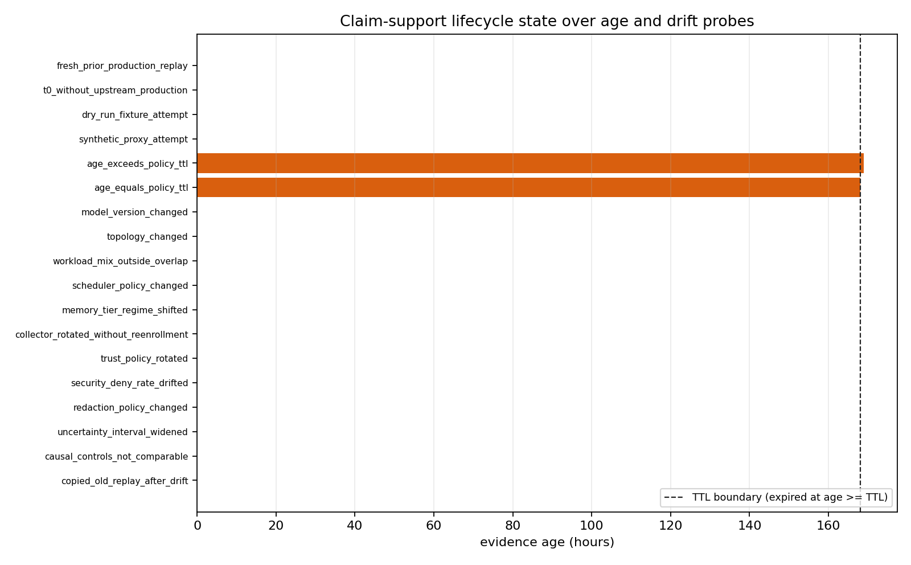
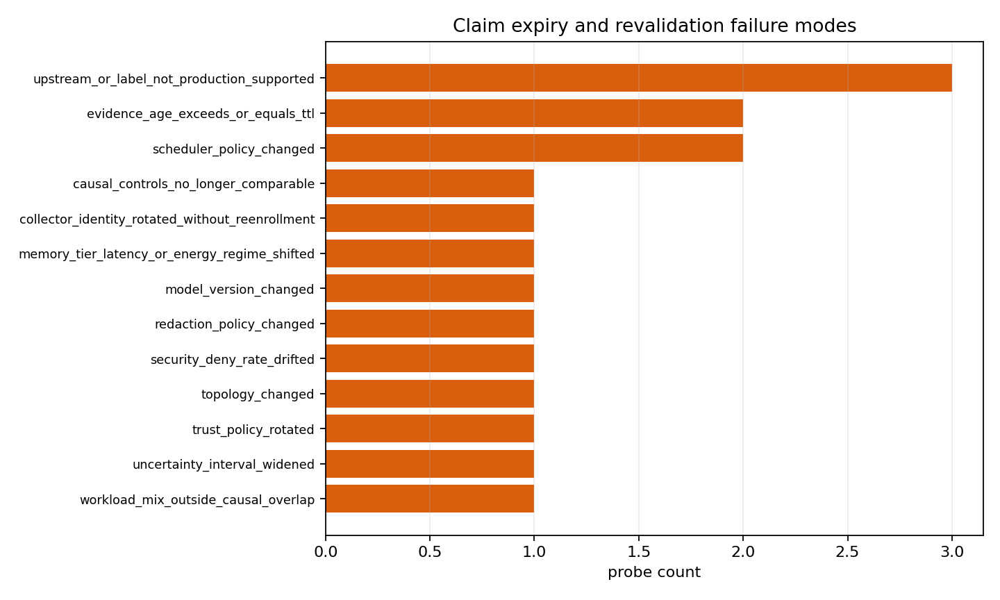
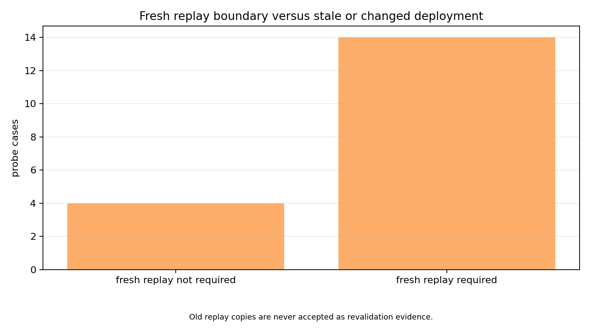

# Production Claim Expiry and Revalidation

M-CLAIMEXP-1 adds a lifecycle boundary after a hypothetical successful `production_target` replay. A prior replay can support a memory-centric architecture claim only while its evidence is inside the declared TTL and the deployment identity, model, topology, workload causal overlap, scheduler, memory-tier regime, trust policy, collector/root identity, redaction policy, uncertainty qualification, and causal controls remain inside the replay envelope.

The default policy uses a 168 hour TTL and a closed expiry boundary: `age_hours >= ttl_hours` is `expired`. Identity-breaking changes such as model version, topology, collector/root rotation without re-enrollment, trust-policy rotation, or redaction-policy change are `invalidated_by_change`; workload, scheduler, memory-tier, security-deny-rate, uncertainty, or causal-control drift is `revalidation_required` unless a stricter operator policy invalidates it outright.

Revalidation requires current production material and a fresh run through M-LIVECOLLECT-1, M-EVIDART-1, and M-PRODREPLAY-1. Copying an old replay result never satisfies revalidation, and non-production labels such as `collector_dry_run_fixture` or `synthetic_proxy` remain `not_production_supported`.

This milestone does not create production evidence. `currently_supportable` is a lifecycle status for an already successful upstream production replay, not a new production-calibration decision. The claim-boundary output therefore keeps `production_calibrated=false`, `production_ready=false`, `threshold_success=false`, `causal_validity_granted=false`, and `claim_credit_allowed=false` for every current workspace fixture row, including the hypothetical fresh prior replay case.

## Figures

