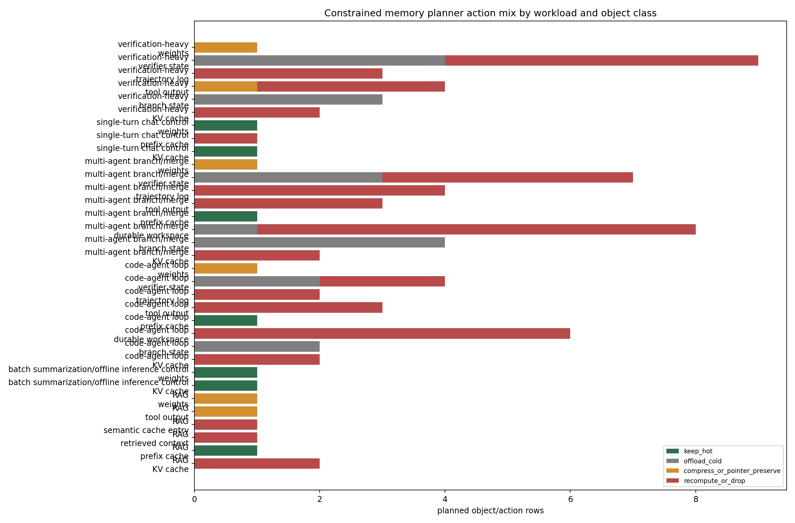
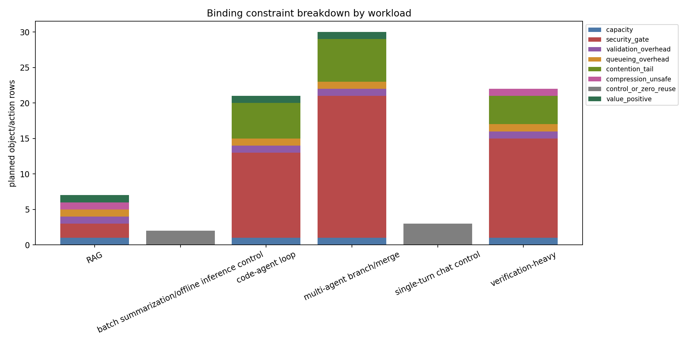
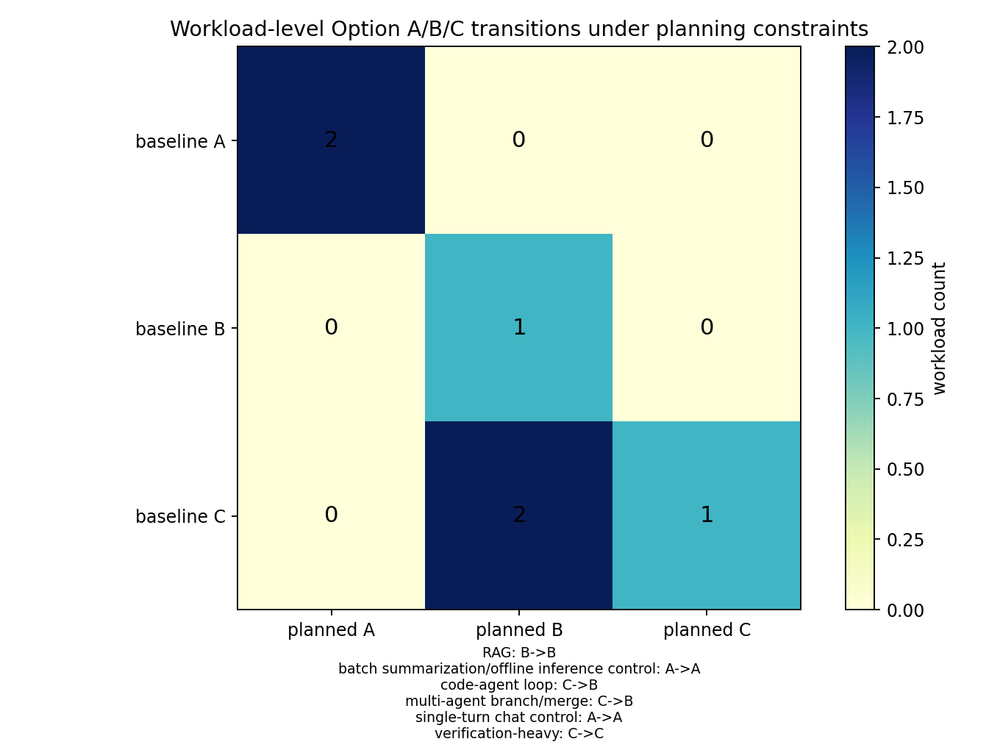

# Constrained Memory Planning Pass

M-PLAN-1 converts the validated architecture options into per-object planning
actions. The pass consumes trace-v3 security decisions, runtime policy rows,
compression safety scores, queueing reversal thresholds, CXL contention
sensitivity, and energy/contention option collapses. All outputs are labeled
`synthetic_planning`; this is an executable formulation over prior synthetic
artifacts, not production-measured planner performance.

## Planner Formulation

For each security-enforcement decision row with a concrete object, the planner
evaluates a greedy action:

`NetPlanValue = SafeReuseValue - MovementCost - ValidationOverhead - QueueOverhead - ContentionPenalty - CompressionRisk`

Security and compression safety are hard gates. A `denied_reuse` security
decision forces `recompute_or_drop` with zero positive reuse credit, and an
invalid lossy compression fixture cannot be selected as the compression
strategy. Capacity, queueing, validation overhead, and CXL contention are soft
constraints that can downgrade Option C to B/A, move state to cold tiers,
compress/preserve pointers, or emit an infeasible row with the named binding
constraint.
Duplicate trace-event decisions for the same object/action are aggregated after
planning, so `memory_plan_actions.csv` is an object/action table rather than an
event log. Conventional baseline objects such as weights and active KV state
remain resident `keep_hot` in control/no-reuse cases, but receive zero reuse
credit.

## Results

The baseline planning run emitted 85 object/action rows across all six
workloads and ten nonblank memory object classes. Action counts were:
`recompute_or_drop=53`, `offload_cold=19`,
`keep_hot=7`, and `compress_or_pointer_preserve=6`. Binding-constraint counts
were: `security_gate=48`, `contention_tail=15`, `control_or_zero_reuse=5`,
`capacity=4`, `validation_overhead=4`, `queueing_overhead=4`,
`value_positive=3`, and `compression_unsafe=2`.

| Workload | Baseline | Planned | Dominant constraint | Positive reuse rows |
|---|---:|---:|---|---:|
| RAG | B | B | security_gate | 3 |
| single-turn chat control | A | A | control_or_zero_reuse | 0 |
| batch summarization/offline inference control | A | A | control_or_zero_reuse | 0 |
| code-agent loop | C | B | security_gate | 2 |
| multi-agent branch/merge | C | B | security_gate | 2 |
| verification-heavy | C | C | security_gate | 2 |

## Hook Ablations

The hook ablation table makes required compiler/runtime hooks explicit. Removing
`object_registry` affects 245 planner rows and blocks 124 reuse actions, because
placement collapses to aggregate request/model heuristics. Removing
`trajectory_graph_edge` affects 108 rows and blocks 48 reuse actions; removing
`correctness_sensitive_pin` affects 109 rows and blocks 22 reuse actions. Hooks
with zero affected rows, such as `tier_placement_hint` in this synthetic pass,
are useful null results: the existing object/action rows did not expose a unique
dependency on that hook under the current schema and planner thresholds.

## Sensitivity

The sensitivity sweep probes baseline constraints, tight capacity, high
validation overhead, and pathological CXL p99 contention. Controls remain Option
A in every setting. At least one C workload collapses under each stressor:
code-agent and multi-agent branch/merge collapse from C to B at baseline because
security, queueing, capacity, and contention constraints eliminate enough
trajectory-fabric value; verification-heavy collapses from C to B under tight
capacity and high validation overhead.

## Limits

The planner is greedy and intentionally not globally optimal. It tests whether
the architecture can be expressed as auditable per-object actions with binding
constraints; it does not claim a production scheduler would use the same
weights. Numeric movement, queueing, contention, and compression-risk scales are
synthetic overlays from prior validated artifacts, so production claims still
require DC-001/DC-002 and security-validation telemetry.
