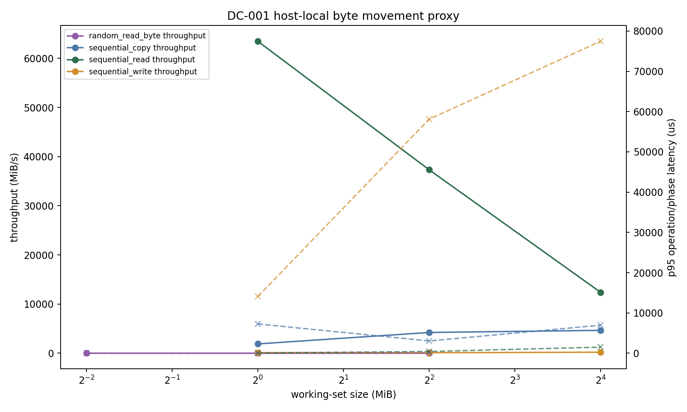
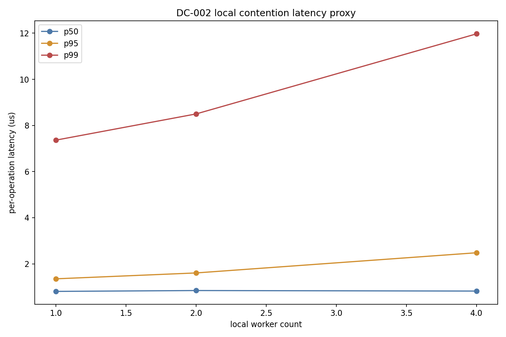
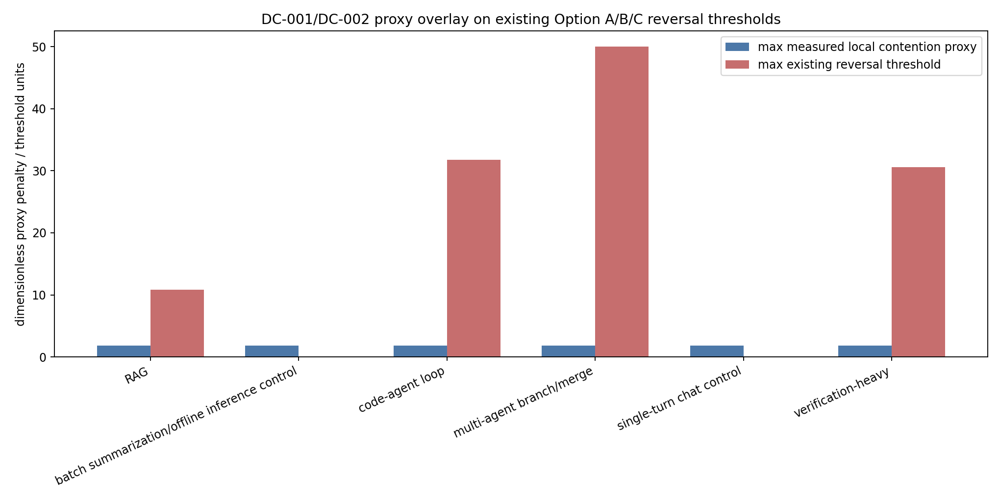

# DC-001/DC-002 Local Proxy Calibration

## Measurement Design

`scripts/local_dc12_proxy_bench.py` measures host-local byte movement and contention proxies without privileged counters. It runs sequential copy/read/write over 1 MiB, 4 MiB, and 16 MiB buffers; random byte reads over 256 KiB, 1 MiB, and 4 MiB working sets; and mixed random read/write contention over an 8 MiB shared-memory buffer with 1, 2, and 4 process workers on this host.

The benchmark records wall time, bytes touched, throughput, p50/p95/p99 latency, worker count, retained resident bytes, and environment metadata. `power_source=unavailable`, so DC-001 evidence is a byte/time proxy only, not joules-per-byte.

## Commands

```bash
python3 scripts/local_dc12_proxy_bench.py
python3 scripts/apply_dc12_proxy_calibration.py
python3 scripts/plot_dc12_proxy_calibration.py
python3 tests/verify_dc12_proxy_calibration.py
```

## Results

The run produced 12 byte-movement rows, 3 contention rows, 60 threshold-overlay rows, 4 claim-update rows, and 5 missing-production-telemetry rows. Sequential copy throughput ranged from 4,343.735 MiB/s to 17,896.271 MiB/s across the three buffer sizes, sequential write throughput ranged from 344.407 MiB/s to 409.685 MiB/s, and random single-byte throughput ranged from 3.562 MiB/s at 256 KiB to 2.134 MiB/s at 4 MiB.

Local contention p99 latency increased from 7.206 us at 1 worker to 8.317 us at 4 workers. The resulting p99 contention proxy was 1.1542x the 1-worker baseline, which did not cross any non-control retained-value reversal threshold in `data/cxl_contention_thresholds.csv`. This is a useful null result: the local proxy path can compare against the threshold machinery, but this host-local contention level is far below the synthetic pathological CXL/pool-memory reversals.







## Threshold and Claim Updates

`scripts/apply_dc12_proxy_calibration.py` maps DC-001 rows to `DC001-BYTE-ENERGY-001` and DC-002 rows to every existing `DC002-*` threshold without mutating M-ENERGY-1 or M-PLAN-1 CSVs. All generated overlay rows set `production_calibrated=false` and `evidence_label=host_local_proxy`.

Negative controls behaved as intended. Single-turn chat control and batch summarization/offline inference control remained Option A in the overlay. CL-012 stayed `proxy_only` because direct power telemetry was unavailable. Security-denied reuse contributed zero credit: `data/dc12_claim_update_matrix.csv` records 75 `denied_reuse` rows with `denied_safe_reuse_credit=0.0`.

## External-Validity Limits

These measurements validate instrumentation and threshold plumbing only. They do not replace target GPU/HBM/CXL/datacenter telemetry, and they do not show that CXL or pooled memory behaves like this local DRAM/cache proxy.

Production calibration still requires accelerator and host power counters, tier-specific bytes by source/destination/object class, target-topology CXL or pooled-memory p50/p95/p99 latency, tenant concurrency and queue depth, and workload/object-class labels joined to planner decisions.

## Files

- `data/dc12_local_bench_metadata.csv`
- `data/dc12_byte_movement_measurements.csv`
- `data/dc12_contention_measurements.csv`
- `data/dc12_proxy_threshold_overlay.csv`
- `data/dc12_claim_update_matrix.csv`
- `data/dc12_missing_production_telemetry.csv`
- `data/dc12_byte_movement_proxy.png`
- `data/dc12_contention_latency_proxy.png`
- `data/dc12_threshold_overlay.png`
