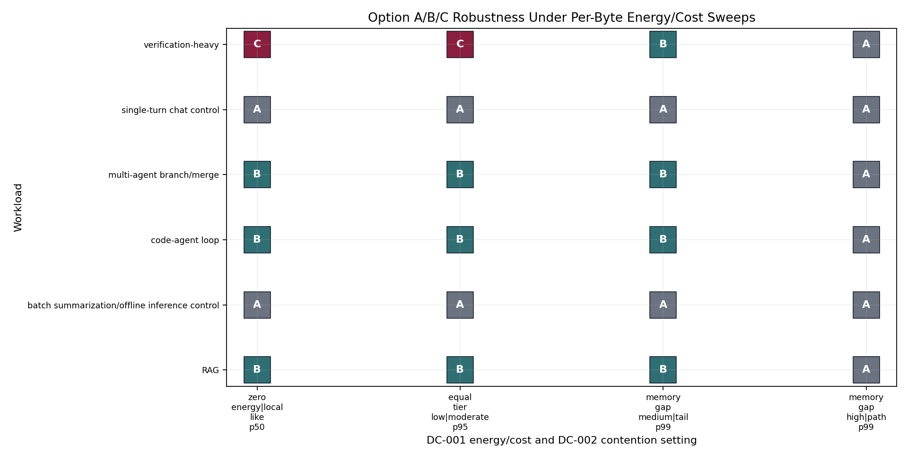
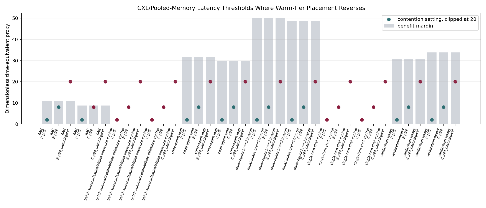
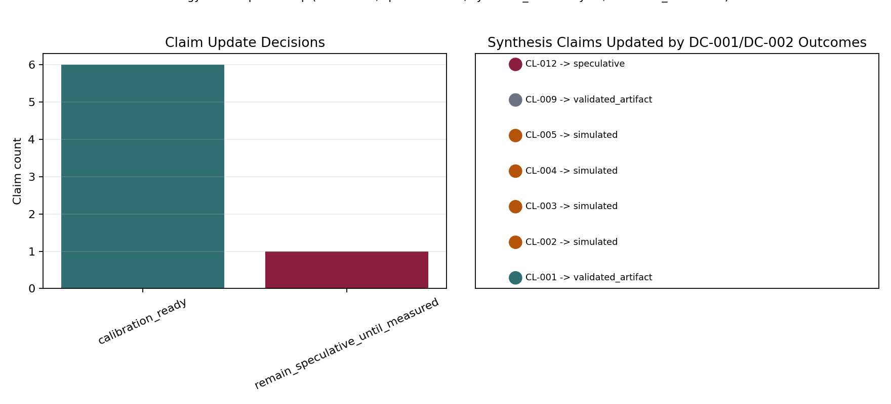

# Energy, Economics, and Contention Falsification Harness

## Thesis and Limits

`derived`: Memory-centric placement has an energy or dollar case only when avoided recompute and avoided movement exceed added residency, transfer, validation, coordination, and contention cost:

`NetEnergyValue = E_recompute_avoided + E_movement_avoided - E_residency - E_transfer - E_validation - E_coordination`.

`simulated`: The CSV harness sweeps synthetic DC-001 per-byte energy/cost settings and DC-002 CXL/pooled-memory contention settings over the validated runtime, queueing, cost, and synthesis artifacts. The numbers are dimensionless proxies; they are useful for locating reversals, not for claiming measured savings.

`sourced_from_existing_calibration`: Existing calibration rows provide public capability ranges for HBM/GPU memory, interconnects, PCIe, CXL capability, NVMe, and workload/cache evidence, but DC-001 and DC-002 remain deferred because public sources do not expose comparable deployed per-byte energy or pooled-memory tail latency under contention.

`measurement_design`: The measurement table defines telemetry needed to replace synthetic rows: per-tier byte movement/residency, power counters, tier occupancy, chargeback, CXL p50/p95/p99 under contention, and security/provenance gate outcomes.

`speculative`: CL-012 remains speculative after this cycle. Sensitivity rows can say which measurements would support or falsify the claim, but they do not convert the claim to calibrated evidence.

## DC-001 and DC-002 Effects

`derived`: If DC-001 is zero, the energy/economics claim vanishes and only latency, capacity, and correctness arguments remain. Equal per-tier energy weakens byte-placement claims because retained value must come from recompute avoidance or capacity pressure rather than energy gradients.

`simulated`: High DC-002 CXL tail latency downgrades warm-tier placement when the contention setting exceeds the retained-value time-equivalent margin. This updates CL-004 and CL-005 by adding explicit CXL/contention collapse thresholds to the earlier queueing reversal claims.

`simulated`: Option A controls remain Option A under the sweeps unless positive non-KV retained value is present. Option B/C rows require safe retained value before any energy or dollar credit is counted.

`measurement_design`: Production adoption needs telemetry that joins bytes, object class, tier, reuse decision, power, queueing, and safety gates. Energy savings do not count when reuse is unsafe, unauthorized, stale, or below measurement noise.

## Hard Downgrade Rules

`derived`: Downgrade energy/economics claims if measured energy savings are below instrument noise, arithmetic dominates total energy, or retained bytes increase capacity reservation without reducing recompute, movement, or latency cost.

`derived`: Downgrade warm-tier placement if CXL or pooled-memory p95/p99 exceeds the retained-value margin plus migration and policy queue costs.

`derived`: Downgrade Option B/C to Option A when safe non-KV retained value is absent. Unsafe reuse forces positive retained value to zero before energy or dollar savings are counted.

`measurement_design`: CL-012 can move out of speculative only after DC-001 and DC-002 telemetry is measured on the target hardware and workload mix.

## Figures

