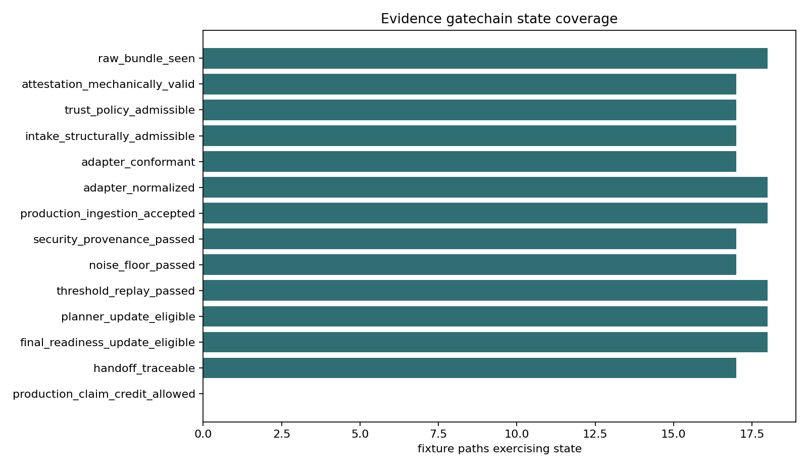
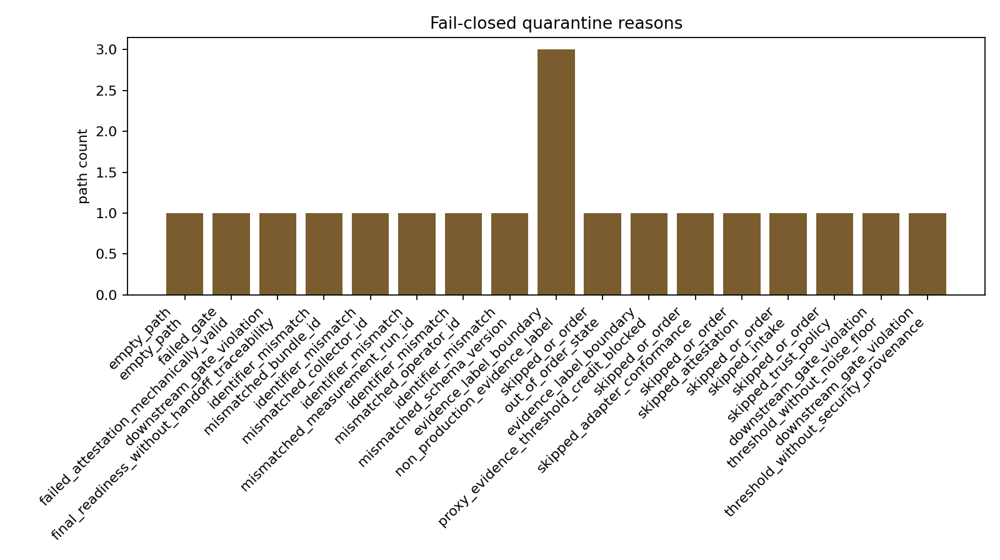
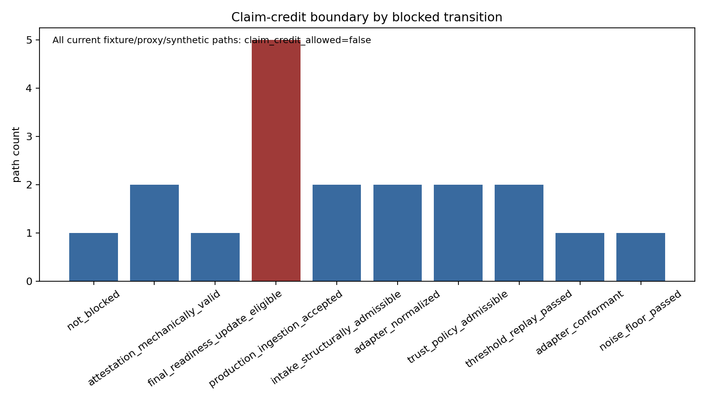

# Evidence Gatechain

M-GATECHAIN-1 composes the validated telemetry gates into one fail-closed promotion-state replay. The state machine runs from `raw_bundle_seen` through attestation mechanics, operator trust-policy admissibility, intake custody, adapter conformance, normalization, production ingestion, security/provenance, noise floor, threshold replay, planner eligibility, final readiness, handoff traceability, and finally `production_claim_credit_allowed`.

Allowed transitions are linear and require identifier continuity for `bundle_id`, `measurement_run_id`, `operator_id`, `collector_id`, and `schema_version`. A skipped gate, out-of-order gate, unknown state, duplicated state, or adjacent identifier mismatch quarantines the path at the first affected transition with a named `blocked_reason`.

Operators should interpret quarantine reasons as audit trail boundaries, not measurement results. `non_production_evidence_label` means a fixture, proxy, synthetic, conformance, intake, attestation, or policy row reached a production-only boundary; `threshold_without_security_provenance` and `threshold_without_noise_floor` mean threshold replay is dominated by upstream validity gates; `final_readiness_without_handoff_traceability` means a final readiness update cannot be detached from handoff evidence.

Future real production telemetry would use this replay as the single audit trail into claim readiness: each accepted row must carry stable identifiers through every gate, use `evidence_label=production_target`, pass security/provenance and noise-floor checks before threshold replay, and remain traceable into the final claim and handoff tables. Current fixture, proxy, synthetic, conformance, intake, attestation, and trust-policy paths remain blocked because they exercise gate semantics only and do not establish production-calibrated claim evidence.

Figures:

