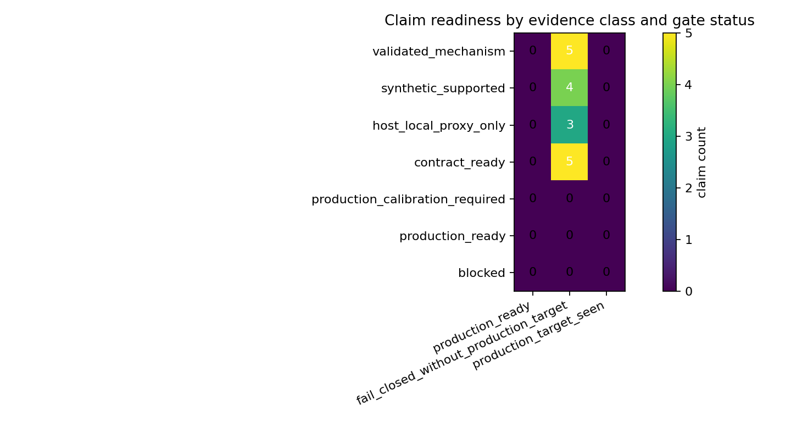
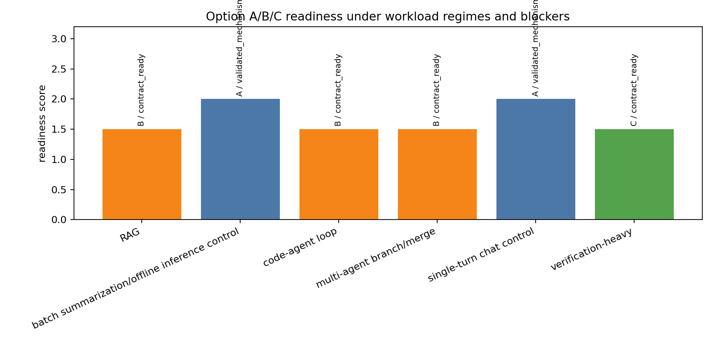
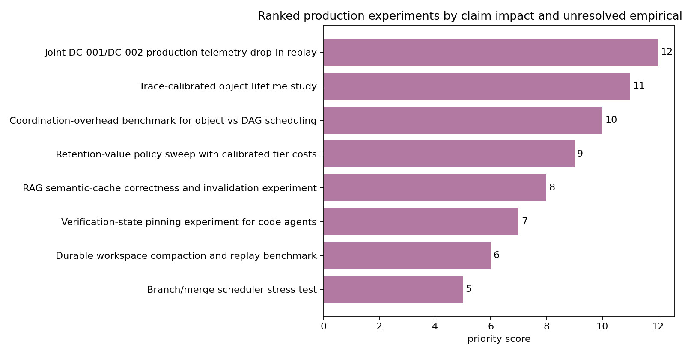

# Final Architecture Package

## Problem Formulation

Agentic LLM inference should be evaluated as a memory-lifetime and movement problem, not only as an arithmetic-throughput problem. The validated package now covers workload taxonomy, object lifetimes, heterogeneous tier costs, scheduling units, queueing reversals, compression safety, runtime hooks, security enforcement, constrained planning, local proxy calibration, and production telemetry ingestion semantics.

## Validated Mechanism Stack

The strongest validated mechanisms are: conventional Option A for control and zero-reuse regimes; Option B mechanisms for object-local retrieved-context, prefix, and semantic-cache reuse when provenance and validation costs are acceptable; and Option C mechanisms for trajectory/DAG state when branch survival, verifier state, durable workspace reuse, and coordination overhead remain favorable. Security, retention, provenance, verifier integrity, compression safety, queueing/contention, validation overhead, and noise-floor gates are hard blockers before reuse, energy, or cost credit is granted.

## Option Definitions

- Option A: conventional request/model/KV serving with no durable cross-trajectory memory fabric.
- Option B: memory-object-aware runtime for retrieved context, prefix/cache objects, semantic cache entries, and tool outputs.
- Option C: trajectory/DAG memory fabric for branch state, verifier state, lineage, durable workspace state, and multi-agent merge state.

## ABI and Action-Gating Control Plane

The architecture-core mechanism now has an explicit control-plane chain: memory-object ABI validation -> runtime/planner compatibility check -> fail-closed action gating. `M-ABI-1` defines and validates the memory-object contract; `M-ABIINT-1` feeds accepted, advisory-only, opaque Option A, and rejected contracts through the runtime prototype and constrained planner.

Option A remains opaque conventional execution: it can run without full object ABI fields and emits no object-level placement, reuse, compression, migration, or retention actions in the ABI integration replay. Option B is memory-object-aware execution and requires ABI-admissible objects before object-local placement, reuse, compression, and retention actions. Option C is a trajectory/DAG memory fabric and requires branch/dependency-admissible objects before DAG-aware migration, dependency-resolution, reuse, compression, and retention actions.

The integration outputs are `data/memory_object_abi_integration_results.csv`, `data/memory_object_abi_runtime_actions.csv`, `data/memory_object_abi_planner_actions.csv`, `data/memory_object_abi_integration_failure_modes.csv`, and `data/memory_object_abi_option_boundary.csv`. The rendered evidence views are `data/memory_object_abi_integration_actions.png`, `data/memory_object_abi_option_boundary.png`, and `data/memory_object_abi_integration_failures.png`. The packaging-level trace is summarized in `memory-centric-agentic/architecture_control_plane_progression.md`, `data/architecture_control_plane_progression.csv`, and `data/architecture_control_plane_progression.png`.

ABI and integration evidence strengthen mechanism plausibility for Options B/C, but they remain synthetic/internal control-plane evidence. They do not grant production calibration, production readiness, threshold success, causal validity, claim credit, or automatic architecture endorsement.

## Deployment-Readiness Rubric

Readiness labels are generated in `data/final_claim_readiness_matrix.csv`: `validated_mechanism`, `synthetic_supported`, `host_local_proxy_only`, `contract_ready`, `production_calibration_required`, `production_ready`, and `blocked`. `production_ready=true` requires direct `production_target` evidence plus passing schema, join, noise-floor, security/provenance/retention/verifier, and threshold-comparability gates.

## Final Outputs

## Production-Readiness Boundary

Option B/C are validated mechanisms and contract-ready pathways, not production recommendations. Current synthetic fixtures and host-local proxy rows can test ingestion, threshold replay, and fail-closed behavior, but they cannot produce production-ready claims. CL-012 remains production-calibration-required until direct target power/energy, tier-specific byte movement, CXL or pooled-memory tail latency, tenant concurrency, workload/object labels, and joined security decisions are measured above noise and pass all gates.

## Ranked Production Experiment Agenda

The generated backlog in `data/final_production_experiment_backlog.csv` ranks the joint DC-001/DC-002 production telemetry replay highest because it can unblock CL-004, CL-005, and CL-012 with the fewest representation changes. Follow-up experiments should calibrate object lifetime/reuse distributions, coordination overhead, semantic-cache correctness/invalidation, provenance overhead, and durable replay-tail latency.

## Falsification Criteria

The architecture package is falsified if any synthetic or host-local proxy evidence becomes production-ready, if security-denied reuse retains positive credit, if controls favor B/C without retained value, if Option B/C stay preferred despite queueing/contention or validation overhead crossing reversal thresholds, or if readiness labels cannot be traced to generated source artifacts.

The control-plane packaging is additionally falsified if ABI integration is described as production evidence, if Option A opacity is omitted, if rejected ABI contracts can reach placement/reuse/compression/migration/retention actions, or if reproduction paths omit ABI validation before ABI integration.
