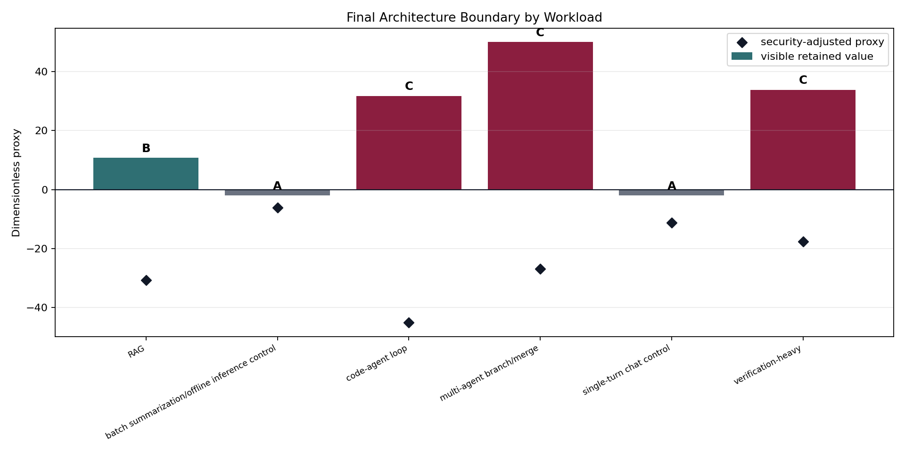
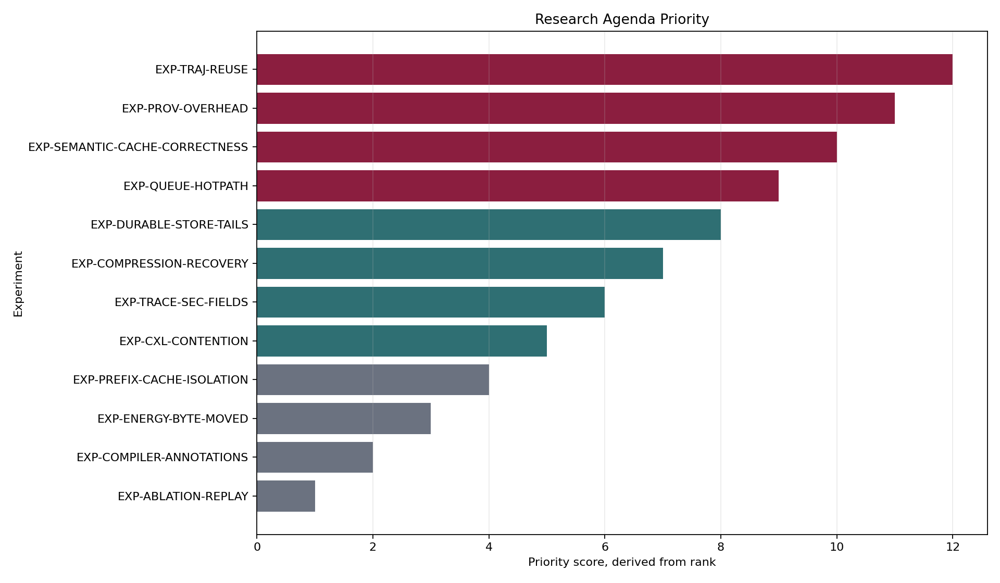
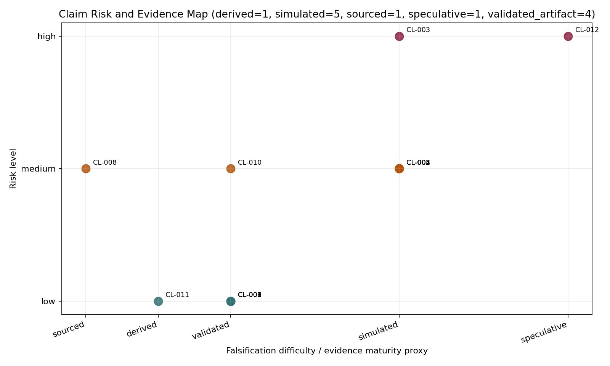

# Final Synthesis: Memory-Centric Architecture for Agentic LLM Inference

## Thesis

`validated_artifact` The architecture should expose memory state only at the coarsest boundary that preserves causal retained-value variables. Conventional request/model/KV serving remains the right baseline for controls; object-aware runtime is justified for reusable retrieved context, semantic cache entries, and prefix state; trajectory/DAG memory fabric is justified only when branch survival, verifier state, trajectory logs, or durable workspace state survive queueing, compression, calibration, and security gates.

ArchitectureChoice(w) = argmax over A/B/C of visible retained value plus movement/correctness benefit minus coordination, compression/recovery, validation, and expected security loss, subject to authorized reuse for every retained object.

## Decision Rule

`derived` Option A wins when branch, durable, verifier, and cross-request reuse variables are zero or when coordination/security overhead dominates. `simulated` Option B wins for RAG-like object reuse when provenance, source freshness, tenant/cache isolation, and invalidation checks pass. `simulated` Option C wins for agentic branch/verify/durable workloads only when trajectory lineage, replay authorization, verifier integrity, and retention constraints pass.

## Workload Conclusions

| Workload | Final option | Main positive mechanism | Main reversal risk |
|---|---:|---|---|
| RAG | B | object-local retrieved-context and semantic/prefix reuse with provenance/freshness checks | security validation overhead and semantic-cache correctness/invalidation cost; high object metadata/registry overhead reverses to A in M-QUEUE-1 |
| batch summarization/offline inference control | A | none; branch, durable, and cross-request reuse variables collapse | none; Option A remains dominant |
| code-agent loop | C | branch survival, verifier retention, trajectory lineage, and durable workspace reuse | security validation overhead, replay authorization, verifier integrity, durable latency tails, and DAG coordination; high object metadata/registry overhead reverses to A in M-QUEUE-1; high DAG overhead reverses C to B in M-QUEUE-1 |
| multi-agent branch/merge | C | branch survival, verifier retention, trajectory lineage, and durable workspace reuse | security validation overhead, replay authorization, verifier integrity, durable latency tails, and DAG coordination; high object metadata/registry overhead reverses to A in M-QUEUE-1; high DAG overhead reverses C to B in M-QUEUE-1 |
| single-turn chat control | A | none; branch, durable, and cross-request reuse variables collapse | none; Option A remains dominant |
| verification-heavy | C | branch survival, verifier retention, trajectory lineage, and durable workspace reuse | security validation overhead, replay authorization, verifier integrity, durable latency tails, and DAG coordination; high object metadata/registry overhead reverses to A in M-QUEUE-1; high DAG overhead reverses C to B in M-QUEUE-1 |

## Robust Conclusions

- `validated_artifact` Control workloads remain Option A across runtime, queueing, compression, and security outputs.
- `validated_artifact` Unsafe reuse must be downgraded or rejected before retained value is counted.
- `derived` The scheduling unit is an information boundary: model/request is enough for controls, memory object is enough for RAG-style reuse, and trajectory/DAG is needed only for branch/verifier/durable dependencies.
- `validated_artifact` Compression is a representation-safety decision before it is a byte-saving decision.

## Sensitive Conclusions

- `simulated` Option B depends on semantic-cache correctness, invalidation, provenance, and tenant/cache-salt overhead.
- `simulated` Option C depends on production trajectory reuse, verifier-state value, branch survival, durable-store latency tails, and DAG coordination overhead.
- `simulated` Queueing can reverse richer memory-centric boundaries when registry, metadata, DAG, verifier, or preemption queues saturate.

## Speculative Or Deferred Conclusions

- `speculative` Energy and economics remain unresolved until per-tier energy-per-byte and cost telemetry are measured.
- `speculative` Durable multi-agent trajectory reuse remains uncalibrated without production or reproducible open traces.
- `speculative` CXL/pooled memory is a capability tier in the current package, not a proven low-latency warm-object tier under contention.

## Top Experiments

1. `EXP-TRAJ-REUSE` — Do production agent runs reuse trajectory, verifier, branch, and durable workspace state often enough to justify Option C? Falsifies if: near-zero trajectory reuse or short lifetimes collapse agentic workloads toward Option B/A
2. `EXP-PROV-OVERHEAD` — What is the end-to-end cost of provenance, source-version, cache-salt, and lineage validation? Falsifies if: validation overhead exceeds retained value for RAG and agentic workloads
3. `EXP-SEMANTIC-CACHE-CORRECTNESS` — How often do semantic-cache hits become stale, poisoned, tenant-invalid, or semantically false-positive? Falsifies if: frequent stale/false-positive hits make semantic reuse unsafe or uneconomic
4. `EXP-QUEUE-HOTPATH` — Where do object registry, policy, migration, verifier sync, and preemption queues saturate? Falsifies if: hot-path metadata saturation erases retained value at realistic arrival rates
5. `EXP-DURABLE-STORE-TAILS` — Do durable workspace and object-store latency tails make replay/checkpoint paths too expensive? Falsifies if: high tails dominate retained value and force recompute or local-only retention
6. `EXP-COMPRESSION-RECOVERY` — Can summary-plus-pointer representations recover exact state cheaply enough for correctness-sensitive replay? Falsifies if: recovery failures or overhead exceed byte movement savings
7. `EXP-TRACE-SEC-FIELDS` — Do security-grade trace fields catch unsafe reuse end to end? Falsifies if: missing fields allow stale, cross-tenant, or unauthorized reuse to score as beneficial
8. `EXP-CXL-CONTENTION` — When does CXL or pooled memory help warm objects rather than adding queueing delay? Falsifies if: contention tails make CXL worse than recompute/offload for reusable state
9. `EXP-PREFIX-CACHE-ISOLATION` — Can prefix-cache reuse preserve tenant isolation and cache-salt boundaries without losing most hits? Falsifies if: safe reuse rate collapses when tenant/cache-salt checks are enforced
10. `EXP-ENERGY-BYTE-MOVED` — Do memory-placement policies reduce measured energy per useful agent step? Falsifies if: energy differences are noise or arithmetic dominates total energy

## Claims and Falsification

- `validated_artifact` `CL-001` Control workloads with no durable, branch, or cross-request reuse variables collapse to conventional Option A serving. Falsification: A control trace shows positive non-KV retained value and valid reuse that beats Option A under overheads.
- `simulated` `CL-002` RAG-like workloads justify Option B when retrieved-context, semantic-cache, or prefix reuse survives provenance and freshness checks. Falsification: Measured stale/false-positive or validation costs make safe object reuse consistently negative.
- `simulated` `CL-003` Option C is justified only when branch survival, verifier state, trajectory logs, and durable workspace state create retained value after coordination costs. Falsification: Production traces show low trajectory reuse or high DAG overhead so C loses to B/A.
- `simulated` `CL-004` High object-registry overhead can reverse both Option B and C to Option A. Falsification: Measured metadata services remain below reversal thresholds at target load.
- `simulated` `CL-005` High DAG/verifier/durable coordination overhead can reverse Option C to Option B. Falsification: Measured DAG coordination overhead is small relative to branch/verifier retained value.
- `validated_artifact` `CL-006` Compression/offload must be representation-safe before byte savings are counted. Falsification: A lossy strategy without recovery preserves correctness across replay/merge/verification fixtures.
- `simulated` `CL-007` Current compression/offload settings do not preserve queue thresholds under synthetic coefficients. Falsification: Measured reconstruction/metadata costs are low enough to create positive object-level queue relief.
- `sourced` `CL-008` Public sources calibrate HBM capacity/bandwidth, fabric capability, PCIe capability, and some workload/cache mechanisms, but not core agentic reuse distributions. Falsification: Public or reproducible traces provide calibrated trajectory reuse, security overhead, and durable latency constants.
- `validated_artifact` `CL-009` Security validation is part of architecture selection, not an add-on. Falsification: A design safely reuses objects without provenance, freshness, isolation, lineage, verifier, or retention checks.
- `validated_artifact` `CL-010` Trace v2 is sufficient for lifetime/reuse/DAG analysis but not production-grade security. Falsification: Production security review shows trace v2 fields alone can enforce all required reuse gates.
- `derived` `CL-011` The architecture rule is to expose the coarsest state boundary that preserves causal retained-value variables. Falsification: Fine-grained state visibility wins even when causal variables are zero or hidden.
- `speculative` `CL-012` The strongest unresolved memory-centric claim is economic and energy value, because per-tier energy and pricing are not calibrated. Falsification: Telemetry shows placement/reuse energy savings are negligible relative to arithmetic and system overhead.

## Open Risks

`validated_artifact` The unresolved risks are recorded in `data/synthesis_open_risks.csv`. The highest-priority missing measurements are production trajectory reuse, provenance-validation overhead, semantic-cache correctness/invalidation cost, durable object-store latency tails, queue hot-path overhead, CXL contention latency, and per-tier energy per byte.
