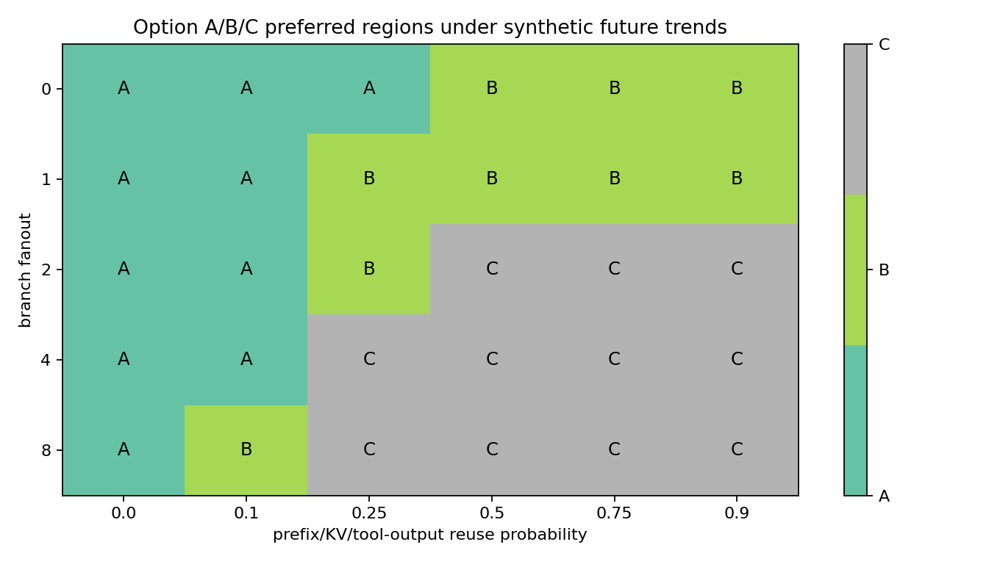
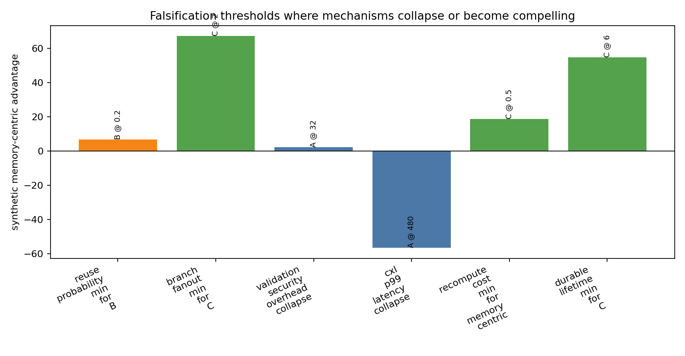
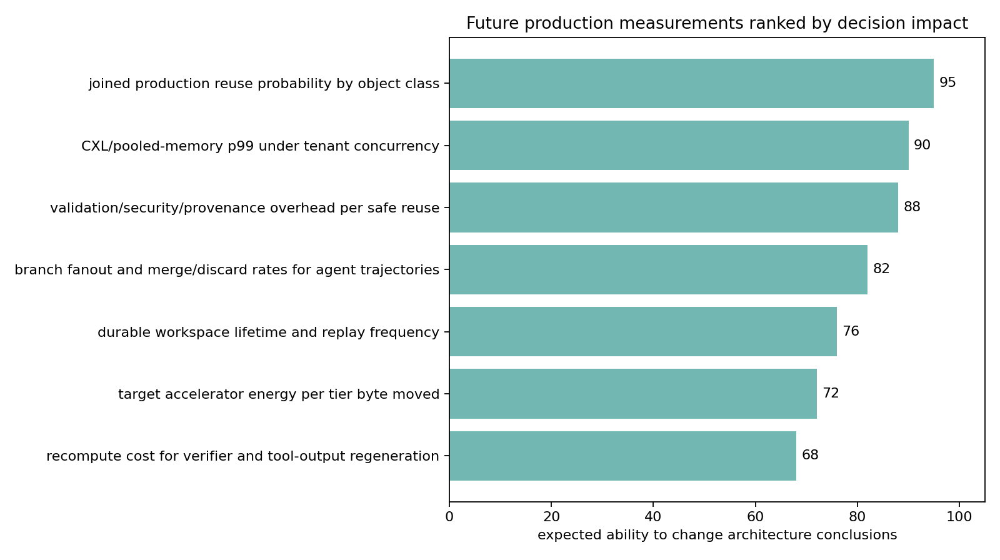

# Future Trend Falsification

This note is a synthetic trend-sensitivity extension of the validated memory-centric agentic inference package. It asks which future hardware and workload trends would strengthen, weaken, or falsify the Option A/B/C architecture argument, while preserving the existing evidence boundary: no result here is measured production evidence and no claim becomes production-ready.

## Scenario Construction

The harness in `scripts/evaluate_future_trends.py` reads the validated cost, energy/contention, CXL contention, constrained-planning, final-readiness, and production-deployment inputs. It emits four tables:

- `data/future_trend_scenarios.csv`: named single-axis and paired-axis futures.
- `data/future_trend_architecture_phase_diagram.csv`: a reuse-probability by branch-fanout phase grid.
- `data/future_trend_falsification_thresholds.csv`: threshold probes for phase changes and collapse points.
- `data/future_trend_measurement_priorities.csv`: ranked production measurements likely to change conclusions.

The required axes are HBM capacity, HBM bandwidth, CXL/pooled-memory p99 latency, NVMe/remote durable-state latency, energy per byte, recompute cost, validation/security overhead, reuse probability, branch fanout, durable-state lifetime, and verification-loop count.

## Equation

The scoring rule is inherited from the campaign-level planner and energy/contention models:

`MemoryCentricAdvantage = RetainedStateValue - MovementCost - ContentionPenalty - RecomputeAlternative - ValidationSecurityOverhead`

Retained value rises with reuse probability, branch fanout, durable-state lifetime, verification-loop count, and recompute cost. Movement and contention costs fall with better HBM bandwidth/capacity and lower tier-movement latency, but those hardware improvements do not create value when reuse is zero. Validation and security overhead is charged after retained value, so high overhead can downgrade Option B/C even in high-reuse futures.

The evaluator also carries forward validated upstream context into each scenario row: baseline planner net value, security safe-hit rate, CXL p99 collapse threshold, energy-sensitivity collapse rate, and the production pilot option scope. These context columns keep the trend sensitivity tied to prior validated artifacts without treating any future scenario as measured evidence.

## Phase Findings

Option A remains sufficient in zero-reuse controls, cheap-recompute futures, large-HBM/fast-bandwidth futures for low-reuse workloads, low-CXL-latency-but-zero-reuse controls, pathological CXL-tail regimes, and high validation/security overhead regimes. These are falsification-friendly cases: memory-centric architecture should not win just because a warm tier is fast.

Option B becomes synthetically compelling when prefix, KV, retrieved-context, or tool-output reuse rises enough to amortize movement and validation without requiring trajectory/DAG machinery. Option C becomes synthetically compelling only when branch fanout, durable-state lifetime, and verification-loop count rise together; branch fanout near zero collapses its advantage.

## Thresholds

The harness records concrete threshold probes for reuse probability, branch fanout, validation/security overhead, CXL p99 latency, recompute cost, and durable-state lifetime. The sharpest synthetic phase changes are validation/security overhead collapse, branch-fanout transition from object reuse to trajectory/DAG value, and CXL p99 tail collapse for warm-tier placement.

## Measurement Priorities

The highest-priority measurements are joined production reuse probability by object class, CXL/pooled-memory p99 under tenant concurrency, validation/security/provenance overhead per safe reuse, branch fanout and merge/discard rates, durable workspace lifetime, target accelerator energy per tier byte moved, and recompute cost for verifier/tool-output regeneration. These are ranked because they move phase boundaries directly rather than merely refining constants.

## Limits

All rows are labeled `synthetic_trend_sensitivity_not_measured_evidence` or `measurement_priority_only_not_measured_evidence`, and all rows set `production_ready=false`. Production endorsement still requires real joined `production_target` telemetry that passes the schema, join, noise-floor, security/provenance/retention/verifier, threshold, and calibration-candidate gates from M-PRODTELEM-1, M-FINALPKG-1, and M-PRODDEPLOY-1.
