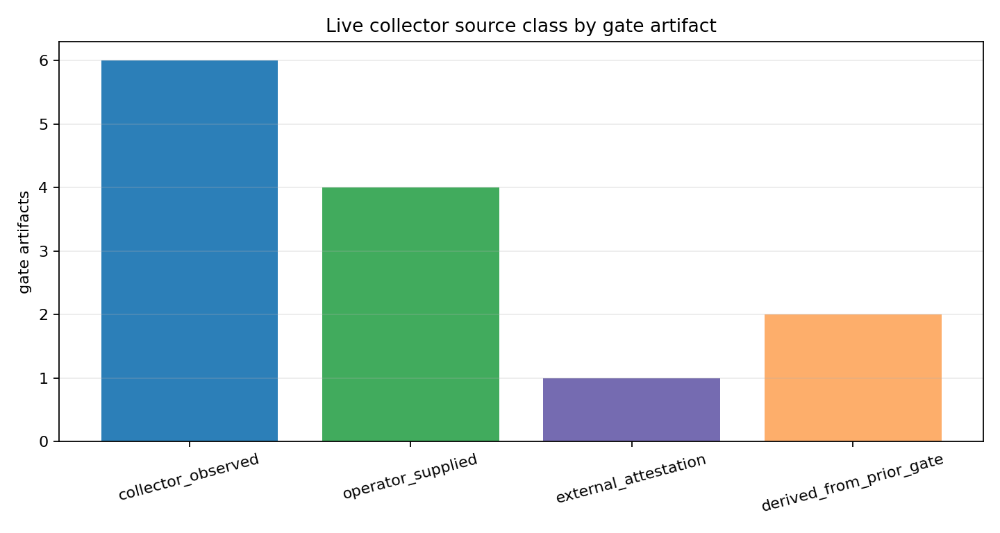
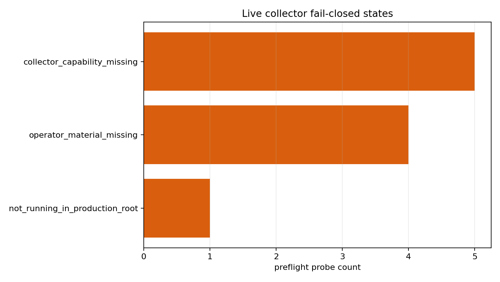
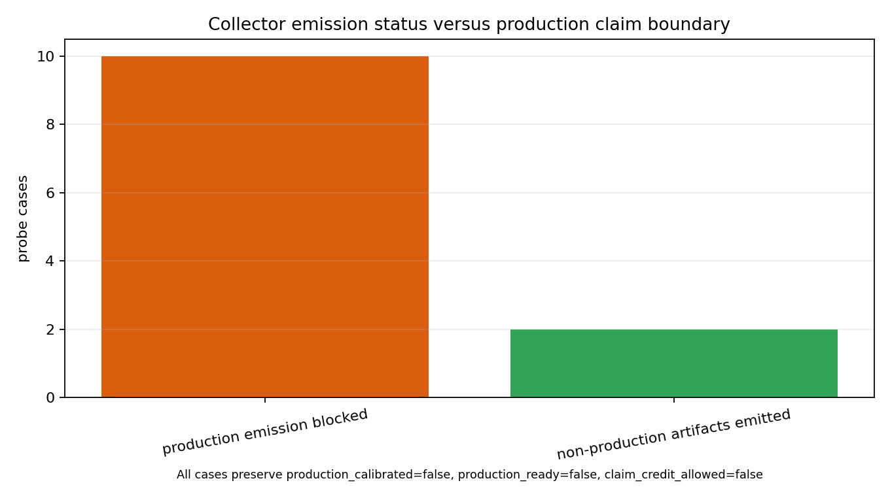

# Production-Side Gate Evidence Collector Scaffold

M-LIVECOLLECT-1 turns the M-EVIDART-1 artifact contract into a production-facing collection scaffold. The collector does not decide claim readiness; it only checks whether a deployment has enough independent material to emit candidate evidence artifacts for later M-EVIDART-1 validation and M-PRODREPLAY-1 replay.

## Deployment Assumptions

Production artifact emission requires a production-root marker, deployment-root identity, collector identity, operator trust policy, external attestation, telemetry counter source, fresh time source, and writable output custody path. Trust-bearing material must come from the operator or an external attester; the collector is not allowed to synthesize its own deployment root, trust policy, or attestation. In this workspace no real production root exists, so production emission remains blocked or dry-run only.

## Collection Source Classes

The capability matrix maps every M-EVIDART gate to one of four source classes:

- `collector_observed`: observable reports or counter-derived material the collector can bind.
- `operator_supplied`: deployment, policy, causal-control, or handoff material supplied by the operator.
- `external_attestation`: hardware/KMS/HSM or external attester material.
- `derived_from_prior_gate`: artifacts derived from earlier validated evidence links.

The generated files are:

- `data/live_collector_capability_matrix.csv`
- `data/live_collector_required_operator_inputs.csv`
- `data/live_collector_artifact_mapping.csv`
- `data/live_collector_preflight_schema.csv`

## CLI Usage

Preflight checks a configured deployment root and writes `preflight_report.json`:

```bash
python3 tools/production_evidence_collector.py preflight --config collector_config.json --output-root out/live_collector
```

Dry-run emits structurally complete non-production artifacts labeled `collector_dry_run_fixture`:

```bash
python3 tools/production_evidence_collector.py dry-run --config collector_config.json --output-root out/live_collector_dry_run
```

Production emission is intentionally stricter:

```bash
python3 tools/production_evidence_collector.py emit-artifacts --config collector_config.json --output-root out/live_collector_production
```

`emit-artifacts` only permits `production_target` when preflight reaches `candidate_artifacts_emitted`. Missing production-root evidence, missing operator material, missing collector capabilities, stale time sources, or self-attestation block emission.

## Failure Modes

The evaluator covers these fail-closed cases:

- no production root marker -> `not_running_in_production_root`
- missing deployment root identity -> `operator_material_missing`
- missing collector identity -> `collector_capability_missing`
- missing operator trust policy file -> `operator_material_missing`
- missing external attestation file -> `operator_material_missing`
- missing telemetry counter source -> `collector_capability_missing`
- missing per-gate source material such as bundle, adapter, redaction, uncertainty, causal, threshold, planner, or handoff reports -> `collector_capability_missing` or `operator_material_missing` by source class
- stale time source -> `collector_capability_missing`
- unwritable artifact output root -> `collector_capability_missing`
- dry-run fixture attempting `production_target` -> rewritten to `collector_dry_run_fixture`
- internally generated self-attestation -> `operator_material_missing`

## Claim Boundary

Candidate artifacts are only inputs to the M-EVIDART-1 structural validator. Preflight success, dry-run artifact completeness, and non-production fixture emission never set `production_calibrated`, `production_ready`, `threshold_success`, `causal_validity_granted`, or `claim_credit_allowed`. The only path to claim support remains: production-rooted artifacts with `evidence_label=production_target`, independent operator/external material, M-EVIDART-1 validation, and M-PRODREPLAY-1 replay.

## Figures






