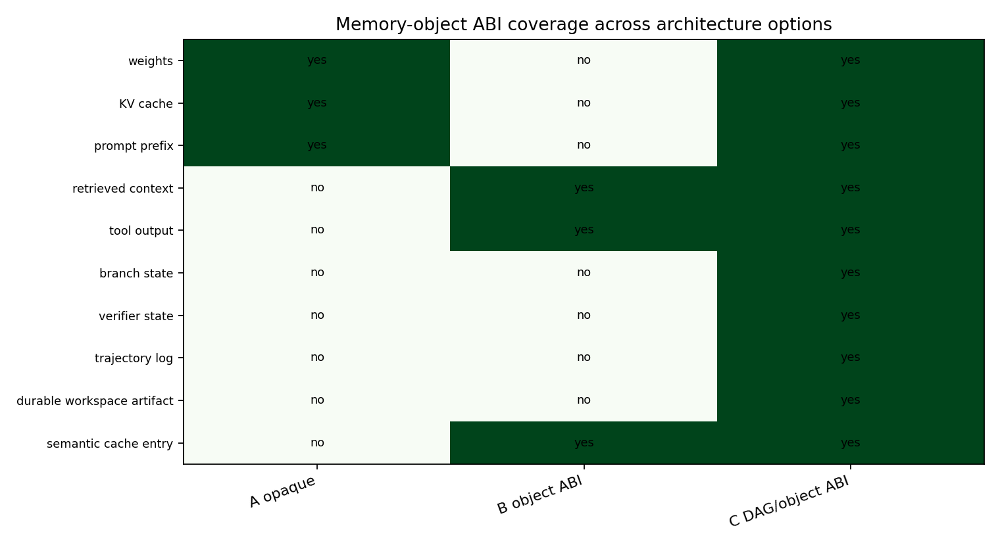
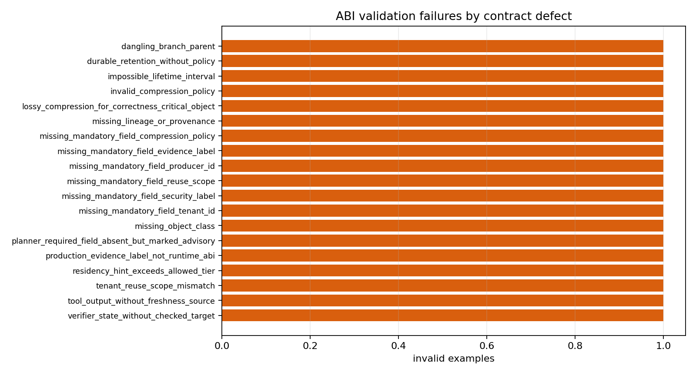
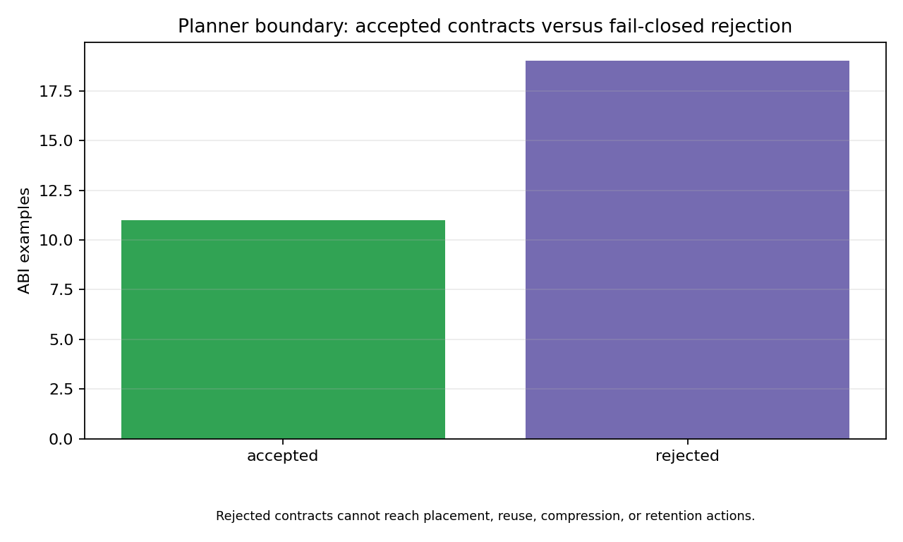

# Memory-Object ABI and Runtime/Compiler Contract

## Purpose

`derived` The ABI is the small contract an agent runtime, compiler/planner, serving engine, and cache/storage fabric need in order to treat agentic state as first-class memory objects. It is not a production telemetry contract and it does not encode claim-readiness semantics. Its job is to decide whether object-aware placement, reuse, compression, retention, or DAG scheduling is admissible before the planner acts.

## Mandatory Core

`derived` Every object-aware contract must expose `object_id`, `object_class`, `producer_id`, `lineage_ids`, `tenant_id`, `reuse_scope`, `security_label`, lifetime bounds, correctness criticality, compression policy, allowed tiers, and an internal runtime evidence label. These fields are mandatory for Options B/C because they are the minimum information needed to prevent unsafe reuse, stale placement, untraceable retention, and correctness-breaking compression.

`derived` The planner may treat `residency_hint` as advisory, but it may not widen `allowed_tiers`, `reuse_scope`, lifetime, or compression permissions. A required field marked advisory is rejected because the planner would otherwise turn absence of evidence into permission.

`derived` Missing `producer_id`, `tenant_id`, `reuse_scope`, `security_label`, `compression_policy`, or runtime `evidence_label` is rejected before planning. An omitted `residency_hint` is accepted as no placement preference because it is advisory; a present hint outside `allowed_tiers` is rejected before placement.

## Conditional Fields

`derived` Branch and trajectory objects add `branch_id` and `parent_object_ids`; verifier state adds `checked_target_id`; retrieved context, semantic cache entries, prompt prefixes, weights, and tool outputs add `freshness_source_id`; durable workspace artifacts and trajectory logs add `retention_policy_id` when retention is infinite or durable. These conditional fields are what separate Option B object-local planning from Option C trajectory/DAG planning.

## Option Boundary

`derived` Option A remains valid for conventional opaque serving of weights, KV cache, and prompt prefix paths. It does not require the full object ABI because its planner does not claim cross-object reuse, durable retention, or trajectory-aware scheduling.

`derived` Option B requires `PlannerAdmissible(object)` for reusable memory objects: class known, lineage present, reuse scope authorized, lifetime interval valid, security policy bound, compression safe, and retention policy valid if durable. Option C additionally requires resolvable trajectory/DAG dependencies for branch state, verifier state, trajectory logs, and durable workspace artifacts.

## Invalid Contracts

`simulated` The validator rejects missing object class, missing mandatory producer/security/reuse/compression/evidence fields, missing lineage/provenance, tenant/reuse-scope mismatch, impossible lifetime intervals, dangling branch parents, verifier state without a checked target, tool output without freshness source, invalid compression policy, lossy compression for correctness-critical state, residency hints outside allowed tiers, durable retention without policy, production evidence labels in the runtime ABI, and planner-required fields marked advisory.

`derived` Rejection happens before placement, reuse, compression, or retention. The fail-closed behavior keeps the ABI as a runtime/compiler safety boundary rather than a best-effort metadata hint.

## Links To Prior Artifacts

- `M-ARCH-1`: establishes Options A/B/C and the coarsest useful scheduling boundary.
- `M-TRACE-1`: provides trace fields that inspired object identity, lifetime, branch, verifier, and durability fields.
- `M-PROTO-1`: proves a small object registry can drive placement and retention decisions.
- `M-COMP-1`: supplies compression safety constraints for correctness-sensitive objects.
- `M-SEC-1` and `M-SECOPS-1`: motivate tenant, reuse-scope, lineage, freshness, and security labels.
- `M-PLAN-1`: consumes admissible object information to emit placement, compression, retention, migration, and recompute actions.
- `M-CLAIMEXP-1`: remains outside the ABI path; lifecycle and production claim currency are evidence-chain concerns, not runtime object fields.

## Generated Artifacts

