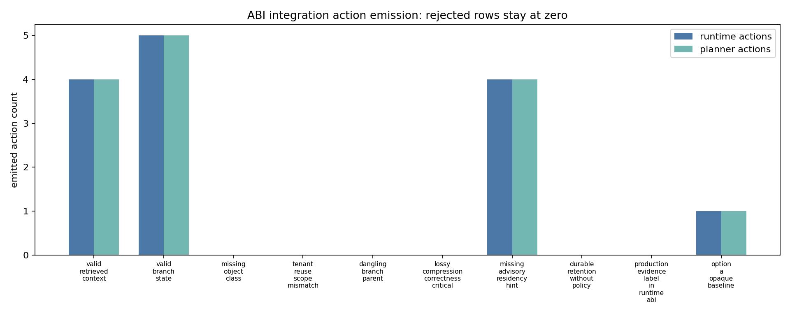
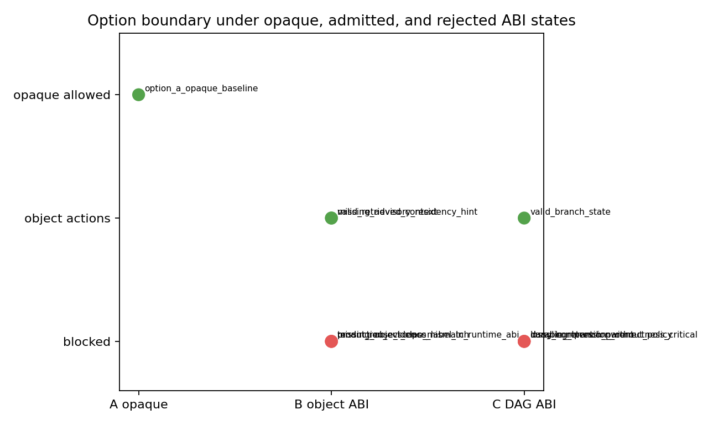
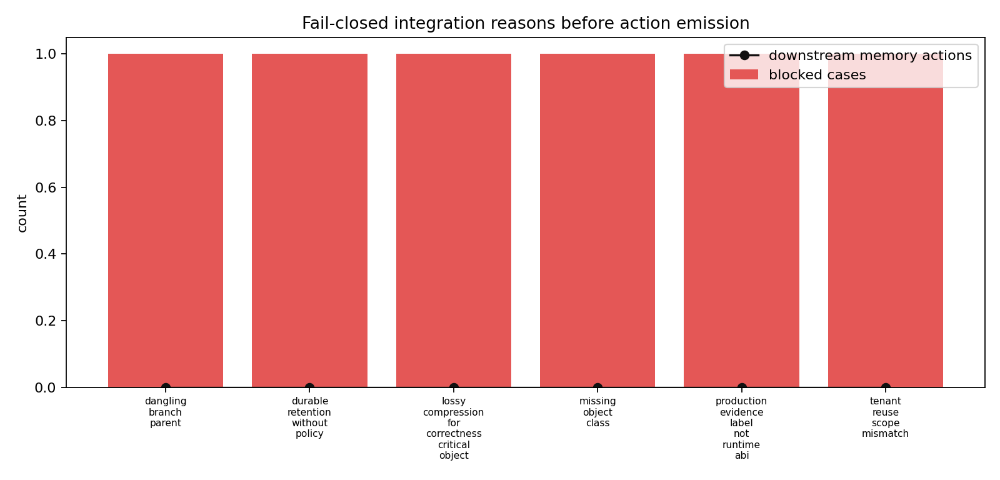

# Memory-Object ABI Integration Replay

`M-ABIINT-1` tests the validated memory-object ABI as an executable control-plane boundary between object contracts, the runtime prototype, and the constrained memory planner. The replay is intentionally small: `scripts/integrate_memory_object_abi.py` consumes `data/memory_object_abi_examples.jsonl`, `data/memory_object_abi_validation_results.csv`, `data/runtime_policy_decisions.csv`, and `data/memory_plan_actions.csv`, then emits runtime and planner action rows only when the ABI row is admitted or when the path is the explicit Option A opaque baseline.

The runtime and planner inputs are used as compatibility gates. The integration script fails if the validated runtime prototype does not expose Option A/B/C policy decisions or if the constrained planner does not expose the action vocabulary needed to support placement, reuse, compression, migration, and retention replay. Integration output rows record this with `runtime_prototype_consistency` and `constrained_planner_consistency`.

## Adapter Semantics

The adapter treats ABI validation as the first gate. Rejected rows emit zero placement, reuse, compression, migration, or retention actions in both `data/memory_object_abi_runtime_actions.csv` and `data/memory_object_abi_planner_actions.csv`.

Option A remains executable without a full memory-object ABI through the `option_a_opaque_baseline` row. That row emits only `opaque_execute` and `baseline_request_schedule`; it does not emit object-level memory actions.

Options B and C require an admitted ABI contract. Accepted object rows feed object-aware planner actions for Option B, while accepted branch/DAG rows feed DAG-aware actions for Option C, including an explicit migration/dependency-resolution action.

## Advisory Fields

`residency_hint` remains advisory. The `missing_advisory_residency_hint` row is admitted, uses `default_no_residency_hint`, and falls back to `CPU DRAM` from the allowed tiers instead of failing as a hidden mandatory field.

Mandatory fields remain mandatory. Missing object class, tenant/reuse-scope mismatch, unsafe lossy compression for correctness-critical state, dangling branch parents, durable retention without policy, and attempted `production_target` labels fail before downstream action emission.

## Production Boundary

The integration replay is a runtime/compiler/planner mechanism, not a production evidence chain. Every integration result, planner row, and option-boundary row keeps `production_calibrated=false`, `production_ready=false`, `threshold_success=false`, `causal_validity_granted=false`, and `claim_credit_allowed=false`.

## Outputs

- `data/memory_object_abi_integration_results.csv`
- `data/memory_object_abi_runtime_actions.csv`
- `data/memory_object_abi_planner_actions.csv`
- `data/memory_object_abi_integration_failure_modes.csv`
- `data/memory_object_abi_option_boundary.csv`
- `data/memory_object_abi_integration_actions.png`
- `data/memory_object_abi_option_boundary.png`
- `data/memory_object_abi_integration_failures.png`

## Links

This milestone connects the standalone ABI contract in `memory-centric-agentic/memory_object_abi.md` to the validated runtime prototype in `memory-centric-agentic/runtime_prototype.md`, the constrained planner in `memory-centric-agentic/constrained_memory_planning.md`, compression safety in `memory-centric-agentic/compression_model.md`, security/provenance gates in `memory-centric-agentic/security_provenance_model.md`, and production claim lifecycle boundaries in `memory-centric-agentic/claim_expiry_revalidation.md`.
