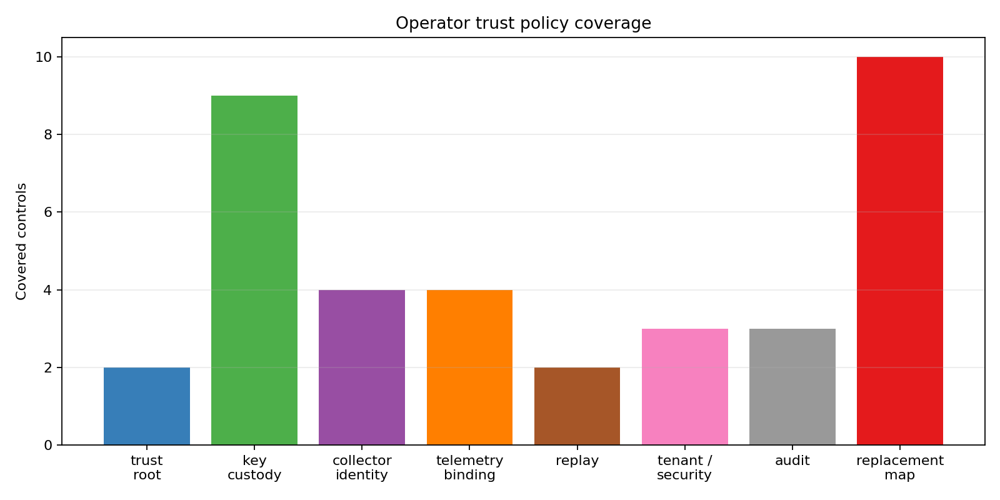
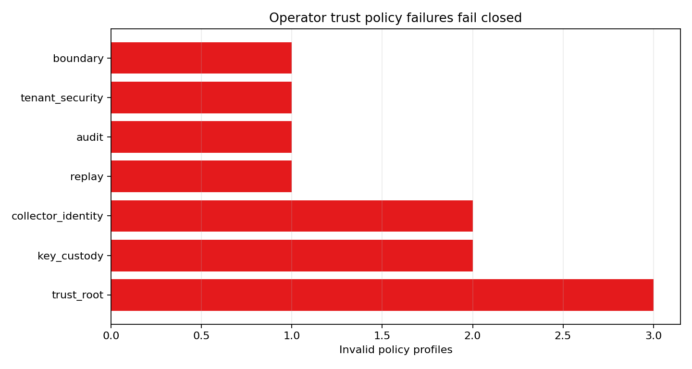
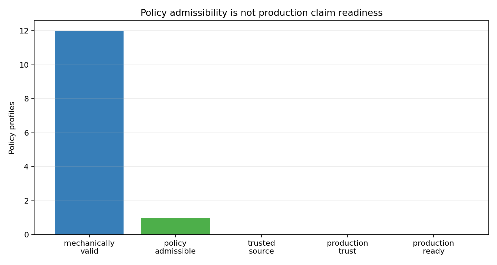

# Operator Trust Policy

M-TRUSTPOL-1 defines the policy gate that must sit between the M-ATTEST-1 test signing envelope and any future production signing deployment. The replacement point is explicit: `hmac_sha256_test_fixture`, `test-key-active-a`, and `test_attestation_fixture` must be replaced by an operator KMS, HSM, hardware-attestation root, or operator certificate authority with non-exportable custody, rotation, revocation, collector identity binding, replay protection, tenant/security binding, and auditability.

A complete fixture policy can become `trust_policy_admissible=true`, but it still leaves `attestation_source_trusted=false` and `production_trust_established=false`. This preserves the strongest boundary from the attestation milestone: fixture signatures and policy profiles prove only that the required design fields are present, not that real production trust roots, real collector identity evidence, or real production telemetry exist.

Real deployment evidence would need to bind the operator trust root to a registered collector, collector software/firmware identity, topology, manifest digest, payload digest-set digest, adapter conformance digest, schema version, bundle ID registry, nonce or monotonic sequence policy, tenant isolation, security context source, retention authorization, append-only audit logs, verifier identity, and incident response ownership. The gate composes upstream of intake, adapter conformance, production ingestion, threshold replay, final readiness, and handoff traceability; none of those downstream gates can be bypassed by a policy document.

Invalid profiles fail closed for fixture HMAC presented as production trust, missing revocation, exportable production key material, unbound collector identity, missing replay protection, missing audit logging, missing tenant/security binding, unsupported trust roots, and policy attempts to assert production trust. No profile in this milestone creates `production_target`, `production_calibrated`, `production_ready`, or claim-credit evidence.

## Figures

