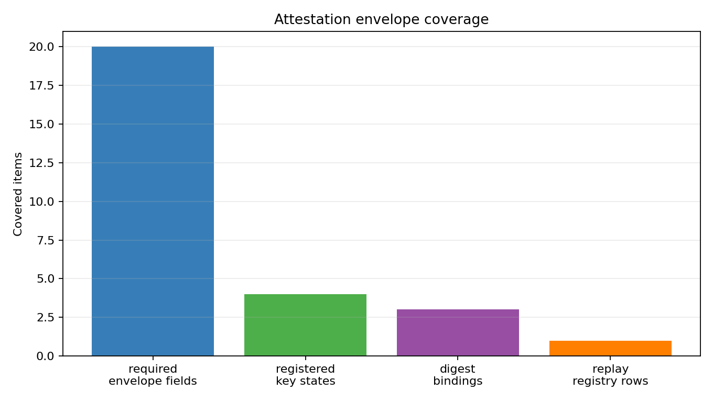
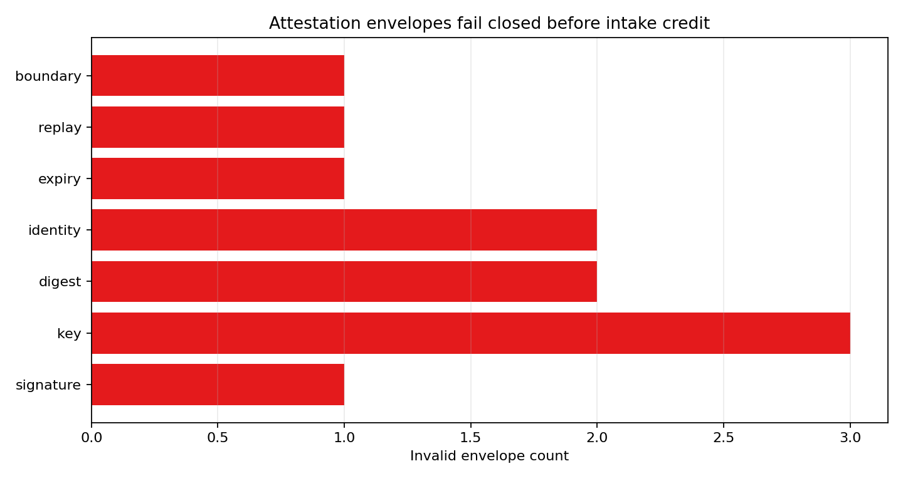
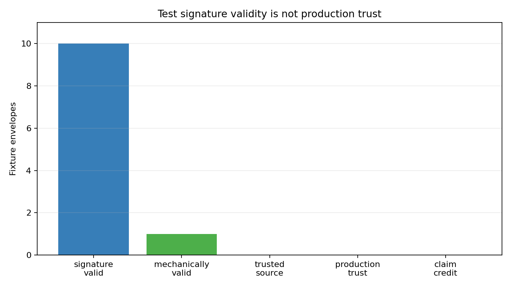

# Production Telemetry Attestation Envelope

M-ATTEST-1 makes the M-INTAKE-1 custody placeholder executable with a test-only signing envelope. The fixture uses HMAC-SHA256 over a canonical JSON object containing `key_id`, operator and collector identity, schema version, bundle ID, manifest digest, payload digest-set digest, adapter conformance digest, collection window, issue time, and expiry time. The manifest digest is computed from canonicalized intake manifest rows, while the payload digest-set digest binds each payload path, row count, checksum, and canonical schema target.

The key registry is authoritative for this fixture gate: unknown, expired, and revoked key IDs fail closed before any downstream intake or ingestion claim can use the bundle. The replay registry marks previously admitted bundle IDs, so a mechanically valid signature over a replayed bundle is still blocked. Identity checks require the envelope operator and collector to match both the registry and the intake manifest.

This is executable test plumbing, not production trust infrastructure. All keys, signatures, and envelopes use `test_attestation_fixture`; `signature_valid=true` can coexist with `attestation_source_trusted=false` and `production_trust_established=false`. Production deployments would replace the fixture HMAC secret with real operator KMS/HSM signing, hardware or collector attestation, key rotation policy, revocation distribution, audit logs, and deployment-specific trust roots.

Attestation validity remains upstream of production ingestion, threshold replay, final readiness, and handoff traceability. A valid fixture envelope proves only that the bundle, payload digests, key state, identity, expiry, and replay mechanics are internally consistent; it does not create `production_target`, `production_calibrated`, `production_ready`, or claim-credit evidence.

## Figures

