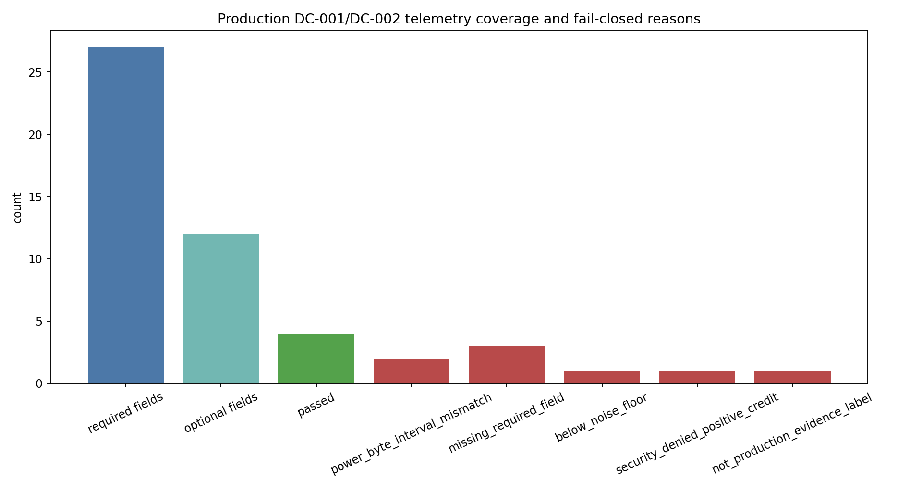
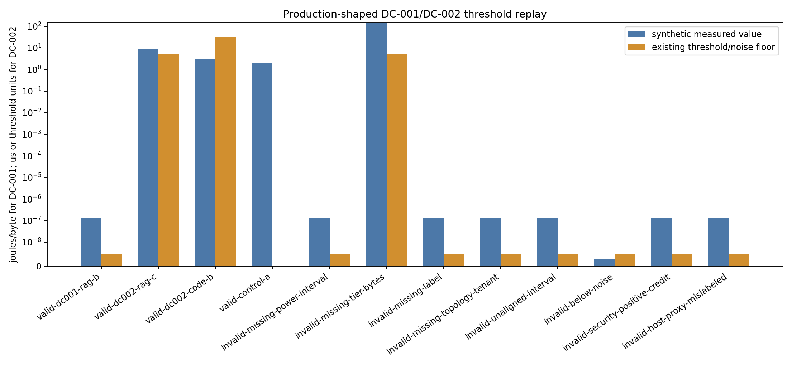
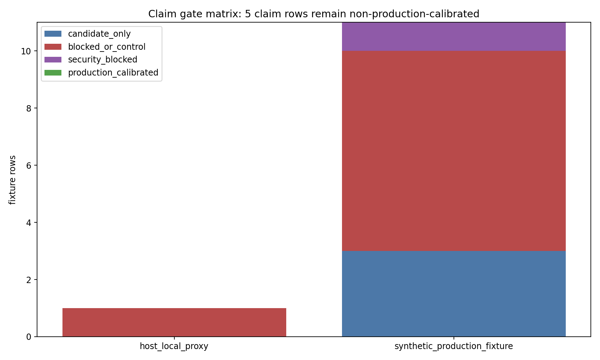

# Production DC-001/DC-002 Telemetry Contract

## Schema Rationale

M-DC12-1 showed that host-local proxy measurements can exercise the DC-001/DC-002 threshold plumbing, but it deliberately did not produce production calibration evidence. `data/production_dc12_telemetry_schema.csv` defines the minimum row needed before future target telemetry may update those claims: joined run identity, production target, topology, tier-specific bytes, target energy counters, CXL or pooled-memory latency tails, tenant concurrency, workload/object labels, reuse decision, and security/provenance gates.

The acceptance rule is fail-closed:

`ProductionCalibrated = evidence_label=production_target AND required fields present AND join keys valid AND power/byte intervals aligned AND delta above noise AND security/provenance/retention/verifier gates pass AND threshold is comparable`.

Synthetic fixtures in this milestone may become `calibration_candidate=true` to prove the ingestion path, but they remain `production_calibrated=false`.

## Commands

```bash
python3 scripts/build_production_dc12_fixtures.py
python3 scripts/ingest_production_dc12_telemetry.py
python3 scripts/plot_production_dc12_telemetry.py
python3 tests/verify_production_dc12_telemetry.py
```

## Fixture Semantics

`data/production_dc12_valid_fixture.csv` contains synthetic production-shaped rows for DC-001 byte/energy telemetry and DC-002 contention telemetry. The rows include complete target identity, tier, workload, object, interval, noise-floor, latency-tail, tenant-concurrency, and security fields. They use `evidence_label=synthetic_production_fixture`, so they can test candidate gates but cannot calibrate CL-012 as real production evidence.

`data/production_dc12_invalid_fixtures.csv` contains fail-closed cases for missing power intervals, missing tier-specific bytes, missing workload/object labels, missing topology or tenant concurrency, unaligned power and byte intervals, below-noise DC-001 energy, security-denied positive credit, and a host-local proxy row. Each invalid row produces a named `blocked_reason` in `data/production_dc12_ingestion_results.csv`.

Evidence classes are intentionally distinct:

- `host_local_proxy`: local host measurements that validate plumbing only.
- `synthetic_production_fixture`: complete production-shaped contract probes that validate ingestion semantics only.
- `production_target`: future direct target telemetry; only this label can ever set `production_calibrated=true`.

## Results

The build emitted 39 schema rows, 4 valid fixture rows, 8 invalid fixture rows, 12 ingestion rows, 12 threshold-replay rows, 5 claim-update rows, and 5 missing-field report rows. Three synthetic rows became candidate-only rows; no row became production-calibrated. Invalid rows failed closed with specific reasons and zero granted reuse or energy credit.







## Claim Updates

`data/production_dc12_claim_update_matrix.csv` keeps CL-012 blocked because no real `production_target` evidence was ingested. CL-004 and CL-005 are marked threshold-replay-ready because DC-002 rows can now be compared against existing CXL/pooled-memory thresholds. Controls remain Option A, and `SECURITY-GATE-ENERGY-001` records that denied rows grant zero credit.

## Deployment-Specific Open Questions

`data/production_dc12_missing_fields_report.csv` maps every M-DC12-1 missing telemetry gap to required schema fields. The remaining deployment-specific work is ranked: accelerator/host power counters, tier-specific bytes, target-topology CXL or pooled-memory latency tails, tenant concurrency/queue depth, and workload/object/reuse labels. The schema makes these representable; it does not make them available.
