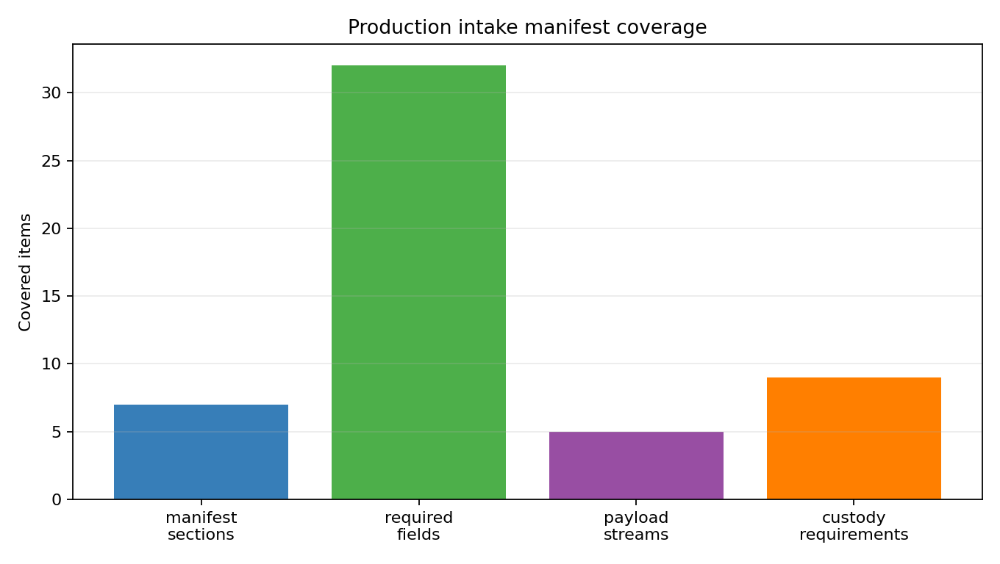
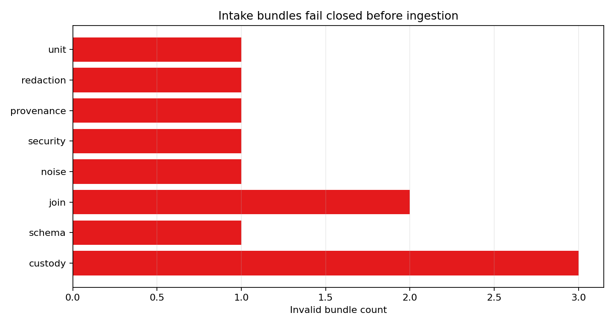
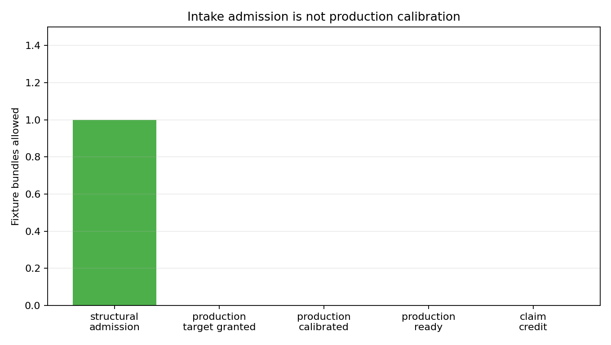

# Production Telemetry Intake Bundle

M-INTAKE-1 defines the front-door protocol for a future operator telemetry drop before the existing adapter conformance, production ingestion, security, threshold, final-readiness, and handoff gates can use it. The intake bundle is a manifest plus payload inventory: bundle identity, telemetry files, checksums, join window, provenance envelope, measurement-quality declarations, security/privacy declarations, and explicit boundary labels.

The bundle manifest schema is in `data/production_intake_bundle_manifest_schema.csv`. Every payload row must name a file path, stream class, positive row count, SHA-256 checksum, and canonical schema target. The chain-of-custody table in `data/production_intake_chain_of_custody_requirements.csv` requires stable bundle identity, schema-version match, adapter conformance report pointer, join-window declaration, measurement noise metadata, trusted-source declaration, signing/attestation placeholder, redaction policy, retention authorization, and security-context source.

Structural admission is deliberately weaker than production calibration. A complete fixture bundle may become `structurally_admissible`, but it keeps `evidence_label=production_intake_fixture`, `production_calibrated=false`, `production_ready=false`, and `claim_credit_allowed=false`. `production_target_requested=true` is only an operator request flag; it does not grant `evidence_label=production_target` without trusted real-source provenance and downstream ingestion success.

Invalid bundles fail closed before ingestion. The evaluator blocks missing checksums, schema-version mismatch, missing adapter conformance pointer, unresolved join alias, missing noise floor, incomplete security/provenance stream, stale collection window, ambiguous redaction policy, invalid unit declaration, and fixture attempts to claim production-target evidence. Status fields separate attempts from results, for example `unit_normalization_attempted=true` can coexist with `unit_valid=false`.

The traceability output links intake admission to the existing adapter conformance report, production telemetry ingestion harness, final claim-readiness matrix, and campaign handoff table. This gives downstream artifacts a reproducible admission report to cite without allowing intake alone to upgrade Option B/C or any claim to production-ready.

## Figures

