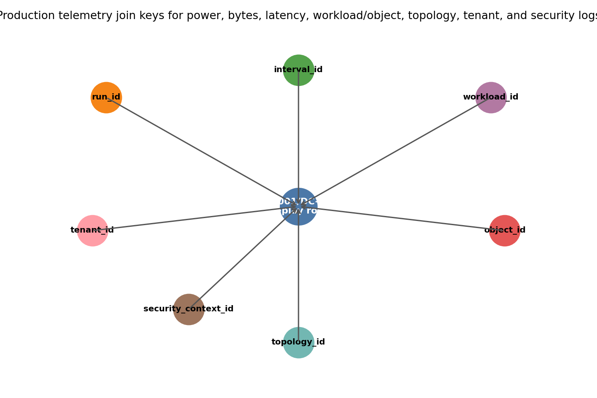
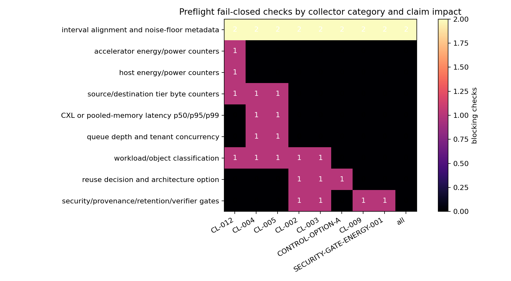
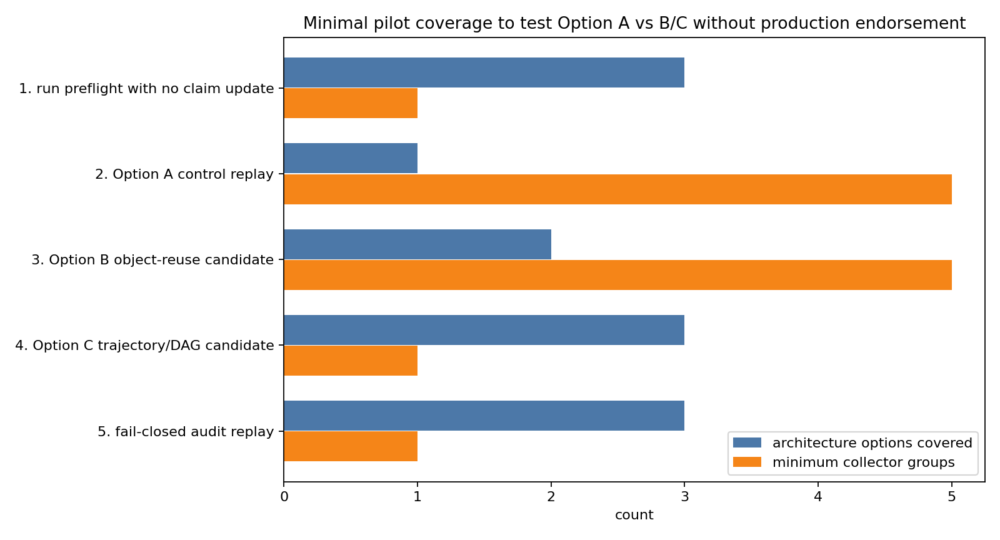

# Production Telemetry Deployment Blueprint

This document turns the validated M-PRODTELEM-1 telemetry contract into an operator-facing deployment kit for collecting future `production_target` evidence. It is a blueprint and preflight package, not measured production evidence; it does not make any current claim production-ready.

## Deployment Intent

The collection target is a joined DC-001/DC-002 replay row that can connect energy, byte movement, memory-tier latency, queueing/concurrency, workload/object labels, architecture decisions, and security/provenance gates inside one production run. A usable run requires:

`RequiredCollectorsPresent AND SharedRunID AND SharedIntervalID AND ClockAligned AND WorkloadObjectJoinValid AND TopologyTenantJoinValid AND SecurityJoinValid AND NoiseFloorKnown AND EvidenceLabel=production_target`.

If any conjunct is false, `production_calibrated=false` and the row remains diagnostic only.

## Required Collection Surfaces

The concrete collector mapping is in `data/production_telemetry_collector_spec.csv`. The required surfaces are accelerator energy/power counters, host energy/power counters, source/destination tier byte counters, CXL or pooled-memory latency p50/p95/p99, queue depth and tenant concurrency, workload/object classification, reuse decision and architecture option logs, security/provenance/retention/verifier gates, and interval/noise-floor metadata.

Deployment-specific APIs are intentionally labeled `deployment_specific_required`. The kit requires the operator to bind those rows to real accelerator, host, CXL/pool, scheduler, runtime, object-registry, and security-control surfaces before any measurement run can enter calibration.

## Join Semantics

The join contract is in `data/production_telemetry_join_contract.csv`. Every replayable row must carry or derive `run_id`, `interval_id`, `workload_id`, `object_id`, `topology_id`, `tenant_id`, and `security_context_id`.

The key point is not just that counters exist. They must share a clock, interval, target topology, workload/object identity, tenant/security context, and production evidence label. A power counter without tier-specific bytes cannot calibrate joules/byte; a latency histogram without topology and tenant context cannot calibrate DC-002; a reuse decision without security/provenance joins receives zero credit.

## Preflight Checks

The preflight matrix is in `data/production_telemetry_preflight_checks.csv`. Every preflight row has `blocks_calibration=true`, because the purpose is to reject misleading instrumentation before it creates rows that look usable.

Scientifically unusable failures include missing accelerator or bounded host power, missing tier-specific bytes, absent CXL/pool p95/p99 latency tails, unjoined workload/object labels, absent tenant concurrency, missing security/provenance gates, unknown noise floors, `evidence_label` other than `production_target`, or clock mismatch beyond the interval tolerance. These failures are not merely incomplete; they block production calibration because threshold replay would otherwise mix incompatible denominators, topologies, or authorization states.

## Minimal Pilot

The pilot design is in `data/production_telemetry_pilot_design.csv`. It starts with a preflight-only dry run, then an Option A control replay, an Option B object-reuse candidate, an Option C trajectory/DAG candidate, and a fail-closed audit replay.

The pilot is intentionally narrow. It can tell an operator what data to collect next and whether the instrumentation is joinable. It cannot endorse Option B/C production deployment by itself; claim promotion still requires the M-PRODTELEM-1 ingestion gates and the M-FINALPKG-1 readiness rules over real `production_target` rows.

## Failure Modes

- No accelerator/host power counter: DC-001 and CL-012 remain blocked.
- No tier-specific bytes: joules/byte and placement attribution are unusable.
- No CXL or pooled-memory p95/p99 under the target topology: DC-002 remains blocked.
- No workload/object labels: Option A/B/C threshold replay is unjoinable.
- No tenant/topology join: contention rows are diagnostic only.
- No security/provenance/retention/verifier join: reuse and energy credit are zero.
- Clock mismatch beyond tolerance: `production_calibrated=false`.
- Planned telemetry, synthetic fixtures, and host-local proxies remain non-production evidence.
