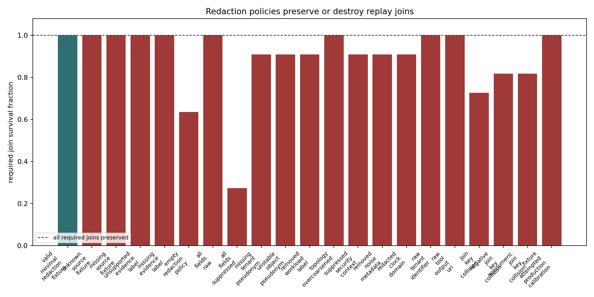
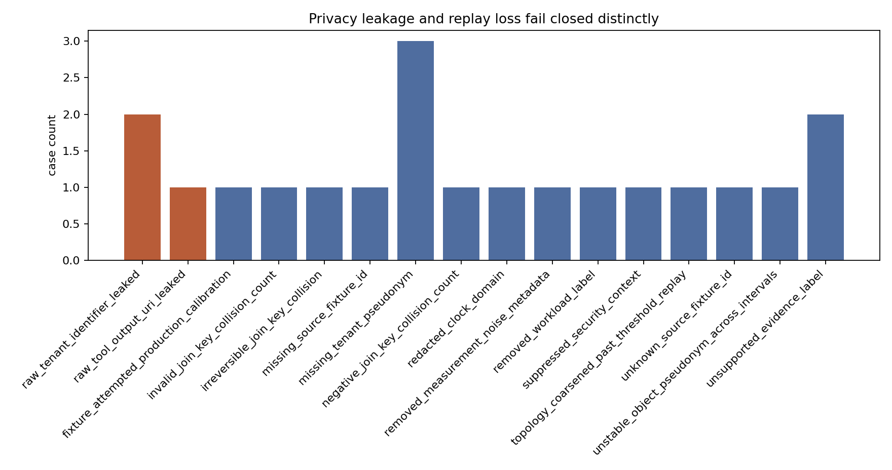
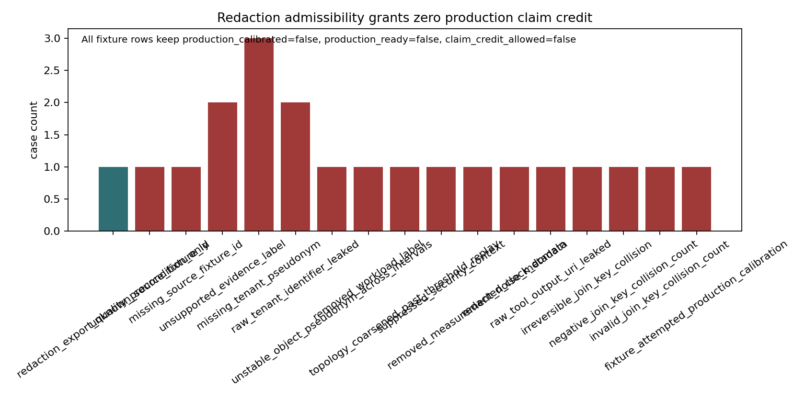

# Telemetry Minimization And Redaction Integrity

M-REDACT-1 adds a privacy and identifiability harness between valid production telemetry collection and claim replay. The fixture treats redaction as an export-quality precondition: operators may pseudonymize tenant, object, collector, bundle, run, security-context, and clock-domain identifiers, and may bucket workload, topology, and noise metadata only when the resulting stream still preserves the joins required for DC-001/DC-002 and final-readiness replay.

The required join map is in `data/redaction_required_join_fields.csv`. Tenant, object, run, bundle, collector, security-context, and clock-domain fields must be stable pseudonyms, not raw identifiers and not interval-local random values. Workload labels, topology buckets, and measurement-noise classes may be coarsened only to the granularity used by threshold replay; suppressing them makes the threshold result non-identifiable rather than a threshold miss. The fixture source must remain a known timebase-admissible fixture, the evidence label must remain `redaction_integrity_fixture`, and join-collision counts must be valid nonnegative integers.

The evaluator separates two fail-closed outcomes. Under-redacted rows with raw tenant identifiers or raw tool-output URIs produce `privacy_leakage`; over-redacted or malformed rows with unknown source fixtures, unsupported evidence labels, missing pseudonyms, removed workload labels, over-coarsened topology, suppressed security context, removed noise metadata, redacted clock domain, unstable object pseudonyms, invalid collision counts, or join-key collisions produce `replay_nonidentifiable`.

The admissible fixture reaches only `redaction_admissible=true`. It keeps `evidence_label=redaction_integrity_fixture`, `production_calibrated=false`, `production_ready=false`, and `claim_credit_allowed=false`; redaction quality never upgrades fixture telemetry into production evidence.

