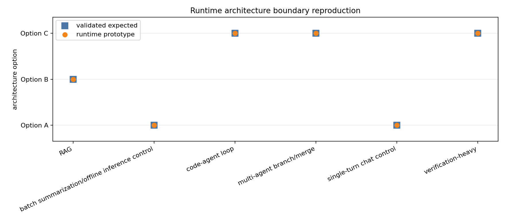
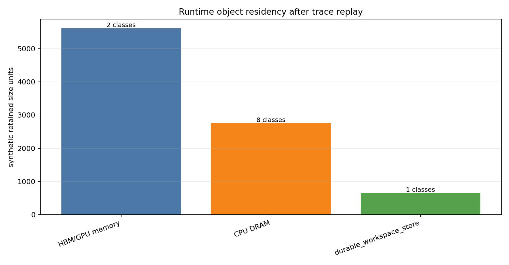
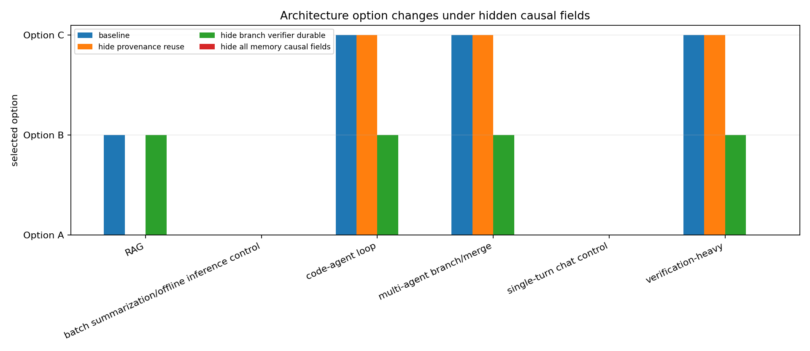

# Runtime Prototype

This artifact supersedes the researcher-seeded M-PROTO-1 placeholders at `memory-centric-agentic/runtime_prototype.md`, `scripts/runtime_prototype.py`, `scripts/plot_runtime_prototype.py`, and the literal placeholder file formerly at `data/runtime_*`, now archived as `stale/runtime_placeholder_2026-05-11.txt`.

## Purpose

The prototype tests whether the validated synthetic trace v2 interface can be replayed into a concrete memory-centric runtime loop. It is not a production scheduler or calibrated performance model. All numerical scores, thresholds, and placement costs are synthetic mechanism probes.

The runtime consumes:

- `data/agentic_trace_events_v2.csv`
- `data/trace_object_lifetimes.csv`
- `data/trace_reuse_intervals.csv`
- `data/trace_workload_summary.csv`
- `data/queueing_architecture_winners.csv`
- `data/compression_best_strategy_by_object.csv`
- `data/compression_object_queue_interactions.csv`
- `data/compression_safety_failures.csv`
- `data/architecture_policy_matrix.csv`

## Registry Schema

Each object registry entry tracks:

`object_id`, `object_class`, `workload_class`, `size_units`, `tier`, `created_at`, `last_seen_at`, `lifetime`, `reuse_count`, `reuse_distance`, `correctness_sensitive`, `provenance_id`, `source_version`, `invalidation_signal`, `trajectory_node_id`, `branch_id`, `verifier_id`, `durability_horizon`, `merge_state`, `active`, `placement_decision`, `retention_decision`, `compression_strategy`, and `eviction_decision`.

Snapshots are emitted to `data/runtime_registry_snapshots.csv` for object-bearing trace events. The final policy surface is emitted to `data/runtime_policy_decisions.csv`, `data/runtime_workload_summary.csv`, `data/runtime_ablation_results.csv`, and `data/runtime_failure_cases.csv`.

## Policy Loop

The runtime computes architecture choice from registry-visible mechanisms rather than workload labels:

- Option A: selected when the trace contains only conventional weights, KV, prefix, and scratch state with no material non-baseline reuse/provenance/DAG value.
- Option B: selected when object-local reuse, provenance, invalidation, and pointer-preserving compression state exceed synthetic object-runtime overhead.
- Option C: selected when branch, verifier, trajectory, or durable workspace state exceeds synthetic trajectory-fabric overhead.

Placement and retention are then derived from the selected option. Option A retains conventional serving state only. Option B retains object metadata and provenance-preserving reuse candidates. Option C pins or pointer-preserves branch/verifier/durable/trajectory state.

Compression decisions import the best strategy by workload/object from M-COMP-1. The runtime does not claim compression helps queue thresholds because `data/compression_object_queue_interactions.csv` currently contains zero selected positive queue-help rows; it records queue harm context instead.

## Boundary Results

The prototype reproduces the validated architecture boundary:

| Workload | Runtime option | Expected option | Match |
|---|---|---|---|
| single-turn chat control | A | A | yes |
| batch summarization/offline inference control | A | A | yes |
| RAG | B | B | yes |
| code-agent loop | C | C | yes |
| verification-heavy | C | C | yes |
| multi-agent branch/merge | C | C | yes |

The registry snapshots include all 11 memory-object classes from the taxonomy.

## Ablations

The ablation table hides causal field groups and recomputes architecture choice:

- Hiding provenance/reuse collapses RAG from Option B to Option A.
- Hiding branch/verifier/durable fields collapses code-agent, verification-heavy, and multi-agent branch/merge workloads from Option C toward Option B.
- Hiding all memory-causal fields collapses all non-control workloads to Option A.

These outcomes support the intended mechanism: Option B/C choices depend on visible memory-state variables, not on workload labels alone.

## Failure Cases

`data/runtime_failure_cases.csv` includes:

- unsafe lossy compression requests imported from M-COMP-1 and blocked;
- missing provenance pointer fixture for pointer-preserving replay;
- invalidation/source-version mismatch fixture requiring revalidation or recompute;
- missing trajectory/DAG field fixture requiring downgrade or pinning.

## Figures

## Limitations

This prototype uses synthetic scores and thresholds inherited from the prior milestones. It proves interface executability and mechanism dependence, not measured performance. A real runtime would need calibrated queueing costs, hardware-specific tier constants, workload traces, provenance/invalidation APIs, and failure isolation semantics before any deployment claim.
