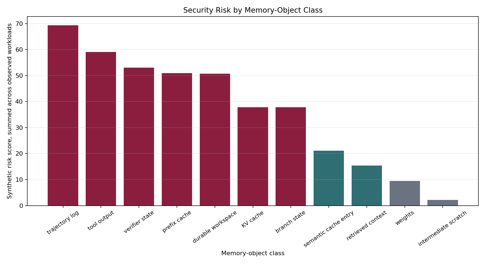
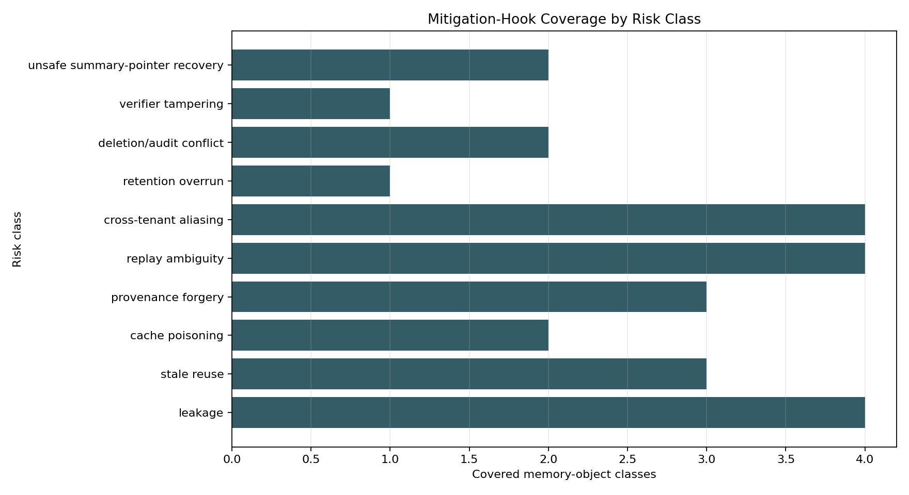
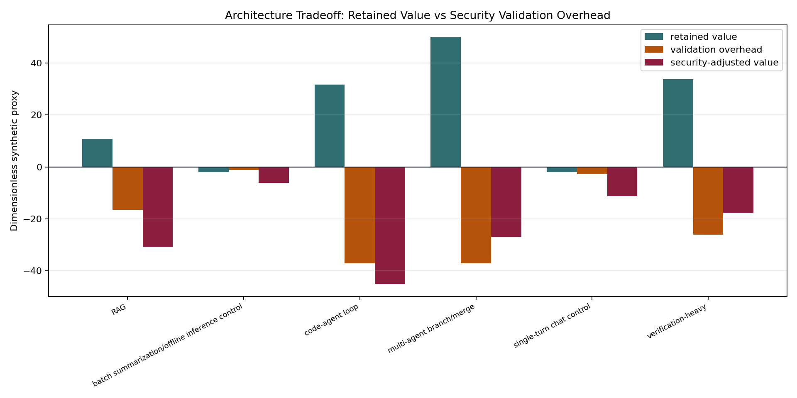

# Security, Provenance, Isolation, and Retention Model

This model treats security validation as part of the memory-placement decision. A retained object contributes positive memory-centric value only when reuse is authorized, fresh, isolated, and replayable:

```text
AuthorizedReuse(object, actor, source_version, lineage, invalidation_state) = true

SecurityAdjustedValue =
  RetainedValue
  - CoordinationOverhead
  - ValidationOverhead
  - ExpectedSecurityLoss
```

Claims in this artifact are `derived`, `simulated`, `sourced_from_calibration`, or `speculative`. No production security rates, legal compliance constants, breach probabilities, or tenant-mix statistics are introduced.

## Threat Boundary

Option A retains the conventional serving boundary: model weights, KV cache, prefix cache, and transient scratch state. Its security requirements are mostly cache isolation, tenant/salt partitioning, and normal lifetime cleanup. Option B adds provenance-sensitive retrieved context and semantic/prefix reuse, so freshness, invalidation, source-version, and cache-poisoning checks become architecture variables. Option C adds trajectory logs, branch state, verifier state, tool outputs, and durable workspace state; reuse now depends on lineage, replay authorization, verifier evidence integrity, durable-retention policy, and deletion/audit conflict handling.

The generated threat matrix covers all 11 memory-object classes:

- Conventional objects: weights, KV cache, prefix cache, intermediate scratch.
- Object-reuse objects: retrieved context, semantic cache entry, tool output.
- Trajectory/durable objects: branch state, verifier state, trajectory log, durable workspace.

The risk classes are leakage, stale reuse, cache poisoning, provenance forgery, replay ambiguity, cross-tenant aliasing, retention overrun, deletion/audit conflict, verifier tampering, and unsafe summary-pointer recovery.

## Trace Sufficiency

Current trace v2 fields can detect missing provenance, source-version mismatch, invalidation signals, branch/merge lineage errors, verifier identity, and expired durability horizons. The current schema does not directly encode tenant scope, cache salt, replay actor authorization, verifier evidence hashes, or legal/audit hold state. M-SEC-1 therefore keeps four instrumentation gaps explicit in `data/security_invalid_trace_fixtures.csv`.

Required new fields for a production-strength trace are:

- `tenant_scope` and `cache_salt` for cross-tenant prefix/semantic cache reuse.
- `actor_id` and `replay_authorization_scope` for trajectory replay authorization.
- `verifier_evidence_hash` for tamper-evident verifier state.
- `retention_hold_state` for durable workspace deletion/audit conflict handling.

## Results

`data/security_threat_matrix.csv` contains 77 risk rows. `data/security_invalid_trace_fixtures.csv` contains 9 invalid fixtures; every fixture is marked invalid and mapped to an expected runtime response. `data/security_mitigation_matrix.csv` maps every risk class to at least one mitigation hook. `data/security_special_cases.csv` validates the required boundary cases.

The synthetic workload-level tradeoff shows that security validation can reverse memory-centric benefit:

| Workload | Option | Retained value | Validation overhead | Security-adjusted value | Reversal |
|---|---:|---:|---:|---:|---|
| RAG | B | 10.8 | 16.527 | -30.631 | true |
| code-agent loop | C | 31.8 | 36.993 | -38.862 | true |
| multi-agent branch/merge | C | 50.0 | 36.993 | -20.662 | true |
| verification-heavy | C | 33.8 | 26.03 | -14.314 | true |

Controls do not show a positive memory-centric value that can be erased: they already sit on Option A with negative B/C retained-value proxies.







## Robust Conclusions

Memory-centric reuse cannot be treated as a byte-retention problem alone. Retrieved context, semantic cache entries, tool outputs, verifier state, trajectory logs, and durable workspace objects require provenance, freshness, lineage, or retention checks before their retained value is counted.

The validated Option A/B/C boundary survives as a security boundary. Controls mainly need isolation and lifetime cleanup; RAG-like Option B needs object provenance and invalidation hooks; Option C needs trajectory lineage, verifier integrity, replay authorization, and durable retention policy.

## Sensitive Conclusions

The magnitude of security overhead is synthetic. M-CALIB-1 already deferred provenance-validation overhead, semantic-cache correctness/invalidation cost, durable object-store latency distributions, and production trajectory reuse distributions. High validation overhead can erase Option B/C value; low overhead would preserve more of the memory-centric benefit.

## Speculative or Deferred Conclusions

Cross-tenant cache exposure and legal retention/deletion conflict are marked speculative because the current local evidence does not include deployment policy, tenancy model, or compliance source material. They remain architecture-relevant because missing tenant or retention fields make unsafe reuse impossible to distinguish from useful reuse.

## Falsification Criteria

M-SEC-1 would be falsified if unsafe reuse receives positive retained value, missing provenance passes validation, tenant/cache salt mismatch is ignored, stale source-version reuse remains valid, verifier tampering does not invalidate replay, or security overhead is absent from architecture tradeoff outputs. The generated fixtures exercise these cases and currently reject or downgrade every one.
