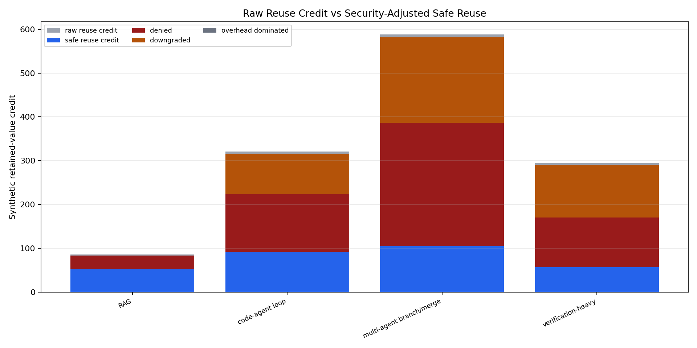
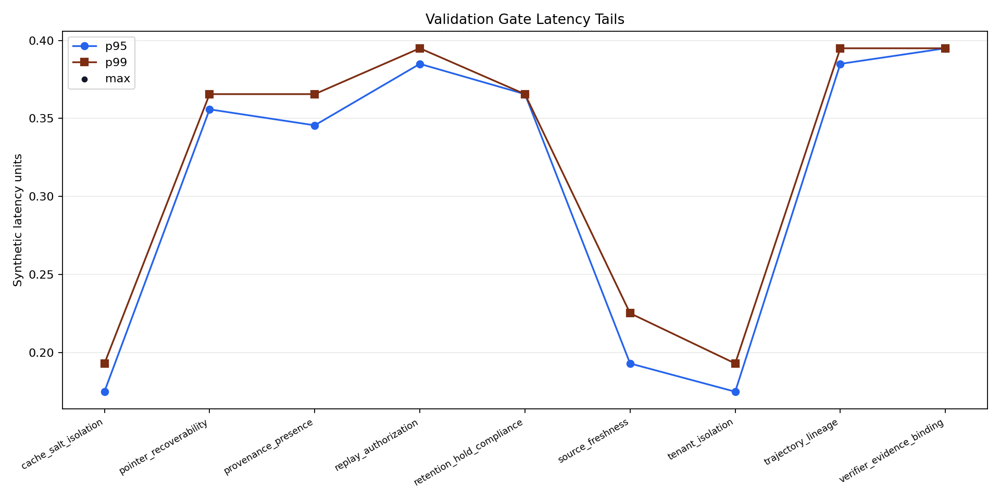
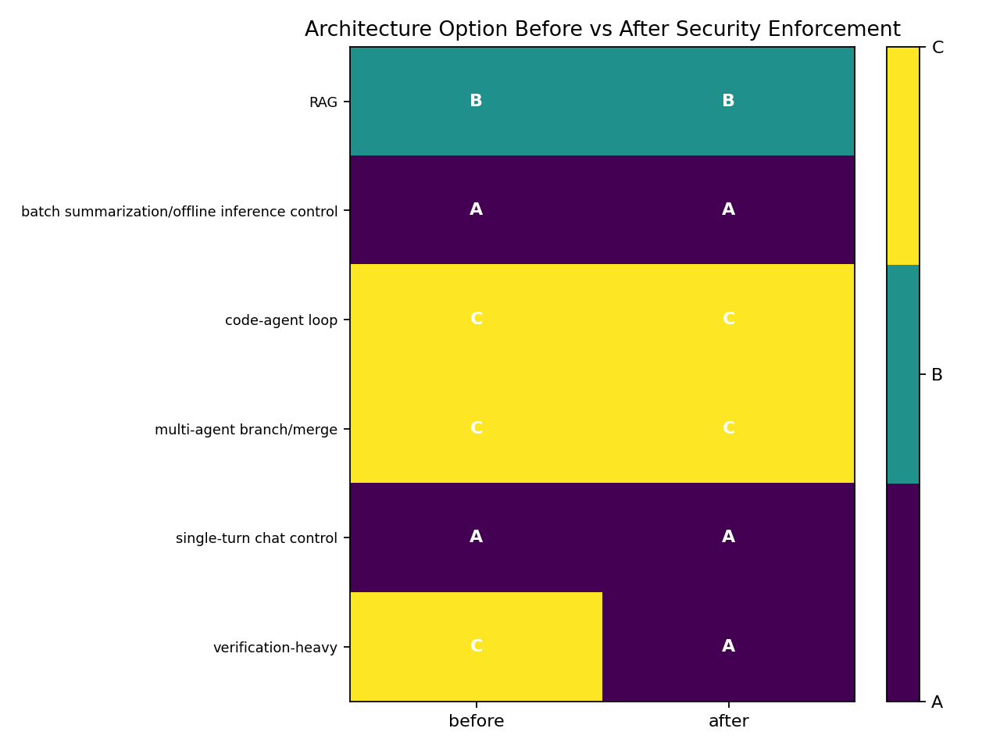

# Security Telemetry and Enforcement Replay

M-SECOPS-1 turns the earlier security/provenance analysis into an executable synthetic replay. The mechanism is:

`SecurityAdjustedValue(object) = RawRetainedValue - ValidationOverhead - ExpectedSecurityLoss`

Raw retained value is credited only when the replay can prove authorized reuse from telemetry. If a gate fails, the replay assigns zero safe reuse credit and chooses deny, downgrade, recompute, or an architecture fallback.

## Trace-v3 Fields

The replay extends `data/agentic_trace_events_v2.csv` into `data/security_trace_v3_events.csv` with:

- `tenant_scope`, `cache_salt`, and `actor_id` for isolation and replay identity.
- `replay_authorization_scope` for actor-to-object authorization.
- `verifier_evidence_hash` for verifier-state binding.
- `retention_hold_state` for durable retention/hold compliance.
- `pointer_valid` for summary/provenance pointer recoverability.
- `validation_gate_ids`, `validation_decision`, `validation_lookup_count`, `validation_queue_wait`, `validation_start_time`, and `validation_end_time` for enforcement cost and outcome replay.

The represented gates are provenance presence, source freshness, tenant isolation, cache-salt isolation, trajectory lineage, replay authorization, verifier evidence binding, retention/hold compliance, and pointer recoverability.

## Replay Results

The generated enforcement table has 268 replay decision rows:

| decision | count |
|---|---:|
| safe reuse | 123 |
| denied reuse | 75 |
| downgraded reuse | 48 |
| overhead-dominated reuse | 4 |
| not reuse candidate | 18 |

The invalid/control fixture table has 13 rows, including 11 invalid fixtures for missing provenance, stale source version, invalidation signal, tenant mismatch, cache-salt mismatch, unauthorized actor, contaminated lineage, tampered verifier hash, expired retention without hold, invalid pointer, and missing validation timing. Invalid fixtures receive zero safe reuse credit.
Fixture outcomes are computed by the same enforcement decision path used for replay rows; mismatch fields, unauthorized actors, and missing validation timing are not accepted as mere field-presence passes.

## Architecture Updates

The replay recomputes Option A/B/C decisions from safe reuse credit, not from annotations. Results:

| workload | before | after security | safe hit rate |
|---|---|---|---:|
| RAG | B | B | 0.740741 |
| batch summarization/offline inference control | A | A | 0.0 |
| code-agent loop | C | C | 0.53125 |
| multi-agent branch/merge | C | C | 0.40404 |
| single-turn chat control | A | A | 0.0 |
| verification-heavy | C | A | 0.483333 |

The field-ablation replay has 54 rows, with 32 causal rows where removing a security field changes safe credit or the recomputed option. This distinguishes required fields from decorative telemetry under the synthetic assumptions.

## Claim Updates and Limits

This cycle operationalizes M-SEC-1 and M-EXP-1 by making authorization, freshness, lineage, verifier integrity, retention, and pointer recoverability causal in replay. It does not replace production telemetry: all evidence labels remain synthetic, validation latency is a deterministic proxy, and expected security loss is not production-calibrated. The main surviving claim is conditional: memory-centric reuse can remain viable for RAG and some branch/merge workloads only when safe-hit loss and validation overhead stay below retained-value margins; otherwise Option B/C must collapse to recompute-oriented Option A.
