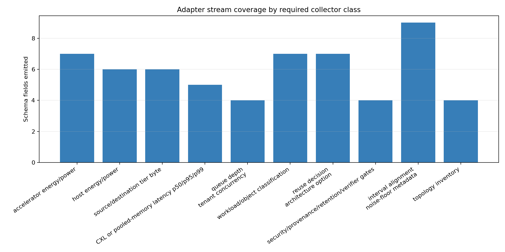
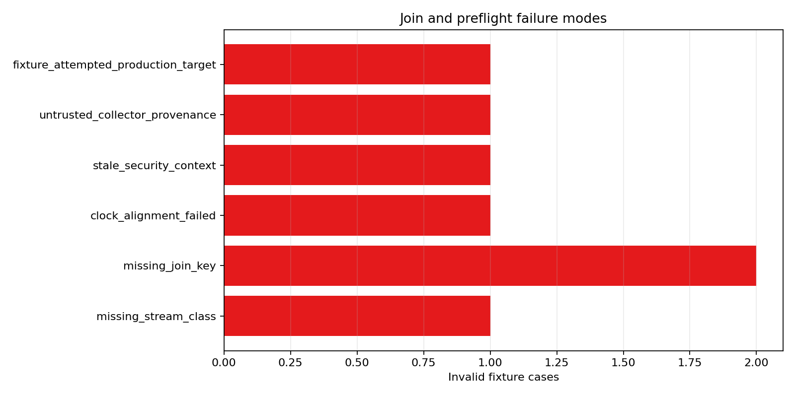
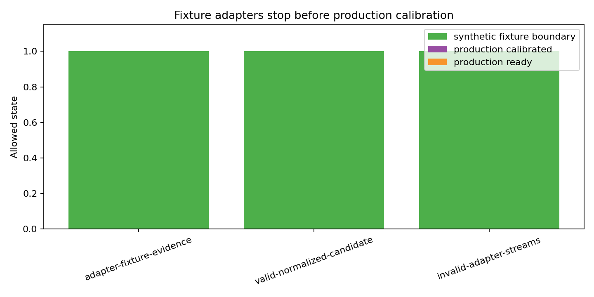

# Telemetry Adapter Interface

M-PRODDEPLOY-1 defined what a deployment must collect; this milestone makes the boundary executable without reading live counters. The adapter interface is vendor-neutral: every collector stream emits a common join envelope, collector provenance, clock metadata, and a small stream payload that is either directly mapped or derived into the validated M-PRODTELEM-1 schema.

## Adapter Contract

Each adapter stream must declare `collector_category`, `adapter_id`, `collector_instance_id`, `collector_trust_domain`, `adapter_version`, `fixture_source`, and `evidence_label`. The required join envelope is `measurement_run_id`, `interval_id`, `workload_id`, `object_id`, `topology_id`, `tenant_id`, and `security_context_id`; the normalizer rejects missing or inconsistent keys before production ingestion.

The offline fixture set covers accelerator power, host power, tier byte movement, CXL or pooled-memory latency, tenant concurrency and queue depth, workload/object labels, reuse and architecture decisions, security/provenance/retention/verifier gates, and topology inventory. Interval timing and clock metadata are carried in the shared envelope because they apply to every stream rather than to one vendor collector.

## Join And Preflight Semantics

The valid fixture streams normalize into one schema-shaped candidate row with `calibration_candidate=true`, `evidence_label=synthetic_adapter_fixture`, `production_calibrated=false`, and `production_ready=false`. Invalid fixtures cover missing stream class, missing interval key, clock mismatch, missing security context, stale security context, untrusted provenance, and an attempted fixture promotion to `production_target`; each receives a named `blocked_reason` in `telemetry_adapter_join_results.csv` and `telemetry_adapter_preflight_results.csv`.

The existing production ingestion harness rejects direct adapter rows with `not_production_evidence_label`. This is intentional: adapter fixtures can test normalization and fail-closed behavior, but real calibration still requires trusted production collectors and explicit deployment provenance.

## Figures

## Limits

No row in this milestone is real production telemetry. Offline fixtures use `synthetic_adapter_fixture`, never `production_target`, and cannot make any final claim production-ready. A real deployment must implement the same interface with trusted collectors, bounded clocks, joined topology/workload/object/security identifiers, and noise-floor metadata before M-PRODTELEM-1 can evaluate production calibration.
