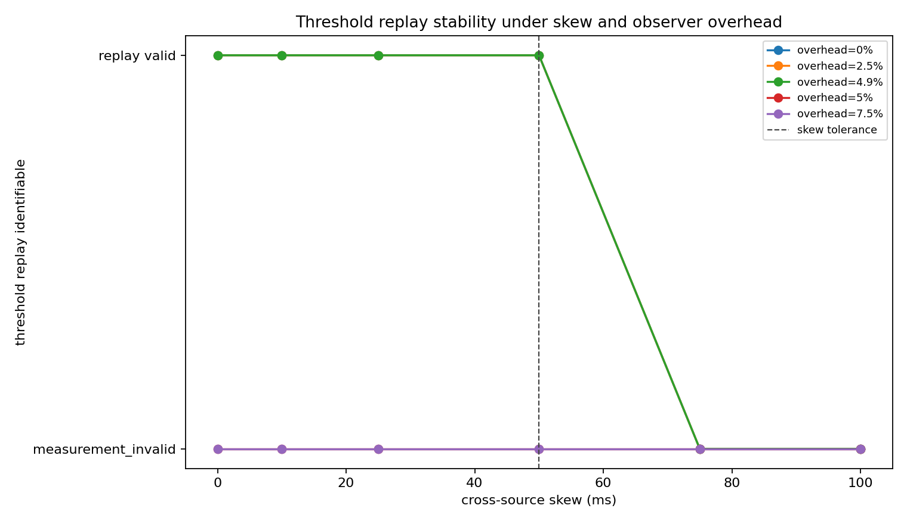
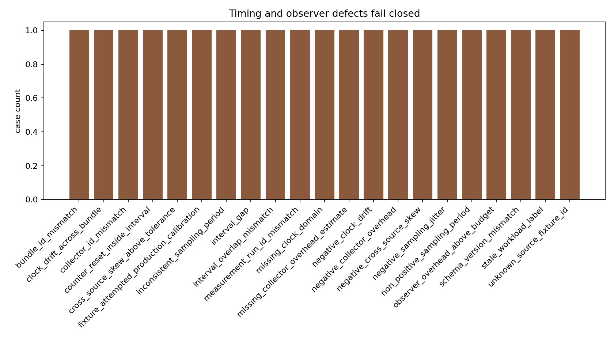
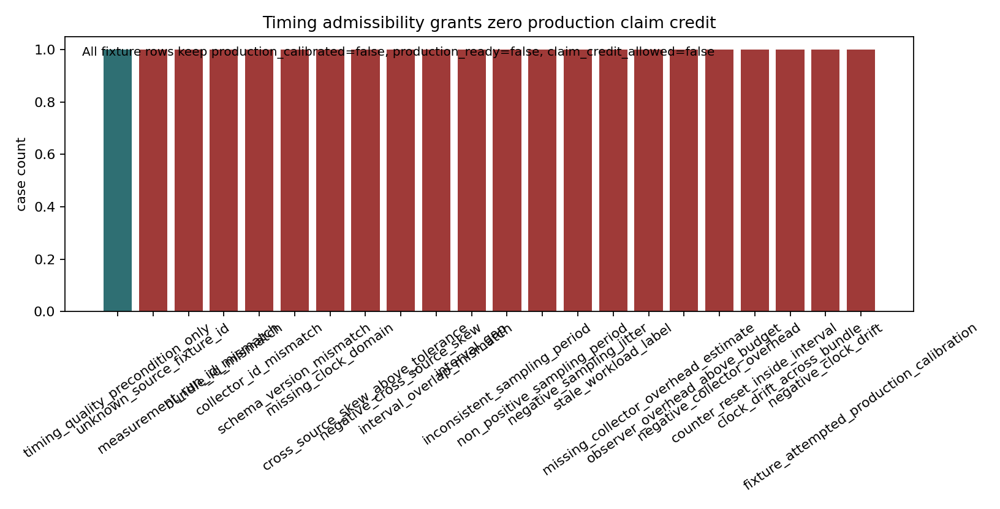

# Production Telemetry Timebase Integrity

M-TIMEBASE-1 adds a measurement-validity precondition before DC-001/DC-002 threshold replay. A joined telemetry row is replayable only when it joins to a known threshold fixture, preserves the expected measurement-run, bundle, collector, and schema identifiers, the clock domain is known, every power/byte/latency/queue/security interval exactly matches the canonical interval, skew is nonnegative and at or below 50 ms, jitter is nonnegative and at or below 25 ms, collector overhead is nonnegative and strictly below the 5% perturbation budget, workload labels are fresh, counters are continuous, and nonnegative drift stays within 25 ppm.

Invalid timing is not interpreted as “no threshold crossing.” Unknown source fixtures, continuity identifier mismatches, missing clock domains, excessive or negative skew, overlap or gap defects, inconsistent or nonpositive sampling periods, negative jitter, stale labels, missing or negative overhead estimates, overhead at or above budget, counter resets, negative or excessive bundle drift, and fixture production-calibration attempts all produce `measurement_invalid` and block DC-001/DC-002 replay.

The sensitivity sweep in `data/timebase_threshold_sensitivity_cases.csv` shows the interpretability boundary directly: zero skew preserves the fixture threshold crossing, while skew beyond tolerance or overhead equal to the perturbation budget makes the result non-identifiable. This keeps observer effects from silently favoring Option A or suppressing memory-centric threshold crossings.

Timing admissibility is still weaker than production calibration. The complete fixture reaches `timing_admissible=true`, but every row keeps `production_calibrated=false`, `production_ready=false`, and `claim_credit_allowed=false`; real `production_target` evidence would still need the existing enrollment, custody, attestation, trust-policy, ingestion, security, threshold, readiness, and handoff gates.

