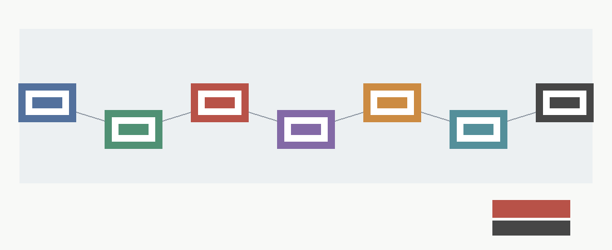

# Campaign Closure Report

## Directive Restatement

The campaign investigated whether useful portions of neural-network inference can be physicalized into hardware, with artifacts kept under `<workspace>`, and with Wolfram, Verilator, Yosys, and Graphviz used where they added tractable evidence.

## Method Summary By Phase

- Phase 1 defined the physicalization taxonomy, strongest null hypothesis, break-even model, target ranking, hybrid safety/filter architecture, and bounded prototype.
- Phase 2 calibrated the safety/filter case against workload assumptions and stronger optimized-software and programmable-accelerator baselines.
- Phase 3 and Phase 4 built the measured evidence pathway: production trace schema, ingestion admissibility, replayable evidence packs, uncertainty durability, and lifecycle terminal states.
- M-ROBUST-1 stress-tested non-safety target classes against the stronger programmable baseline.
- M-DEFER-1 converted the validated negative endpoint into a deferral watchlist so future cycles do not treat substitutes as measured evidence.

## Final Claim Disposition

| Claim | Disposition | Support |
|---|---|---|
| `full_frontier_fixed_weight_physicalization` | rejected_under_current_evidence | `physicalized-weights/docs/taxonomy_and_null.md`<br>`physicalized-weights/data/breakeven_summary.json` |
| `safety_filter_performance_superiority` | falsified_under_stronger_programmable_baseline | `physicalized-weights/data/phase2_synthesis_summary.json`<br>`physicalized-weights/data/stronger_baseline_summary.json`<br>`physicalized-weights/docs/stronger_baseline_comparison.md` |
| `hybrid_architecture_failure_mode_value` | retained_as_architecture_and_failure_mode_study | `physicalized-weights/docs/hybrid_safety_filter_architecture.md`<br>`physicalized-weights/docs/campaign_deferral_watchlist.md` |
| `prototype_hdl_evidence` | retained_as_bounded_prototype_evidence | `physicalized-weights/data/prototype_verification_closure.json`<br>`physicalized-weights/docs/prototype_verification_closure.md`<br>`physicalized-weights/data/hdl_sim_results.csv` |
| `future_measured_reopen_path` | complete_but_inactive_absent_actual_measured_evidence | `physicalized-weights/data/phase4_reopen_summary.json`<br>`physicalized-weights/docs/phase4_reopen_lifecycle_synthesis.md` |
| `non_safety_target_robustness` | no_calibrated_current_superiority_claim | `physicalized-weights/data/target_robustness_summary.json`<br>`physicalized-weights/docs/target_robustness_stress_test.md` |
| `campaign_deferral_state` | closed_under_current_evidence_deferred_until_valid_measured_package | `physicalized-weights/data/campaign_deferral_watchlist_summary.json`<br>`physicalized-weights/data/campaign_deferral_watchlist_results.csv`<br>`physicalized-weights/docs/campaign_deferral_watchlist.md` |

## Strongest Null Hypothesis And Outcome

The operative null was that software/runtime improvements and programmable accelerators capture the practical benefit before a fixed physical substrate can amortize substrate, update, yield, integration, fallback, and audit costs. Current artifacts support the null for performance/economic superiority: `phase2_hybrid_workload_wins = 0`, `robust_calibrated_physicalized_win_count = 0`, and `current_superiority_claim_count = 0`.

## Why Safety/Filter Moved From Plausible To Falsified

Phase 1 identified safety/filter as a plausible narrow target because it had stable features, high reuse, and a bounded fallback architecture. Phase 2 replayed that target under equal workload accounting and a stronger programmable accelerator; the stronger baseline won nine of ten scenarios, optimized software won the zero-invocation control, and the hybrid won zero scenarios.

## What Remains Valuable

The architecture and prototype remain valuable as a bounded study of interfaces, fixed-policy versioning, confidence/fallback behavior, audit hooks, HDL equivalence, and closure criteria. That is different from a performance or economic win: the retained value is design and verification evidence, not a claim that fixed weights beat programmable baselines.

## Why Current Artifacts Cannot Reopen

Current artifacts report `actual_reopen_candidate_count = 0`, `current_artifacts_reopen = false`, and `new_reopen_gate_count = 0`. Synthetic traces, local proxy timing, vendor-only claims, templates, dry-runs, intake rehearsals, lifecycle controls, and point crossings without uncertainty durability remain non-evidence for reopening.

## Future Evidence Triggers

M-DEFER-1 preserves restart triggers without creating new gates. Measured reopen triggers are `measured_shadow_or_canary_package`, `measured_production_package`, `new_stable_high-volume_target_evidence`; insufficient substitutes are `vendor_benchmark_only`, `synthetic_counterfactual_only`, `local_proxy_only`, `template_or_dryrun_only`. Any future performance/economic restart must use the existing Phase 4 condition:

```text
valid_package && hash_match && schema_compatible && known_threshold_scenario && valid_trace && admissible_ingestion_path && measured_terms && production_or_shadow_or_canary_source && provenance_attestation && privacy_attestation && nonzero_request_volume && nonzero_accepted_fast_path_volume && measured_best_programmable_baseline && threshold_crossed && UCB_alpha(H - B) < 0 && lifecycle_terminal_state=actual_reopen_candidate
```



## Artifact Reproduction Commands

Run from `<workspace>`:

```bash
python3 physicalized-weights/scripts/build_campaign_closure_report.py
python3 physicalized-weights/tests/test_campaign_closure_report.py
file physicalized-weights/data/campaign_closure_evidence_flow.png
python3 -m long_exposure.tools.promise_check .
python3 -m long_exposure.tools.org_check .
```
