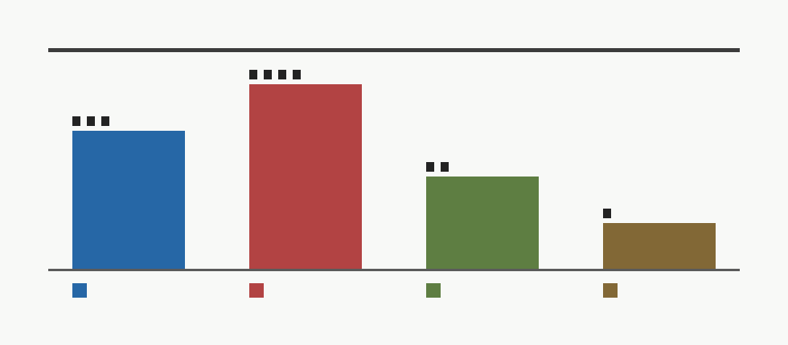

# Campaign Deferral Watchlist

M-DEFER-1 formalizes campaign closure under current evidence. It does not add a new reopen gate, does not introduce synthetic evidence, and does not alter the Phase 4 future reopen conjunction.

## Current Disposition

- `broad_fixed_frontier_model_physicalization`: rejected_under_current_evidence. Update cadence, yield, integration, and programmable-baseline burdens remain unclosed.
- `safety_filter_performance_or_economic_winner`: falsified_under_stronger_programmable_baseline. Equal-workload stronger-baseline replay gives the hybrid zero workload wins.
- `hybrid_architecture_and_prototype`: retained_as_architecture_failure_mode_evidence_scaffold. The architecture remains useful for interfaces, fallback, audit, and HDL closure studies.
- `phase4_reopen_pathway`: complete_but_inactive_absent_actual_measured_evidence. The validated lifecycle and uncertainty conjunction exists, but no current artifact satisfies it.
- `non_safety_target_classes_current_superiority`: no_calibrated_current_superiority_claim. M-ROBUST-1 found zero calibrated physicalized wins across the broader target classes.

## Do Not Reopen For

- synthetic traces
- local proxy timing
- vendor-only accelerator claims
- dry-run/intake/lifecycle templates
- production summaries without raw admissible package artifacts
- point crossings without uncertainty durability

## Reopen Evaluation Only For

- measured shadow/canary/production package satisfying Phase 4 lifecycle and uncertainty conditions
- updated public baseline evidence strong enough to materially change programmable accelerator assumptions
- actual toolchain/environment improvement that changes HDL closure evidence, such as compiled Verilator becoming available

## Machine-Readable Watchlist

| Trigger | Classification | Action scope | Owning milestone |
|---|---|---|---|
| `measured_shadow_or_canary_package` | inactive_reopen_trigger | performance_economic_reopen_existing_phase4_only | `M-PHASE4-SYNTH-1` |
| `measured_production_package` | inactive_reopen_trigger | performance_economic_reopen_existing_phase4_only | `M-PHASE4-SYNTH-1` |
| `programmable_baseline_public_update` | watch_baseline_refresh | model_refresh_only | `M-SWBASE-2` |
| `compiled_verilator_available` | prototype_verification_trigger | prototype_verification_only | `M-PROTO-1` |
| `hdl_design_scope_change` | prototype_verification_trigger | prototype_verification_only | `M-PROTO-1` |
| `new_stable_high-volume_target_evidence` | inactive_reopen_trigger | performance_economic_reopen_existing_phase4_only | `M-ROBUST-1` |
| `vendor_benchmark_only` | insufficient_substitute | no_reopen | `M-INGEST-1` |
| `synthetic_counterfactual_only` | insufficient_substitute | no_reopen | `M-PIPELINE-1` |
| `local_proxy_only` | insufficient_substitute | no_reopen | `M-MEASURE-1` |
| `template_or_dryrun_only` | insufficient_substitute | no_reopen | `M-DRYRUN-1` |

## Summary Controls

- `new_reopen_gate_count`: 0
- `current_superiority_claim_count`: 0
- `current_artifacts_reopen`: false
- `phase4_future_reopen_condition_unchanged`: true
