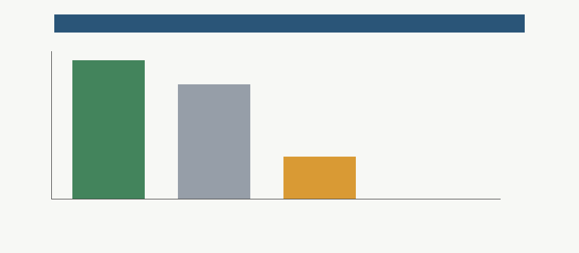

# Campaign Invariant Consistency Report

## Scope And Non-Scope

This checker audits representation consistency across canonical campaign summaries and reports. It does not modify source artifacts, create a new reopen gate, introduce a scientific criterion, or change the validated Phase 2 downgrade.

## Invariant Definitions

- `current_superiority_claim_count` must remain `0` where present.
- `actual_reopen_candidate_count` must remain `0` where present.
- `new_reopen_gate_count` must remain `0` where present.
- `current_artifacts_reopen` must remain `false` where present.
- `performance_claim_reopened` must remain `false` where present.

## Artifact Coverage

- Artifacts checked: 17
- JSON summaries checked: 8
- Markdown reports checked: 9

## JSON Field Agreement Results

- Contradictions: 0
- Field-absent/not-applicable rows: 19
- Consistent rows: 23

## Text Ambiguity Review

- Warning-level ambiguous text rows: 7
- `physicalized-weights/docs/campaign_closure_report.md`: line 19: - Phase 3 and Phase 4 built the measured evidence pathway: production trace schema, ingestion admissibility, replayable evidence packs, uncertainty durability, and lifecycle termin | line 37: The operative null was that software/runtime improvements and programmable accelerators capture the practical benefit before a fixed physical substrate can amortize substrate, upda | line 45: The architecture and prototype remain valuable as a bounded study of interfaces, fixed-policy versioning, confidence/fallback behavior, audit hooks, HDL equivalence, and closure cr
- `physicalized-weights/docs/campaign_deferral_watchlist.md`: line 16: - `safety_filter_performance_or_economic_winner`: falsified_under_stronger_programmable_baseline. Equal-workload stronger-baseline replay gives the hybrid zero workload wins. | line 19: - `non_safety_target_classes_current_superiority`: no_calibrated_current_superiority_claim. M-ROBUST-1 found zero calibrated physicalized wins across the broader target classes.
- `physicalized-weights/docs/campaign_executive_summary.md`: line 21: Full frontier fixed-weight physicalization is rejected under current evidence, and safety/filter performance superiority is falsified under the stronger equal-workload baseline. Sy
- `physicalized-weights/docs/final_synthesis.md`: line 15: Phase 2 supersedes the performance/economic part of that narrow positive result. `M-CAL-1`, `M-WORKLOAD-1`, and especially `M-SWBASE-2` show that, under current calibrated assumpti | line 23: If request volume is zero, there is no fixed-substrate win. If update cadence approaches weekly or daily, fixed weights lose unless they are reprogrammable enough to become a progr | line 70: | Software/runtime and programmable-accelerator baselines win large regions of the sampled model space. | modeled | `data/breakeven_summary.json`, `data/breakeven_grid.csv` | | line 82: `M-SWBASE-2` is the decisive downgrade. Replaying the exact workload rows against optimized software/runtime, programmable accelerator, and hybrid physicalized safety/filter produc | line 122: Phase 4 folds `M-ACQUIRE-1`, `M-DRYRUN-1`, `M-INTAKE-1`, `M-UNCERTAINTY-1`, and `M-LIFECYCLE-1` into the canonical campaign record. The current claim state is unchanged but now una
- `physicalized-weights/docs/phase2_synthesis_downgrade.md`: line 11: Under current calibrated assumptions and equal workload accounting, hybrid physicalized safety/filter wins zero workload scenarios. The stronger programmable accelerator wins nine  | line 15: Phase 2 status counts: `{"falsified": 1, "open": 0, "preserved": 6, "superseded": 1, "weakened": 1}`. The safety/filter performance/economic claim is `falsified`; the target-rankin | line 22: | Safety/filter classifier physicalization is a performance or economic winner over strong programmable baselines. | provisionally_supported | falsified | modeled | Identical-workl | line 27: | Phase 1 safety/filter target ranking remains a sufficient reason to claim hardware superiority. | supported | superseded | modeled | A new target-ranking pass must include strong | line 33: - `M-SWBASE-2`: winner counts `{"optimized_software_runtime": 1, "programmable_accelerator": 9}`; hybrid workload wins `0`.
- `physicalized-weights/docs/phase4_reopen_lifecycle_synthesis.md`: line 16: - Safety/filter performance superiority remains falsified against stronger programmable baselines. | line 31: - `phase2_performance_superiority_falsified`: Safety/filter performance and economic superiority remains falsified against the stronger programmable accelerator baseline. | line 36: - `intake_rehearsal_is_non_evidence`: Intake rehearsal proves handoff mechanics and replay delegation, but rehearsal packages are not current measured evidence.
- `physicalized-weights/docs/target_robustness_stress_test.md`: line 23: Zero request volume, all-fallback routing, high update cadence for anti-targets, low utilization, and absent measured evidence are robust blockers. `decoder_dense_weights`, `attent

## Contradictions Or Warnings

- No machine-readable endpoint contradictions were found.

## No New Gate

This checker is consistency QA only and does not create a new reopen gate. Future performance/economic reopening still requires measured production, shadow, or canary evidence plus lifecycle, provenance, privacy, threshold, and uncertainty gates from the validated Phase 4 conjunction.
