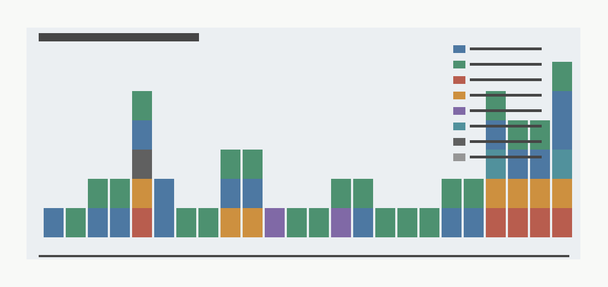

# Closure Archive Index

## Purpose And Scope

This index is a handoff artifact for the validated campaign endpoint. It maps canonical closure and evidence-chain artifacts to milestone owner, artifact class, byte size, SHA-256 hash, and regeneration command where applicable. It does not add a model, reopen gate, synthetic evidence path, or current superiority claim.

## Canonical Endpoint Artifacts

| Artifact | Milestone | Class | Size | SHA-256 |
|---|---|---:|---:|---|
| `physicalized-weights/docs/taxonomy_and_null.md` | `M-TAX-1` | report | 8891 | `de468fb925fa...` |
| `physicalized-weights/data/breakeven_summary.json` | `M-MODEL-1` | summary_data | 25328 | `a32d851d578f...` |
| `physicalized-weights/data/target_scores_summary.json` | `M-TARGET-1` | summary_data | 14604 | `f25a6dbeacb0...` |
| `physicalized-weights/docs/target_ranking.md` | `M-TARGET-1` | report | 9092 | `cd8f4d42ae5e...` |
| `physicalized-weights/docs/hybrid_safety_filter_architecture.md` | `M-ARCH-1` | report | 11391 | `19b6258d0c2e...` |
| `physicalized-weights/data/hybrid_arch_summary.json` | `M-ARCH-1` | summary_data | 11623 | `ab48ac7870f2...` |
| `physicalized-weights/data/prototype_verification_closure.json` | `M-PROTO-1` | summary_data | 3821 | `2eeed47545b5...` |
| `physicalized-weights/data/hdl_sim_results.csv` | `M-PROTO-1` | evidence_data | 598 | `0246f1f8e588...` |
| `physicalized-weights/docs/prototype_verification_closure.md` | `M-PROTO-1` | report | 2964 | `718b13a04425...` |
| `physicalized-weights/hdl/safety_filter_core.sv` | `M-PROTO-1` | hdl_source | 1607 | `0e8c8bf40b62...` |
| `physicalized-weights/data/safety_filter_core_netlist.png` | `M-PROTO-1` | figure | 335518 | `979ad443f5be...` |
| `physicalized-weights/docs/final_synthesis.md` | `M-FINAL-1` | report | 19095 | `4e0b55d569e0...` |
| `physicalized-weights/docs/reproducibility.md` | `M-FINAL-1` | report | 8385 | `7bbc0be0ef28...` |
| `physicalized-weights/data/calibrated_breakeven_summary.json` | `M-CAL-1` | summary_data | 2437 | `50399b1c18b2...` |
| `physicalized-weights/data/workload_summary.json` | `M-WORKLOAD-1` | summary_data | 10784 | `48b9b318d651...` |
| `physicalized-weights/data/stronger_baseline_summary.json` | `M-SWBASE-2` | summary_data | 2561 | `025bbe6014df...` |
| `physicalized-weights/docs/stronger_baseline_comparison.md` | `M-SWBASE-2` | report | 3517 | `debcd9f4b89e...` |
| `physicalized-weights/data/stronger_baseline_workload_comparison.png` | `M-SWBASE-2` | figure | 5232 | `5145fa6409f2...` |
| `physicalized-weights/data/phase2_synthesis_summary.json` | `M-SYNTH-2` | summary_data | 1535 | `eeadcb2bdd6f...` |
| `physicalized-weights/docs/phase2_synthesis_downgrade.md` | `M-SYNTH-2` | report | 5103 | `58841894327d...` |
| `physicalized-weights/data/phase2_evidence_map.png` | `M-SYNTH-2` | figure | 4166 | `fb97b283a3a4...` |
| `physicalized-weights/data/production_trace_schema.json` | `M-TRACE-1` | schema | 5056 | `0ec4f128b708...` |
| `physicalized-weights/data/reopen_thresholds_summary.json` | `M-REOPEN-1` | summary_data | 3213 | `f1d29788c312...` |
| `physicalized-weights/data/reopen_pipeline_summary.json` | `M-PIPELINE-1` | summary_data | 865 | `4c129122d220...` |
| `physicalized-weights/data/evidence_pack_manifest_schema.json` | `M-EVIDENCEPACK-1` | schema | 1149 | `bb14c90a1745...` |
| `physicalized-weights/data/evidence_pack_replay_summary.json` | `M-EVIDENCEPACK-1` | summary_data | 1066 | `5486804032fa...` |
| `physicalized-weights/data/phase3_reopen_summary.json` | `M-PHASE3-SYNTH-1` | summary_data | 1780 | `b0ef34f92699...` |
| `physicalized-weights/docs/phase3_reopen_pathway_summary.md` | `M-PHASE3-SYNTH-1` | report | 4979 | `1ccddf63d4df...` |
| `physicalized-weights/data/evidence_acquisition_readiness_summary.json` | `M-ACQUIRE-1` | summary_data | 1641 | `3cf452853643...` |
| `physicalized-weights/data/evidence_pack_dryrun_summary.json` | `M-DRYRUN-1` | summary_data | 2250 | `19d3436f5d11...` |
| `physicalized-weights/data/evidence_pack_intake_rehearsal_summary.json` | `M-INTAKE-1` | summary_data | 1657 | `04aee29e4590...` |
| `physicalized-weights/data/reopen_uncertainty_summary.json` | `M-UNCERTAINTY-1` | summary_data | 1655 | `a3f0f7ca9b1c...` |
| `physicalized-weights/docs/measured_reopen_uncertainty_protocol.md` | `M-UNCERTAINTY-1` | report | 3008 | `1764e1f318bd...` |
| `physicalized-weights/data/evidence_package_lifecycle_summary.json` | `M-LIFECYCLE-1` | summary_data | 2870 | `fd459b71dca6...` |
| `physicalized-weights/docs/evidence_package_lifecycle_state_machine.md` | `M-LIFECYCLE-1` | report | 3297 | `c65824476032...` |
| `physicalized-weights/data/phase4_reopen_summary.json` | `M-PHASE4-SYNTH-1` | summary_data | 2650 | `862b1849d70d...` |
| `physicalized-weights/data/phase4_reopen_claim_matrix.csv` | `M-PHASE4-SYNTH-1` | evidence_data | 3703 | `f0b57bb1e06b...` |
| `physicalized-weights/data/phase4_reopen_manifest.csv` | `M-PHASE4-SYNTH-1` | manifest | 6250 | `9da79bf49029...` |
| `physicalized-weights/docs/phase4_reopen_lifecycle_synthesis.md` | `M-PHASE4-SYNTH-1` | report | 5189 | `3f11d3854d80...` |
| `physicalized-weights/data/phase4_reopen_lifecycle_flow.png` | `M-PHASE4-SYNTH-1` | figure | 4391 | `0347bcd5f02e...` |
| `physicalized-weights/data/target_robustness_summary.json` | `M-ROBUST-1` | summary_data | 1700 | `b0b3eeb0219a...` |
| `physicalized-weights/data/target_robustness_results.csv` | `M-ROBUST-1` | evidence_data | 9745 | `f74d157ffc5f...` |
| `physicalized-weights/docs/target_robustness_stress_test.md` | `M-ROBUST-1` | report | 2438 | `264f678af44c...` |
| `physicalized-weights/data/target_robustness_frontier.png` | `M-ROBUST-1` | figure | 4441 | `33c14e536f67...` |
| `physicalized-weights/data/campaign_deferral_watchlist_summary.json` | `M-DEFER-1` | summary_data | 3493 | `5240066e4def...` |
| `physicalized-weights/data/campaign_deferral_watchlist_results.csv` | `M-DEFER-1` | evidence_data | 6852 | `3ee5e4201f6b...` |
| `physicalized-weights/docs/campaign_deferral_watchlist.md` | `M-DEFER-1` | report | 3389 | `59cfc99e0294...` |
| `physicalized-weights/data/campaign_deferral_watchlist.png` | `M-DEFER-1` | figure | 3782 | `23db03dd5a47...` |
| `physicalized-weights/data/campaign_closure_summary.json` | `M-CLOSURE-1` | summary_data | 2615 | `d25eb5d79b1b...` |
| `physicalized-weights/data/campaign_closure_claim_disposition.csv` | `M-CLOSURE-1` | evidence_data | 2772 | `3e5c9f7c9093...` |
| `physicalized-weights/data/campaign_closure_manifest.csv` | `M-CLOSURE-1` | manifest | 5117 | `ea1850f228d6...` |
| `physicalized-weights/docs/campaign_closure_report.md` | `M-CLOSURE-1` | report | 6116 | `41576f1b6d60...` |
| `physicalized-weights/docs/campaign_executive_summary.md` | `M-CLOSURE-1` | report | 1717 | `41d306bb2872...` |
| `physicalized-weights/data/campaign_closure_evidence_flow.png` | `M-CLOSURE-1` | figure | 4432 | `e5c96e8b850b...` |

## Reproduction Commands

Run from `<workspace>`:

```bash
python3 physicalized-weights/scripts/build_closure_archive_index.py
python3 physicalized-weights/tests/test_closure_archive_index.py
file physicalized-weights/data/closure_archive_coverage.png
python3 -m long_exposure.tools.promise_check .
python3 -m long_exposure.tools.org_check .
```

## Integrity Checks

- `canonical_artifact_count`: 54
- `missing_canonical_artifact_count`: 0
- `zero_size_canonical_artifact_count`: 0
- Manifest CSV: `physicalized-weights/data/closure_archive_manifest.csv`
- Manifest JSON: `physicalized-weights/data/closure_archive_manifest.json`
- Summary JSON: `physicalized-weights/data/closure_archive_summary.json`



## Known Non-Blocking Warnings

- `orphan_cycle_reports` from `promise_check`: reports/cycles/report_cycles_* (pre_existing_noncanonical). Generated cycle reports are outside the curated closure archive and remain non-blocking.
- `root_prompt_and_log` from `org_check`: physicalized_model_weights_long_exposure_prompt.md; physicalized_weights_long_exposure_live.log (pre_existing_noncanonical). The original prompt and live log remain root-level directive artifacts and are not archive failures.

## Current Evidence Disposition Invariants

- `current_superiority_claim_count = 0`
- `actual_reopen_candidate_count = 0`
- `new_reopen_gate_count = 0`
- `current_artifacts_reopen = false`

Synthetic, proxy, template, rehearsal, vendor-only, and dry-run artifacts may appear as prior fixtures or controls, but this archive does not label them as measured production evidence.
