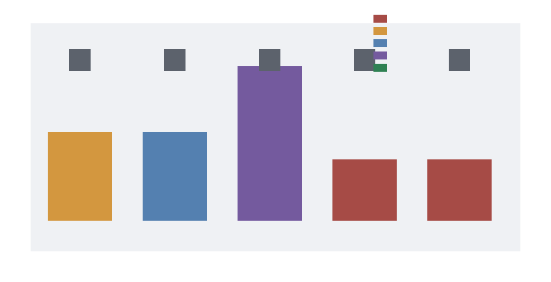

# Evidence-pack replay harness

M-EVIDENCEPACK-1 packages candidate future trace evidence into a replayable manifest. The harness verifies manifest completeness, schema version, trace SHA-256, privacy attestation, provenance attestation, manifest-to-trace consistency, ingestion-path declaration, threshold scenario mapping, and then delegates the downstream decision to the M-PIPELINE-1 gate. It packages evidence; it does not lower the reopen standard.

Required manifest fields are `pack_id`, `schema_version`, `created_at_utc`, `trace_schema_version`, `trace_file`, `trace_sha256`, `ingestion_path_id`, `evidence_source_type`, `measurement_status`, `provenance_attestation`, `threshold_scenario_id`, `pipeline_expected_status`, and `privacy_attestation`. A package can become an actual reopen candidate only if the package preconditions and the downstream gate are both satisfied: valid package, hash match, schema compatibility, known threshold scenario, valid trace, admissible ingestion path, measured terms, production/shadow/canary source, provenance attestation, and threshold crossing.

## Replay Results

- `valid_synthetic_proxy`: package `valid_package`, pipeline `valid_but_insufficient`, final `valid_but_insufficient`, blockers `pipeline:trace_status=valid_but_insufficient|ingestion_class=valid_but_insufficient|measured_terms=false|source_type=synthetic|threshold_crossed=false`.
- `shadow_non_crossing`: package `valid_package`, pipeline `threshold_evaluable_not_crossed`, final `threshold_evaluable_not_crossed`, blockers `pipeline:threshold_crossed=false`.
- `synthetic_counterfactual_crossed`: package `valid_package`, pipeline `synthetic_counterfactual_crossed`, final `synthetic_counterfactual_crossed`, blockers `pipeline:ingestion_class=threshold_evaluable_if_measured|source_type=synthetic`.
- `missing_provenance_attestation`: package `invalid_package`, pipeline `not_run`, final `package_invalid`, blockers `provenance_attestation=false|manifest_trace_mismatch:provenance_attestation`.
- `bad_trace_hash`: package `invalid_package`, pipeline `not_run`, final `package_invalid`, blockers `trace_sha256_mismatch`.

## Interpretation

The committed fixtures are privacy-safe stand-ins and report `actual_reopen_candidate_count = 0`. The bad-hash and missing-attestation packages are rejected before threshold evaluation, while the synthetic counterfactual reaches the threshold-crossed arithmetic branch but remains non-actual because its source and ingestion path are not eligible production evidence. Future measured production, shadow, or canary packages must pass the same manifest and downstream gates before they can challenge the Phase 2 downgrade.
