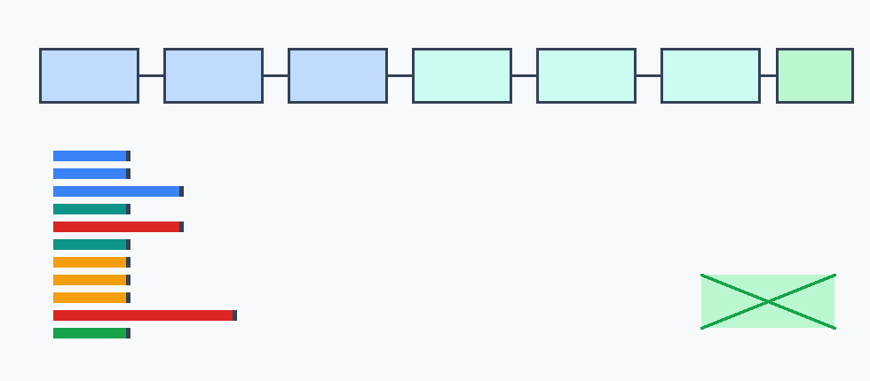

# Evidence-Package Lifecycle State Machine

M-LIFECYCLE-1 composes the already validated acquisition, dry-run, intake, evidence-pack replay, threshold, and uncertainty gates into a deterministic state machine. It does not replace the upstream validators; it consumes normalized gate outcomes and records which validated milestone owns each terminal state.

Only measured, privacy-safe, provenance-attested production, shadow-production, or canary-production packages with preserved hashes, known threshold mappings, measured terms, point threshold crossing, and `UCB_alpha(hybrid_total - best_programmable_total) < 0` can reach `actual_reopen_candidate`.

## States

| State | Owning gate | Meaning |
|---|---|---|
| `design_screened` | `M-ACQUIRE-1` | Design was inspected before collection but is not yet collection-ready evidence. |
| `collection_ready_not_evidence` | `M-ACQUIRE-1` | M-ACQUIRE-1 says a collection design can proceed; no measured package exists. |
| `dryrun_ready_not_evidence` | `M-DRYRUN-1` | M-DRYRUN-1 templates are complete but contain placeholders or no measured rows. |
| `intake_rehearsed_not_evidence` | `M-INTAKE-1` | M-INTAKE-1 handoff mechanics are preserved using synthetic-safe rehearsal rows. |
| `replay_valid_nonactual` | `M-EVIDENCEPACK-1` | Replay can diagnose the package, but source or measured-term gates remain nonactual. |
| `replay_blocked` | `M-EVIDENCEPACK-1` | Evidence-pack integrity, hash, threshold mapping, or replay contract failed before threshold evaluation. |
| `threshold_evaluable_not_crossed` | `M-REOPEN-1` | Measured package can be evaluated, but M-REOPEN-1 threshold is not crossed. |
| `threshold_crossed_nonactual` | `M-REOPEN-1` | Point threshold crossed, but source or package actuality gates block reopening. |
| `uncertainty_inconclusive` | `M-UNCERTAINTY-1` | Point threshold crossed, but M-UNCERTAINTY-1 UCB rule is not durable. |
| `statistically_durable_nonactual` | `M-UNCERTAINTY-1` | Uncertainty rule is favorable, but the package is synthetic/proxy/template/rehearsal/nonactual. |
| `actual_reopen_candidate` | `M-UNCERTAINTY-1` | All package, source, threshold, and uncertainty gates pass for a measured actual source. |
| `blocked_invalid_or_unsafe` | `M-EVIDENCEPACK-1/M-REOPEN-1` | Privacy/provenance, zero-volume, all-fallback, or other unsafe invalid cases block evaluation. |

## Ordering

The automaton stops readiness artifacts before replay, stops stale hashes and unknown threshold mappings before threshold evaluation, stops zero-volume and all-fallback cases before margin credit, stops nonactual sources before actual candidacy, and stops noisy point crossings at the uncertainty gate.

## Current Result

`actual_reopen_candidate_count` for current/synthetic/template/proxy/rehearsal artifacts is `0`.
`hypothetical_actual_candidate_control_count` is `1`; that row is a labeled positive-control branch, not current evidence.
