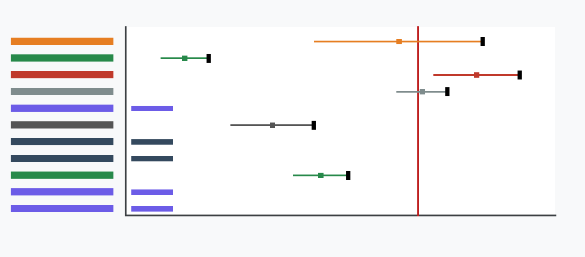

# Measured Reopen Uncertainty Protocol

M-UNCERTAINTY-1 refines the future reopen rule from a point inequality to a confidence-bound decision. The operative quantity is `D = H - B`, where `H` is the measured hybrid total and `B` is the measured best programmable baseline total under identical workload, fallback, audit, update, utilization, latency, and energy accounting.

The uncertainty-aware rule is:

`UCB_alpha(D) = delta_mean + z_alpha * sigma_delta < 0`

with:

`delta_mean = hybrid_total_mean - best_programmable_total_mean`

`sigma_delta = sqrt(sigma_hybrid^2 + sigma_baseline^2 - 2*rho*sigma_hybrid*sigma_baseline + sigma_workload_mix^2 + sigma_meter^2)`

This is necessary but not sufficient. A future package must also satisfy all existing Phase 3 gates: valid package, hash match, schema compatibility, known threshold scenario, valid trace, admissible ingestion path, measured terms, production/shadow/canary source, provenance attestation, privacy attestation, threshold crossing, nonzero request volume, and nonzero accepted fast-path volume. Synthetic, proxy, template, dry-run, readiness, and intake-rehearsal artifacts remain non-actual even when the statistical interval is favorable.

## Uncertainty Sources

- Sample variance: finite trace windows make both `H` and `B` estimated totals.
- Meter calibration error: power, timing, and counter calibration uncertainty contributes to `sigma_meter`.
- Correlated measurement error: shared traffic, feature extraction, audit, or instrumentation can be represented by `rho`; high-correlation cancellation requires explicit shared-instrumentation attestation, cancels only the explicitly shared component, and never cancels missing or independent path variance.
- Workload mix uncertainty: sampling or replay mismatch across request classes contributes to `sigma_workload_mix`.
- Missing baseline uncertainty: absent programmable-baseline variance blocks evaluation rather than becoming zero.
- Guardrail-telemetry uncertainty: missing health, drift, audit, or fallback telemetry blocks evaluation because accepted fast-path credit is not trustworthy.

## Current Synthetic-Safe Evaluation

The classifier evaluates 11 synthetic-safe scenarios. It reports `actual_reopen_candidate_count = 0`.

## Interpretation

No current artifact reopens the Phase 2 downgrade. The added layer is discriminating: small point crossings with intervals overlapping zero are blocked, large synthetic/control crossings can be identified as statistically durable while still non-actual, and zero-volume, all-fallback, missing-uncertainty, and non-actual-source cases preserve the prior Phase 3 blockers.
