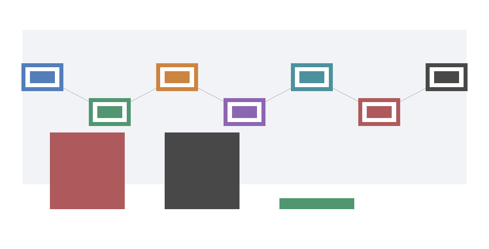

# Phase 3 Reopen-Pathway Summary

Phase 3 closes the reopen evidence pathway without reopening the Phase 2 downgrade. The integrated result is explicit: current evidence remains downgraded, and physicalized safety/filter is not a current performance/economic winner over the strong programmable accelerator baseline.

The future reopen condition is conjunctive:

```text
valid_package ∧ hash_match ∧ schema_compatible ∧ known_threshold_scenario ∧ valid_trace ∧ admissible_ingestion_path ∧ measured_terms ∧ production_or_shadow_or_canary_source ∧ provenance_attestation ∧ privacy_attestation ∧ threshold_crossed
```

No current committed artifact satisfies that conjunction. The current `actual_reopen_candidate_count` is `0` across the end-to-end gate and evidence-pack replay layers.



## Integrated Gate Chain

- `P3-C1`: No current artifact reopens the Phase 2 downgrade or makes safety/filter physicalization a current performance/economic winner.
- `P3-C2`: M-MEASURE-1 decomposes overheads but cannot reopen the downgraded claim.
- `P3-C3`: M-TRACE-1 makes schema validity necessary but not sufficient for reopening.
- `P3-C4`: M-REOPEN-1 provides finite thresholds for eight scenarios and unreopenable controls for zero-volume/all-fallback cases.
- `P3-C5`: M-INGEST-1 identifies only shadow production dual-run and canary A/B dual-instrumented paths as future candidate paths.
- `P3-C6`: M-PIPELINE-1 keeps synthetic numeric threshold crossing from becoming actual reopen evidence.
- `P3-C7`: M-EVIDENCEPACK-1 rejects malformed packages before threshold evaluation and preserves zero current actual reopen candidates.

## Blocked Evidence Classes

- `synthetic`: eligible source and ingestion path gates; example `physicalized-weights/data/evidence_pack_synthetic_counterfactual_manifest.json`.
- `proxy/local`: measured_terms gate; example `physicalized-weights/data/evidence_pack_valid_synthetic_manifest.json`.
- `vendor-only`: counterfactual workload and admissible ingestion gates; example `physicalized-weights/data/trace_ingestion_path_scores.csv`.
- `privacy-risk`: privacy/schema gate; example `physicalized-weights/data/pipeline_trace_invalid_privacy.csv`.
- `stale-hash`: valid_package and hash_match gates; example `physicalized-weights/data/evidence_pack_bad_hash_manifest.json`.
- `unknown-threshold`: known_threshold_scenario gate; example `physicalized-weights/scripts/evidence_pack_replay.py`.
- `non-crossing measured packages`: threshold_crossed gate; example `physicalized-weights/data/evidence_pack_shadow_non_crossing_manifest.json`.

## Replay From One Place

Run these commands from `<workspace>` to reproduce the Phase 3 chain:

```bash
python3 physicalized-weights/scripts/local_overhead_benchmark.py
python3 physicalized-weights/scripts/production_trace_validator.py physicalized-weights/data/example_production_trace_valid.csv physicalized-weights/data/example_production_trace_invalid.csv
python3 physicalized-weights/scripts/reopen_thresholds.py
wolfram-batch -script physicalized-weights/scripts/symbolic_reopen_thresholds.wls
python3 physicalized-weights/scripts/trace_ingestion_path_evaluator.py
python3 physicalized-weights/scripts/reopen_pipeline_demo.py
python3 physicalized-weights/scripts/evidence_pack_replay.py
python3 physicalized-weights/scripts/build_phase3_reopen_synthesis.py
```

Then run:

```bash
python3 physicalized-weights/tests/test_local_overhead_benchmark.py
python3 physicalized-weights/tests/test_production_trace_validator.py
python3 physicalized-weights/tests/test_reopen_thresholds.py
python3 physicalized-weights/tests/test_trace_ingestion_path_evaluator.py
python3 physicalized-weights/tests/test_reopen_pipeline_demo.py
python3 physicalized-weights/tests/test_evidence_pack_replay.py
python3 physicalized-weights/tests/test_phase3_reopen_synthesis.py
file physicalized-weights/data/phase3_reopen_evidence_flow.png
python3 -m long_exposure.tools.promise_check .
python3 -m long_exposure.tools.org_check .
```

## Interpretation

The accepted future class is narrow: a replayable package with integrity-matched traces, schema compatibility, known threshold scenario, valid trace status, admissible ingestion path, measured terms, eligible production/shadow/canary source, provenance and privacy attestations, and a measured threshold crossing. Synthetic counterfactuals, proxy/local measurements, vendor-only benchmarks, privacy-risk traces, stale hashes, unknown thresholds, and non-crossing measured packages are useful diagnostics, but they cannot challenge the Phase 2 downgrade.
