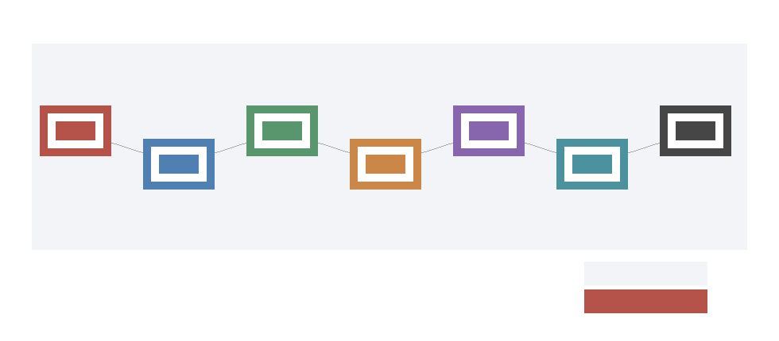

# Phase 4 Reopen Lifecycle Synthesis

Phase 4 refreshes the canonical campaign record after acquisition readiness, operator dry-run, intake rehearsal, uncertainty margins, and lifecycle closure. It does not add a new gate. It consolidates the validated monotone conjunction that a future package must satisfy before it can challenge the Phase 2 downgrade.

Current claim state:

- Broad/full fixed frontier-model physicalization remains rejected.
- Safety/filter performance superiority remains falsified against stronger programmable baselines.
- The hybrid safety/filter architecture remains useful as a failure-mode and evidence-scaffold study.
- Current committed artifacts report `actual_reopen_candidate_count = 0` and `current_artifacts_reopen = false`.
- The lifecycle positive branch count is `1`, and that branch is a hypothetical control only.

Future reopening requires this full conjunction:

```text
valid_package && hash_match && schema_compatible && known_threshold_scenario && valid_trace && admissible_ingestion_path && measured_terms && production_or_shadow_or_canary_source && provenance_attestation && privacy_attestation && nonzero_request_volume && nonzero_accepted_fast_path_volume && measured_best_programmable_baseline && threshold_crossed && UCB_alpha(H - B) < 0 && lifecycle_terminal_state=actual_reopen_candidate
```



## Claim Matrix

- `phase2_performance_superiority_falsified`: Safety/filter performance and economic superiority remains falsified against the stronger programmable accelerator baseline.
- `hybrid_architecture_still_valid_as_failure_mode_study`: The hybrid safety/filter block remains useful as a bounded architecture, failure-mode, and evidence-scaffold study.
- `production_measurement_required`: Local proxies decompose overheads, but future reopening requires measured production, shadow, or canary latency, energy, utilization, and baseline terms.
- `evidence_pack_replay_required`: Future traces must pass manifest integrity, schema, source, ingestion, provenance, privacy, and downstream replay gates.
- `operator_dryrun_is_non_evidence`: Operator templates and dry-run acceptance checks are collection preparation only and cannot reopen the Phase 2 downgrade.
- `intake_rehearsal_is_non_evidence`: Intake rehearsal proves handoff mechanics and replay delegation, but rehearsal packages are not current measured evidence.
- `uncertainty_margin_required`: A point threshold crossing is insufficient; future reopening also requires UCB_alpha(H - B) < 0.
- `lifecycle_candidate_branch_is_hypothetical_only`: The single candidate branch is a labeled hypothetical positive control and is excluded from current artifact reopen counts.
- `current_artifacts_do_not_reopen`: Current committed artifacts have actual_reopen_candidate_count=0 and current_artifacts_reopen=false.
- `future_reopen_condition`: valid_package && hash_match && schema_compatible && known_threshold_scenario && valid_trace && admissible_ingestion_path && measured_terms && production_or_shadow_or_canary_source && provenance_attestation && privacy_attestation && nonzero_request_volume && nonzero_accepted_fast_path_volume && measured_best_programmable_baseline && threshold_crossed && UCB_alpha(H - B) < 0 && lifecycle_terminal_state=actual_reopen_candidate

## Lifecycle Link

`M-LIFECYCLE-1` defines the terminal states used here, including `collection_ready_not_evidence`, `dryrun_ready_not_evidence`, `intake_rehearsed_not_evidence`, `replay_valid_nonactual`, `threshold_crossed_nonactual`, `uncertainty_inconclusive`, `statistically_durable_nonactual`, and `actual_reopen_candidate`. The Phase 4 synthesis keeps the hypothetical `actual_reopen_candidate` branch separate from current evidence.

## Replay

Run from `<workspace>`:

```bash
python3 physicalized-weights/scripts/evidence_acquisition_readiness.py
python3 physicalized-weights/scripts/evidence_pack_template_dryrun.py
python3 physicalized-weights/scripts/evidence_pack_intake_rehearsal.py
python3 physicalized-weights/scripts/reopen_uncertainty_protocol.py
python3 physicalized-weights/scripts/evidence_package_lifecycle.py
python3 physicalized-weights/scripts/build_phase4_reopen_synthesis.py
```

Then validate:

```bash
python3 physicalized-weights/tests/test_evidence_acquisition_readiness.py
python3 physicalized-weights/tests/test_evidence_pack_template_dryrun.py
python3 physicalized-weights/tests/test_evidence_pack_intake_rehearsal.py
python3 physicalized-weights/tests/test_reopen_uncertainty_protocol.py
python3 physicalized-weights/tests/test_evidence_package_lifecycle.py
python3 physicalized-weights/tests/test_phase4_reopen_synthesis.py
file physicalized-weights/data/phase4_reopen_lifecycle_flow.png
python3 -m long_exposure.tools.promise_check .
python3 -m long_exposure.tools.org_check .
```
