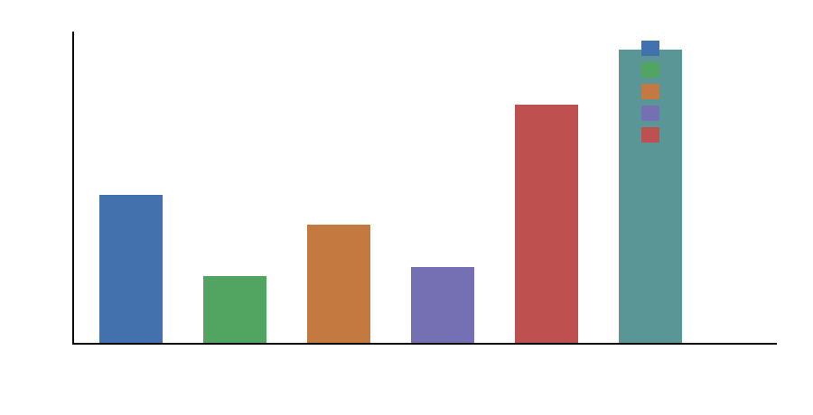

# Production Measurement Requirements

`M-SYNTH-2` falsified the current safety/filter performance/economic superiority claim. This cycle does not reopen it; it defines the evidence contract required before it can be reconsidered.

## Required Measurements

| quantity | status | production requirement |
|---|---:|---|
| feature_extraction_latency_per_request | locally_measured_proxy | measure in serving stack on identical request features |
| feature_extraction_energy_per_request | production_required | instrument platform power or accelerator counters for feature extraction |
| audit_serialization_logging_latency | locally_measured_proxy | measure production audit serialization, storage, sync, and retention path |
| audit_storage_cost | production_required | measure bytes retained, storage tier, replication, and compliance retention |
| fallback_dispatch_latency_and_queueing | locally_measured_proxy | measure fallback queue depth and dispatch latency under load |
| optimized_software_classifier_latency | locally_measured_proxy | measure optimized implementation on target serving hardware |
| optimized_software_classifier_energy | production_required | measure energy per accepted request for optimized software baseline |
| programmable_accelerator_latency | production_required | measure accelerator latency including batching and host transfer |
| programmable_accelerator_energy | production_required | measure accelerator energy with identical features, audit, fallback accounting |
| programmable_accelerator_utilization_batching | production_required | measure utilization, batch size, occupancy, and queueing behavior |
| hybrid_control_plane_latency | modeled_from_prior_artifact | measure register/control path and failure-mode routing in a real integration |
| update_cadence_rollback_policy_churn | modeled_from_prior_artifact | collect production policy update, rollback, drift, health alarm rates |
| durable_hybrid_margin_vs_best_baseline | not_measured | compute after all production software, accelerator, feature, audit, fallback, update, and utilization measurements exist |

## Local Proxy Harness

The benchmark emits local host/Python timing proxies for feature extraction, fixed classifier evaluation, optimized software classifier evaluation, route/fallback decision, audit serialization, and append-only audit write. Results are in `physicalized-weights/data/local_overhead_benchmark.csv` and `physicalized-weights/data/local_overhead_summary.json`.

## Reopen Criteria

Hybrid physicalization can only be reconsidered if measured optimized software and programmable accelerator baselines lose to hybrid under identical feature extraction, audit, fallback, update, utilization, latency, and energy accounting. The margin must remain positive after uncertainty on production-only quantities, especially accelerator energy/latency, batching behavior, utilization, fallback queueing, and audit storage cost.

## Interpretation

Local timing can decompose control overheads but cannot establish production accelerator energy or durable economic advantage. In this run, control overhead dominance is `True` because median feature extraction, routing, audit serialization, or audit write proxies exceed the fixed classifier proxy in at least one component aggregate. Accelerator energy status is `production_required`.
