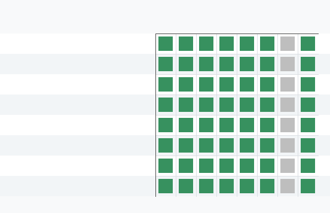

# Prototype Verification Closure

## Scope

This closure addresses only the verification gap in `M-PROTO-1`: compiled Verilator simulation was requested for the tiny safety-filter HDL core, but the local environment cannot build the generated simulator. The classifier weights, vector set, fallback policy, architecture boundary, and baseline comparison are held constant.

## Verilator Gap

Compiled Verilator was requested originally to add an independent executable check of `hdl/safety_filter_core.sv` against the Python golden vectors. The local probe found `/usr/bin/verilator`, `/usr/bin/yosys`, and `/usr/bin/dot`, but no `make` and no C++ compiler in `PATH`. The recorded Verilator build log contains `make: not found` and exits with code 127 after lint, so the failure is a local build-tool constraint rather than an HDL mismatch.

## Amended Evidence Contract

For this specific core, Verilator lint plus Yosys eval/synthesis plus Python golden equivalence is sufficient to close `M-PROTO-1` because the HDL contains no clock, no reset, no memories, no handshake timing, and no mutable policy state. The core is fixed localparam weights, a signed int8 dot product, a threshold compare, and a margin/confidence output. Yosys eval exercises the emitted vector set directly against the RTL, while the Python golden model and prototype CSVs provide the expected scores, decisions, margins, and confidence values.

The closure script records hashes for the HDL source, Python source, emitted vectors, Yosys eval output, Verilator log, Yosys log, and Graphviz netlist artifacts. It also verifies that HDL parameters match the Python and summary parameters, that Yosys reports no memories/processes, and that the netlist DOT/PNG artifacts exist with nonzero size.

## Closure Result

`data/prototype_verification_closure.json` records `closure_status: validated` with evidence contract `amended_lint_yosys_eval_synthesis`. Compiled Verilator is not claimed to have passed; it is recorded as `blocked_make_unavailable`. The closure remains narrow: it validates this pure combinational fixed-weight core and does not validate a larger accelerator, control plane, or policy engine.

## Reopen Criteria

Reopen `M-PROTO-1` if compiled Verilator later runs and disagrees with Python or Yosys rows, if any Python/Yosys vector differs, if the HDL source hash changes without regenerated evidence, or if the HDL gains sequential state, memories, handshake timing, or data-dependent mutable policy logic. Missing or stale Verilator lint, Yosys synthesis, or Graphviz netlist evidence also invalidates this closure.
