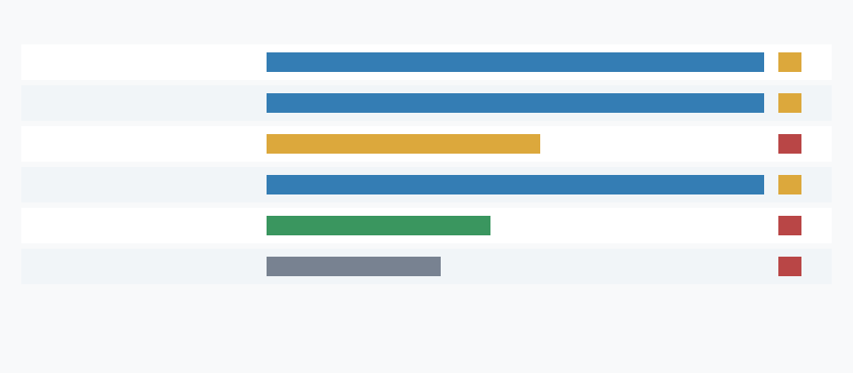

# Public Baseline Recency Report

## Scope And Method

This probe uses curated official/public sources rather than broad scraping. MLCommons pages and result repositories are primary evidence for public benchmark recency; the vendor page is secondary context for hardware naming and submitted-system interpretation only, not a primary calibration source.

## Latest Official Release

The latest official MLPerf Inference release identified here is MLPerf Inference v6.0, published 2026-04-01 [11]. It is newer than the campaign's earlier MLPerf documentation reference [10] and newer than the intermediate v5.1 release [12].

## Source Table

| source_id | ref | release | publisher | publication_date | role | machine_readable | directly usable | measured hybrid reopen |
|---|---:|---|---|---|---|---|---|---|
| mlperf_inference_docs | [10] | MLPerf Inference documentation | MLCommons | current | primary | partial | no | no |
| mlperf_inference_v60_results | [11] | MLPerf Inference v6.0 | MLCommons | 2026-04-01 | primary | linked_repository | partial | no |
| mlperf_inference_v51_results | [12] | MLPerf Inference v5.1 | MLCommons | 2025-09-09 | primary | linked_repository | partial | no |
| mlperf_inference_v60_repository | [13] | MLPerf Inference v6.0 | MLCommons | 2026-04-01 | primary | yes | partial | no |
| nvidia_mlperf_ai_benchmarks | [14] | MLPerf vendor context | NVIDIA | current | secondary | no | no | no |

## Delta Versus Campaign Assumptions

| baseline_dimension | materiality | directly_calibratable | recommended_action |
|---|---|---|---|
| official_release_recency | material | partial | future_model_refresh_recommended |
| programmable_accelerator_strength | material | partial | baseline_strengthened_no_claim_reopen |
| benchmark_workload_match | context_only | no | do_not_map_directly_to_safety_filter |
| machine_readable_public_data | material | partial | use_primary_repository_not_vendor_page |
| phase2_conclusion | preserves_endpoint | no | preserve_phase2_downgrade |
| phase4_reopen_path | not_reopen_evidence | no | actual_reopen_candidate_count_remains_zero |

## Calibration Impact

The public update is material enough to recommend a future programmable-baseline refresh, because the latest official MLCommons release and machine-readable v6.0 repository are newer than the campaign reference set and can refresh public accelerator priors. That recommendation is conditional: the public benchmark data are not directly the campaign's safety-filter workload, so they should not be copied into the calibrated model without an explicit mapping to feature extraction, audit, fallback, update cadence, utilization, energy, and latency terms.

## Effect On Phase 2 And Phase 4

The Phase 2 stronger-baseline conclusion is preserved and, if anything, public benchmark drift strengthens the null hypothesis around programmable accelerators. Public accelerator benchmark updates are not measured hybrid production, shadow, or canary evidence; they do not include the campaign hybrid path under identical workload accounting and cannot satisfy the Phase 4 measured hybrid reopen path. Endpoint counters remain zero/false: current_superiority_claim_count=0, actual_reopen_candidate_count=0, new_reopen_gate_count=0, and current_artifacts_reopen=false.
