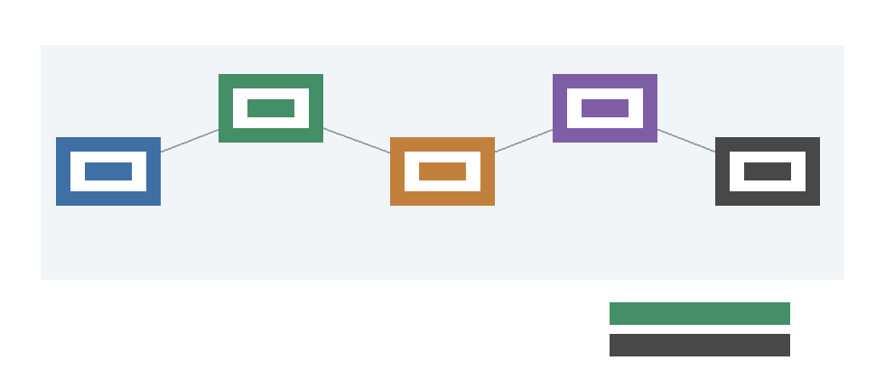

# Public Baseline Refresh Synthesis

This addendum exists after closure because `M-PUBLICBASE-1` found a materially changed public programmable-baseline condition and `M-PUBLICBASE-2` converted that condition into a conservative campaign mapping. It updates the reader-facing record without changing the measured hybrid reopen requirements.

`M-PUBLICBASE-1` found that the latest official MLPerf Inference release recorded here is `MLPerf Inference v6.0` from `2026-04-01`, and that the public update is material enough to record as programmable-baseline drift. `M-PUBLICBASE-2` ingested `12` primary MLCommons rows from `520` available rows, producing throughput-prior evidence only: direct energy calibration rows are `0` and direct safety-filter workload rows are `0`.

Claim impact:

- `public_mlperf_recency`: supported (primary_public_benchmark_recency). MLPerf Inference v6.0 is newer and material enough to record after closure.
- `programmable_null_strength`: strengthened_or_preserved (primary_public_benchmark_prior). Primary MLCommons rows produce 12 throughput-prior rows and effect strengthened_or_preserved.
- `direct_energy_calibration_from_public_mlperf`: unsupported (blocked_direct_energy_calibration). Direct energy calibration rows are 0; no energy value is inferred from throughput-only rows.
- `safety_filter_workload_comparability`: unsupported (non_comparable_public_workload). Direct safety-filter workload rows are 0; public benchmark rows do not measure the campaign workload.
- `phase2_downgrade_after_public_refresh`: preserved (conservative_synthesis). Public throughput-prior evidence affects B, not measured hybrid total H; the downgrade is preserved.
- `physicalized_reopen_from_public_benchmark`: falsified_public_benchmark_only (non_reopen_public_benchmark_context). Public benchmark-only evidence is not production, shadow, or canary measured hybrid evidence and cannot reopen the claim.
- `future_model_refresh_scope`: bounded_future_work (scope_boundary). A full model refresh is separate work; physicalized reopen still requires the unchanged Phase 4 condition.

The synthesis result is conservative: the programmable null is `strengthened_or_preserved`, the Phase 2 downgrade is preserved, and no public benchmark source reopens physicalized superiority. Public programmable benchmark progress can strengthen `B`, but it does not supply measured hybrid `H`.

Future work boundary:

- A full model refresh is separate work and should map primary public data into explicit model terms before changing calibrated assumptions.
- Physicalized claim reopening remains possible only through lifecycle-valid measured hybrid evidence satisfying the unchanged Phase 4 condition.

```text
valid_package && hash_match && schema_compatible && known_threshold_scenario && valid_trace && admissible_ingestion_path && measured_terms && production_or_shadow_or_canary_source && provenance_attestation && privacy_attestation && nonzero_request_volume && nonzero_accepted_fast_path_volume && measured_best_programmable_baseline && threshold_crossed && UCB_alpha(H - B) < 0 && lifecycle_terminal_state=actual_reopen_candidate
```


