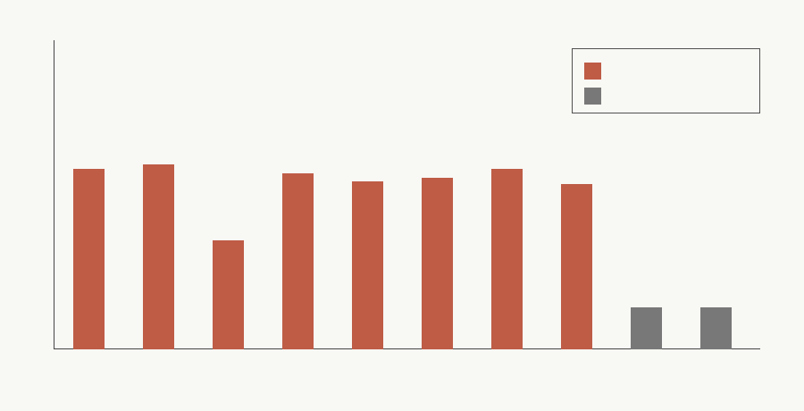

# Reopen Thresholds

A production trace can reopen the downgraded safety/filter performance claim only if:

`measured_hybrid_total < measured_best_programmable_baseline`

The comparison must use identical accepted-volume, fallback, audit, update, utilization, latency, and energy accounting. Current modeled/proxy rows do not reopen the claim; they only quantify how far measured production evidence would have to move.

## Terms and Units

- `measured_hybrid_total`: daily pJ-equivalent production cost for the hybrid fast path plus feature extraction, audit/control, fallback, update, fixed substrate, and utilization terms.
- `measured_best_programmable_baseline`: lower daily pJ-equivalent production cost of optimized software/runtime and programmable accelerator under the same request stream.
- `hybrid_margin_to_best_baseline`: `hybrid_total - best_baseline_total`; positive means the programmable baseline still wins.
- `required_hybrid_daily_reduction_to_tie`: positive margin the hybrid must remove to tie the best baseline.
- `required_best_baseline_daily_degradation_to_tie`: equal positive margin by which measured baseline cost would have to worsen.
- `required_accepted_fast_path_multiplier_to_tie`: fast-path volume multiplier when the current fallback pool can be shifted to accepted fast-path traffic; otherwise reported as non-finite.
- `maximum_fallback_frequency_for_reopen`, `maximum_audit_control_multiplier_for_reopen`, and `minimum_utilization_for_reopen`: one-variable thresholds holding other modeled terms fixed; non-finite labels mean that knob alone cannot close the gap.

## Special Cases

- Zero accepted fast-path volume: no reopen because the fixed path receives no useful credit.
- All fallback: no reopen because accepted fast-path volume is zero.
- Proxy-only energy: no reopen because M-TRACE-1 requires measured hybrid and accelerator energy.
- Missing accelerator baseline: no reopen because the best programmable baseline is undefined.
- Failed health, drift, or audit gates: no accepted fast-path credit.

## Current Threshold Readout

The formerly preserved `high_volume_stable_moderation` scenario requires `1471448845.624272` pJ-equivalent/day of hybrid reduction, or the same degradation in the best programmable baseline, before it can tie. Its current best baseline remains `programmable_accelerator` and the current evidence status is `modeled_proxy_not_measured_production`.

| scenario | class | best baseline | required reduction pJ-eq/day | fast-path multiplier | max fallback | min utilization |
|---|---:|---:|---:|---:|---:|---:|
| high_volume_stable_moderation | finite_threshold | programmable_accelerator | 1471448845.624272 | not_finite_exceeds_fallback_pool | not_finite_requires_negative_fallback | not_finite_fixed_cost_elimination_insufficient |
| bursty_consumer_traffic | finite_threshold | programmable_accelerator | 2485085352.027402 | not_finite_exceeds_fallback_pool | not_finite_requires_negative_fallback | not_finite_fixed_cost_elimination_insufficient |
| low_volume_enterprise_deployment | finite_threshold | programmable_accelerator | 320638.701573 | not_finite_exceeds_fallback_pool | not_finite_requires_negative_fallback | not_finite_fixed_cost_elimination_insufficient |
| high_near_threshold_adversarial | finite_threshold | programmable_accelerator | 797452597.822575 | not_finite_exceeds_fallback_pool | not_finite_requires_negative_fallback | not_finite_fixed_cost_elimination_insufficient |
| frequent_policy_update_regime | finite_threshold | programmable_accelerator | 325381375.528754 | not_finite_exceeds_fallback_pool | not_finite_requires_negative_fallback | not_finite_fixed_cost_elimination_insufficient |
| audit_heavy_regulated_deployment | finite_threshold | programmable_accelerator | 505622627.467455 | not_finite_exceeds_fallback_pool | not_finite_requires_negative_fallback | not_finite_fixed_cost_elimination_insufficient |
| fallback_degraded_outage_regime | finite_threshold | programmable_accelerator | 1409483322.001479 | not_finite_exceeds_fallback_pool | not_finite_requires_negative_fallback | not_finite_fixed_cost_elimination_insufficient |
| multi_tenant_underutilized_deployment | finite_threshold | programmable_accelerator | 250503258.369032 | not_finite_exceeds_fallback_pool | not_finite_requires_negative_fallback | not_finite_fixed_cost_elimination_insufficient |
| zero_invocation_control | unreopenable_zero_volume | optimized_software_runtime | 42000000001283.336 | not_finite_no_accepted_fast_path_volume | not_finite_no_volume | not_derivable_no_fixed_utilization_term |
| fallback_all_control | unreopenable_all_fallback | programmable_accelerator | 948037179.803857 | not_finite_no_accepted_fast_path_volume | not_finite_no_volume | not_finite_fixed_cost_elimination_insufficient |

## Future Trace Evaluation

A future serving trace must first pass the M-TRACE-1 validator as `valid_reopen_candidate`. Then the measured trace totals replace the proxy/model terms in this threshold table. If the measured hybrid margin is still positive, the claim remains downgraded; if it is negative under identical accounting, the safety/filter performance claim can be reopened for that scenario only.

## Limits

The table is a threshold contract, not new hardware evidence. It keeps Phase 2 stronger-baseline semantics fixed and deliberately does not classify modeled, synthetic, proxy-only, zero-volume, all-fallback, or missing-baseline evidence as reopened.
