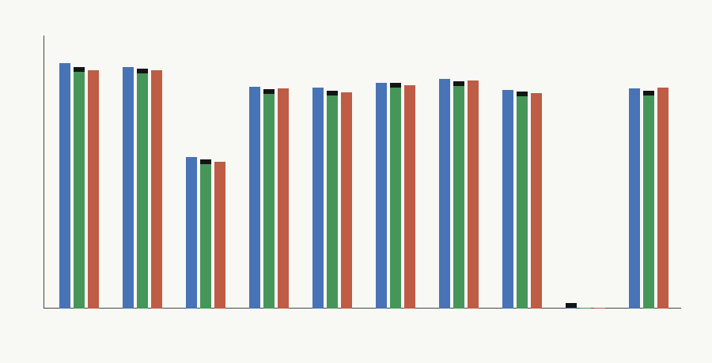

# Stronger Baseline Comparison

This comparison replays the exact `M-WORKLOAD-1` workload rows through three alternatives: optimized software/runtime, programmable accelerator, and the validated hybrid safety/filter fast path. Feature extraction, audit logging, raw volume, fallback frequency, update cadence, and utilization are held fixed per scenario.

Result: the single previously preserved workload is now `accelerator_dominates` with winner `programmable_accelerator` and a daily hybrid margin of `-1471448845.624272` pJ-equivalent/day versus the best programmable baseline. A negative margin means the stronger programmable baseline has already erased the hybrid win; special controls also route away from hybrid.

## Scenario Winners

| scenario | winner | decision | total daily cost proxy | energy/request | latency/request |
|---|---:|---:|---:|---:|---:|
| high_volume_stable_moderation | programmable_accelerator | accelerator_dominates | 8178811874.415 | 8882.271264 | 8.98 |
| bursty_consumer_traffic | programmable_accelerator | accelerator_dominates | 7437975610.401 | 9866.26498 | 9.964 |
| low_volume_enterprise_deployment | programmable_accelerator | accelerator_dominates | 1127078.147 | 9843.477263 | 9.59 |
| high_near_threshold_adversarial | programmable_accelerator | accelerator_dominates | 966196801.474 | 9456.386179 | 9.554 |
| frequent_policy_update_regime | programmable_accelerator | hybrid_falsified | 878299881.819 | 8992.426036 | 9.09 |
| audit_heavy_regulated_deployment | programmable_accelerator | accelerator_dominates | 1782995196.356 | 17904.896669 | 18.0025 |
| fallback_degraded_outage_regime | programmable_accelerator | accelerator_dominates | 2156170043.074 | 17320.351128 | 9.554 |
| multi_tenant_underutilized_deployment | programmable_accelerator | hybrid_falsified | 789895007.478 | 9657.261483 | 9.754 |
| zero_invocation_control | optimized_software_runtime | hybrid_falsified | 50.000 | inf | inf |
| fallback_all_control | programmable_accelerator | hybrid_falsified | 849408642.870 | 8992.393532 | 9.09 |

## Threshold Readout

The threshold table records the current hybrid margin, the software memory-savings level that would erase a current hybrid win, and the accelerator compute multiplier that would erase it. `already_erased` means a programmable baseline already wins at the modeled baseline strength.

## Interpretation

The prior preserved case was driven by high effective fast-path volume, low fallback rate, slow updates, and low audit/control overhead, but the stronger programmable accelerator baseline still beats it under equal workload accounting. This downgrades the safety/filter physicalization claim for this calibration cycle. Bursty, audit-heavy, frequent-update, all-fallback, zero-volume, and underutilized regimes also select software or the programmable accelerator.

## Open Limits

All costs are pJ-equivalent proxies tied to the existing calibration assumptions and local Python overhead probes. Production measurements of feature extraction, audit logging, fallback dispatch, and accelerator latency on the same request features would replace the largest modeled terms.
