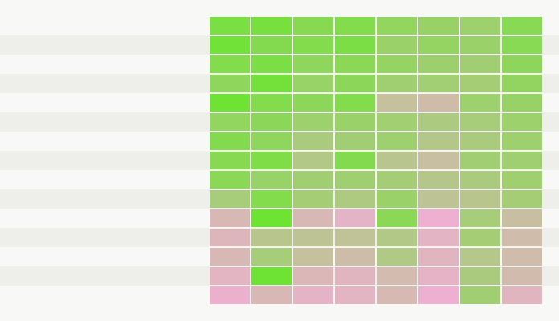

# Target Ranking for Physicalized Inference Components

This cycle converts the break-even model's dominant variables into a ranked search space for architecture work. Scores are normalized 0-5 modeled heuristics, not measured silicon data. The prior break-even sweep is the calibration anchor: software-optimized and programmable-accelerator baselines won about 63% of sampled scenarios, fixed digital won only in some higher-volume or slower-update regions, and analog/hybrid did not win under the default penalty sweep.

## Scoring Method

The scoring script reads `physicalized-weights/data/breakeven_summary.json` and `physicalized-weights/data/breakeven_grid.csv`, then scores components on update stability, reuse volume, approximation tolerance, integration complexity, energy upside versus baseline, software-baseline resistance, and evidence quality. Energy upside and software-baseline resistance are reduced under a 35% software/runtime memory-movement savings assumption, preserving the null hypothesis that runtime/compiler/control-plane gains may erase hardware-specific benefits. Components with zero reuse or near-zero update interval are capped because fixed costs cannot amortize.

## Ranked Candidates

| Rank | Component | Score | Evidence | Baseline check | Rationale | Demotion evidence |
|---:|---|---:|---|---|---|---|
| 1 | Fixed safety/filter classifier submodels | 3.775 | inferred | Programmable accelerators are strong, but isolation and fallback make fixed or semi-fixed safety filters testable. | Small repeated classifiers can be long-lived, isolated, and tolerant of conservative fallback. | Demote if policy churn forces weekly updates or false-positive/negative cost requires full programmable execution. |
| 2 | Small always-on wake-word or router models | 3.772 | inferred | Programmable accelerator cost may dominate for always-on tiny models; fixed local logic has a plausible idle-energy niche. | Always-on routing has stable weights, simple interfaces, and high aggregate reuse despite small per-request work. | Demote if the router must track fast-changing model menus or if CPU/NPU idle states already match the energy target. |
| 3 | Repeated retrieval/reranking feature transforms | 3.545 | inferred | Software caching helps, but repeated feature transforms can remain hot across requests. | Reranking pipelines often reuse stable transforms at high volume and can fall back to programmable paths. | Demote if workload-specific feature changes dominate or batching/caching erases memory movement. |
| 4 | Mixture-of-experts router or dispatch logic | 3.354 | modeled | Software runtimes already optimize dispatch, so credit only the stable high-volume router core. | Routers are reused heavily and smaller than experts, but integration with dynamic serving is nontrivial. | Demote if expert churn or load balancing changes the router distribution faster than quarterly. |
| 5 | Positional encoding / RoPE / deterministic transform support | 3.163 | inferred | Deterministic transforms are easy to optimize in software or programmable logic; physicalized weights add little. | Stable and reusable, but not obviously weight-dominated. | Demote if profiling shows negligible memory/energy share versus attention and KV movement. |
| 6 | Domain-specific adapter or LoRA blocks with slow update cadence | 3.023 | modeled | The software-optimized baseline is dangerous because adapters are already compact and easy to swap. | Some long-lived enterprise adapters may justify semi-fixed treatment, not permanent masks. | Demote if tenant-specific updates are monthly or adapter caching reaches 50% memory-movement savings. |
| 7 | Fixed or slowly changing embedding tables for constrained vocabularies/domains | 2.957 | inferred | Programmable memory hierarchy improvements compete directly; only constrained stable vocabularies survive. | Constrained domains can make table storage stable and reusable, but vocabulary churn is a major risk. | Demote if vocabulary/logit-head variants churn or compression/caching removes the movement bottleneck. |
| 8 | Quantization/dequantization and scaling constants | 2.907 | inferred | Quantization is already a software/compiler strength, so fixed constants alone get limited credit. | Constants are stable and easy to integrate, but energy upside may be too small for a dedicated substrate. | Demote if compiler fusion removes standalone movement or formats change per model family. |
| 9 | Frozen first-layer projections or low-rank projection blocks | 2.880 | modeled | Programmable accelerators handle dense projections well, so physicalization must exploit exceptional reuse or locality. | Static and simple, but deeply coupled to model layout. | Demote if accelerator matrix units keep the block bandwidth-local or model revisions alter dimensions. |
| 10 | KV-cache compression/decompression transforms | 2.718 | speculative | Software/runtime KV management is a core null-hypothesis strength; fixed transforms need robust cross-model reuse. | KV traffic matters, but context-dependent behavior makes fixed physicalization risky. | Demote if quality loss is prompt-dependent or runtime compression policies change frequently. |

## Rejected Anti-Targets

| Rank | Anti-target | Score | Why rejected | Promotion evidence required |
|---:|---|---:|---|---|
| 11 | Full frontier LLM dense weights burned permanently into fixed logic | 1.377 | Large nominal energy upside is overwhelmed by update cadence, yield, repair, model churn, and stranded capital. | Multi-year frozen weights, extreme shared volume, credible repair, and no competitive programmable path. |
| 12 | Frequently updated tenant-specific fine-tunes or adapters | 1.127 | Software adapter loading and routing are designed for this case; fixed substrates strand value quickly. | A tenant model freezes for quarters and reaches high shared reuse. |
| 13 | High-churn vocabulary/logit-head variants | 1.126 | Tokenizer/head variants look table-like but update and SKU fragmentation erase the fixed-weight case. | A constrained vocabulary with stable deployment and high shared traffic. |
| 14 | Dynamic attention over live context as fixed physical logic | 1.045 | KV/cache software and programmable accelerators are the right baseline because live context is not static weight state. | A narrow fixed transform inside attention with measured stability and fallback. |
| 15 | Training/optimizer state and gradient computation | 0.472 | This is not inference weight reuse; optimizer state mutates continuously. | Only a scoped change to inference-only frozen auxiliary weights would make it relevant. |

## Baseline Sensitivity

At 35% software/runtime memory-movement savings, the top candidate scores remain modest rather than decisive. The ranking preserves the null hypothesis: components that are mostly compiler/runtime wins, such as quantization constants and RoPE support, remain below isolated classifiers, routers, and reranking transforms. If software/runtime savings reaches 50%, `target_scoring.py` lowers or preserves every total viability score; a target that only wins before those savings is not a credible architecture candidate.

## Recommended Next Target

The recommended next architecture/prototype target is a fixed or semi-fixed safety/filter classifier submodel with programmable fallback. It is narrow, isolated, repeatedly invoked, and can be evaluated without claiming that a full LLM should be physicalized. For `M-ARCH-1`, the right architecture is likely a RISC-V or host-controlled accelerator interface that exposes a small fixed classifier path, logs confidence and fallback decisions, and keeps policy/model update escape hatches programmable.

Falsification criteria for promoting this target into `M-PROTO-1`:

- Demote it if realistic policy/model updates are weekly rather than quarterly or semiannual.
- Demote it if a software-optimized or programmable-accelerator implementation with batching/caching closes most memory-movement savings.
- Demote it if false-positive/false-negative costs require exact programmable execution rather than approximate fixed inference plus fallback.
- Promote it if a small fixed classifier shows stable high-volume reuse, bounded interfaces, low fallback rate, and a measurable per-request movement reduction under the same baseline model.

## Null Results That Matter

Full fixed frontier models remain rejected despite large apparent per-request savings. Dynamic attention remains rejected because the dominant state is live context, not static weights. Training and optimizer state are outside the inference-physicalization mechanism. These null results narrow the next cycle: architecture work should target small isolated submodels or routing/filter paths, not full-model permanence.
