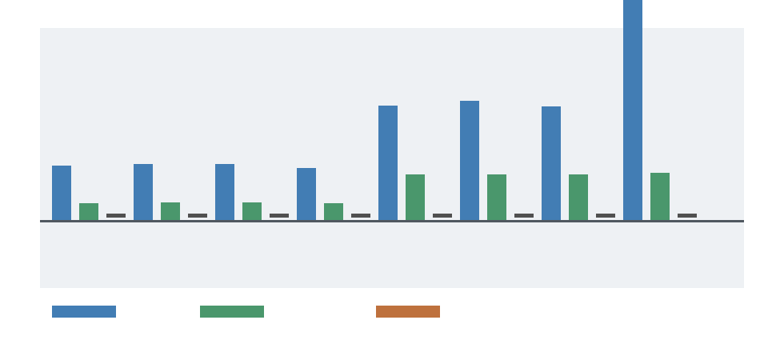

# Target Robustness Stress Test

M-ROBUST-1 adversarially probes whether the Phase 2 negative conclusion is tied only to the safety/filter workload. It is not a reopen gate and it introduces no measured production, shadow, or canary evidence.

The stress test covers `safety_filter`, `embedding_lookup_or_static_table`, `fixed_feature_extractor`, `small_keyword_or_policy_classifier`, `decoder_dense_weights`, `attention_kv_or_dynamic_context`, `tenant_adapter_or_lora`, and `training_optimizer_state`. Each target is evaluated under separate `calibrated`, `favorable_plausible`, and `extreme_counterfactual` regimes, plus special controls for zero volume, all fallback, high update cadence, and high software savings.



## Current Result

Calibrated stronger-baseline replay produces `0` physicalized wins and `current_superiority_claim_count = 0`. Favorable-plausible wins are labeled assumption-sensitive model-space results, not current claims. Extreme wins are labeled `counterfactual_not_current_evidence`.

## Robust Blockers

Zero request volume, all-fallback routing, high update cadence for anti-targets, low utilization, and absent measured evidence are robust blockers. `decoder_dense_weights`, `attention_kv_or_dynamic_context`, `tenant_adapter_or_lora`, and `training_optimizer_state` remain anti-targets under plausible assumptions because their update, dynamic-state, or training-state mechanisms prevent amortization.

## Assumption-Sensitive Blockers

Small stable classifiers and fixed feature extractors can cross in the favorable-plausible regime when request volume, utilization, update cadence, and physicalized per-request savings all move together. Those rows define frontier targets for future measured evidence, not current superiority. High software/runtime savings compresses the programmable baseline enough to eliminate otherwise marginal physicalized wins.

## Replay

```bash
python3 physicalized-weights/scripts/target_robustness_stress.py
python3 physicalized-weights/tests/test_target_robustness_stress.py
file physicalized-weights/data/target_robustness_frontier.png
```
