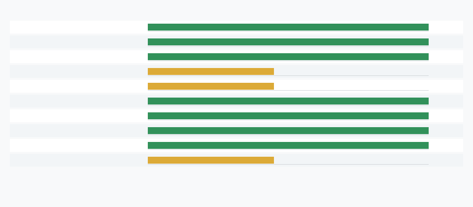

# Toolchain Condition Report

## Scope

This report is a prototype-verification refresh only. It is not a performance/economic reopen path, does not add a new reopen gate, and does not change the Phase 2 stronger-baseline downgrade or campaign closure endpoint.

## Tool Availability And Checks

| check_id | tool | available | version | status | blocker |
|---|---:|---:|---|---|---|
| tool_verilator | verilator | true | Verilator 5.020 2024-01-01 rev (Debian 5.020-1) | available |  |
| tool_yosys | yosys | true | Yosys 0.33 (git sha1 2584903a060) | available |  |
| tool_dot | dot | true | dot - graphviz version 2.43.0 (0) | available |  |
| tool_make | make | false |  | missing | not found on PATH |
| tool_cxx_compiler | c++|g++|clang++ | false |  | missing | not found on PATH |
| check_verilator_lint | verilator | true | Verilator 5.020 2024-01-01 rev (Debian 5.020-1) | passed |  |
| check_yosys_eval | yosys | true | Yosys 0.33 (git sha1 2584903a060) | passed |  |
| check_yosys_synthesis | yosys | true | Yosys 0.33 (git sha1 2584903a060) | passed |  |
| check_graphviz_netlist | dot | true | dot - graphviz version 2.43.0 (0) | checked |  |
| check_compiled_verilator | verilator+make+cxx | false | conditional | blocked_environment | make,cxx_compiler |

## Existing M-PROTO-1 Evidence Contract Recap

The validated prototype contract is a fixed combinational safety-filter HDL core checked against Python golden vectors, Yosys eval rows, Verilator lint, Yosys synthesis with no memories/processes, and Graphviz netlist artifacts. Compiled Verilator simulation can strengthen this contract only if local `verilator`, `make`, and a C++ compiler are available.

## Conditional Compiled-Verilator Outcome

`compiled_verilator_status`: `blocked_environment`

`compiled_verilator_equivalence_passed`: `None`

Missing compiled-simulation tools: `make, cxx_compiler`

## Lint, Yosys, And Graphviz Refresh

Verilator lint passed: `True`.

Yosys eval passed: `True`.

Graphviz artifact checked: `True`.

## Interpretation Boundaries

This cycle tests local toolchain condition and prototype verification modality. It introduces no workload evidence, measured production trace, baseline economics, or superiority claim.

## Prototype Reopen Conditions

Reopen prototype correctness only if compiled simulation runs and disagrees with golden vectors, Verilator lint fails, Yosys eval/synthesis fails, the HDL source hash changes without refreshed evidence, or the HDL design gains sequential state, memories, handshake timing, or mutable policy logic.
