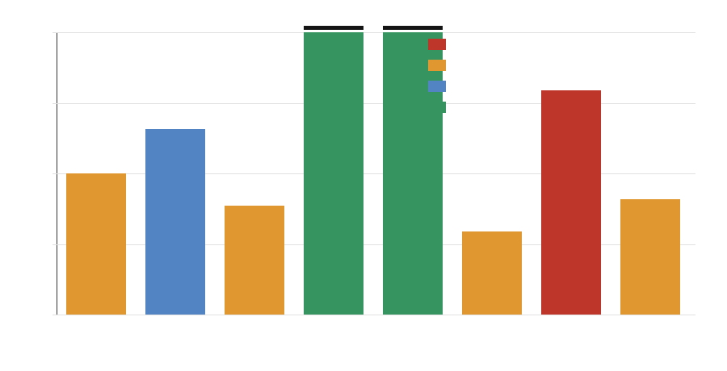

# Trace Ingestion Path Admissibility

This note ranks candidate evidence-acquisition paths against the M-TRACE-1 validator and the M-REOPEN-1 threshold contract. A path can challenge the downgraded safety/filter claim only if it can form `measured_hybrid_total - measured_best_programmable_total` for the same requests, policy window, fallback/audit decisions, utilization, latency, and energy accounting.

Current result: 2 path designs can become reopen-candidate paths, but no path is actual reopened evidence because no measured production trace was supplied.

## Candidate Paths

### `synthetic_fixture_only`

- Classification: `valid_but_insufficient`.
- Can pass M-TRACE-1: `false`.
- Can evaluate M-REOPEN-1: `false`.
- Privacy status: `privacy_safe`.
- Workload fidelity score: `1/4`.
- Counterfactual baseline validity score: `1/4`.
- Missing fields or measurement gaps: production/shadow environment, measured energy, and measured same-workload counterfactual baselines are absent.
- Recommended next instrumentation: Use only for validator testing; replace with shadow or canary dual-run production telemetry before threshold evaluation.

### `offline_replay_redacted_features`

- Classification: `threshold_evaluable_if_measured`.
- Can pass M-TRACE-1: `false`.
- Can evaluate M-REOPEN-1: `false`.
- Privacy status: `privacy_safe`.
- Workload fidelity score: `2/4`.
- Counterfactual baseline validity score: `3/4`.
- Missing fields or measurement gaps: production/shadow environment and measured deployment energy/utilization are absent.
- Recommended next instrumentation: Run the same dual-path instrumentation in shadow production and replace proxy/replay energy with measured hardware energy.

### `sampled_production_logs_without_baselines`

- Classification: `valid_but_insufficient`.
- Can pass M-TRACE-1: `false`.
- Can evaluate M-REOPEN-1: `false`.
- Privacy status: `privacy_safe`.
- Workload fidelity score: `3/4`.
- Counterfactual baseline validity score: `0/4`.
- Missing fields or measurement gaps: software/accelerator/hybrid counterfactual baselines and accepted fast-path gate evidence are incomplete.
- Recommended next instrumentation: Add dual-run baseline capture, measured accelerator/hybrid energy, and audit/health/drift gate telemetry for the same requests.

### `shadow_production_dual_run`

- Classification: `reopen_candidate_path`.
- Can pass M-TRACE-1: `true`.
- Can evaluate M-REOPEN-1: `true`.
- Privacy status: `privacy_safe`.
- Workload fidelity score: `4/4`.
- Counterfactual baseline validity score: `4/4`.
- Missing fields or measurement gaps: none if raw content is excluded and measured energy is captured for both paths.
- Recommended next instrumentation: Keep raw prompts out, enforce consistent policy windows, and export M-TRACE-1 rows plus measured energy/latency/utilization.

### `canary_ab_dual_instrumented`

- Classification: `reopen_candidate_path`.
- Can pass M-TRACE-1: `true`.
- Can evaluate M-REOPEN-1: `true`.
- Privacy status: `privacy_safe`.
- Workload fidelity score: `4/4`.
- Counterfactual baseline validity score: `4/4`.
- Missing fields or measurement gaps: none if traffic assignment preserves identical workload accounting and no raw sensitive columns are exported.
- Recommended next instrumentation: Pin policy versions, log audit/fallback/update gates, and capture measured energy and latency for both alternatives per request class.

### `accelerator_vendor_benchmark_only`

- Classification: `valid_but_insufficient`.
- Can pass M-TRACE-1: `false`.
- Can evaluate M-REOPEN-1: `false`.
- Privacy status: `privacy_safe`.
- Workload fidelity score: `1/4`.
- Counterfactual baseline validity score: `0/4`.
- Missing fields or measurement gaps: hybrid path, fallback/audit/update accounting, policy windows, and identical workload mapping are absent.
- Recommended next instrumentation: Treat as a component prior only; collect same-request shadow/canary traces before comparing against reopen thresholds.

### `privacy_risk_raw_logs`

- Classification: `inadmissible`.
- Can pass M-TRACE-1: `false`.
- Can evaluate M-REOPEN-1: `false`.
- Privacy status: `privacy_risk`.
- Workload fidelity score: `4/4`.
- Counterfactual baseline validity score: `4/4`.
- Missing fields or measurement gaps: privacy-disallowed raw columns make the evidence inadmissible regardless of metric richness.
- Recommended next instrumentation: Drop raw content and identifiers before export; use feature hashes, aggregate route labels, and privacy-safe operational telemetry.

### `simulated_scaled_workload`

- Classification: `valid_but_insufficient`.
- Can pass M-TRACE-1: `false`.
- Can evaluate M-REOPEN-1: `false`.
- Privacy status: `privacy_safe`.
- Workload fidelity score: `1/4`.
- Counterfactual baseline validity score: `1/4`.
- Missing fields or measurement gaps: production measurement status, measured energy, and same-request counterfactual baseline totals are absent.
- Recommended next instrumentation: Use for planning only; validate with privacy-safe production or shadow-production dual-run telemetry.

## Interpretation

Synthetic fixtures, simulated scaled workloads, vendor-only accelerator benchmarks, and sampled logs without counterfactual baselines cannot reopen the claim. Offline redacted replay is useful for rehearsing the pipeline, but it remains below the measured-evidence standard until it is converted into production or shadow-production dual-run telemetry with measured energy and utilization. Privacy-risk raw logs are inadmissible regardless of metric richness because M-TRACE-1 explicitly disallows raw prompt, user, tenant, address, key, email, IP, and content columns.

Only `shadow_production_dual_run` and `canary_ab_dual_instrumented` are classified as reopen-candidate path designs. That classification means the path can generate admissible rows if implemented with the stated instrumentation; it does not mean the safety/filter performance claim has reopened or won.
