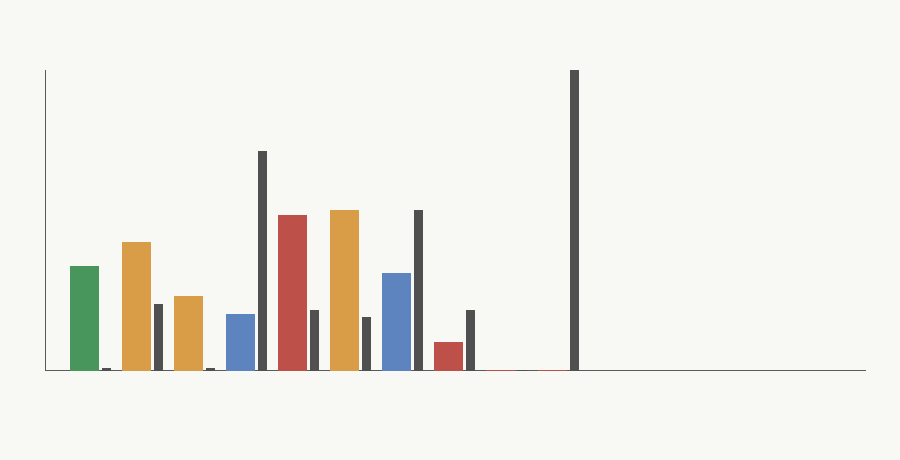

# Workload Trace Assumptions

## Scope

This note makes the `M-WORKLOAD-1` traffic assumptions explicit for the safety/filter fast path. It does not add hardware structure or change the calibrated cost model from `M-CAL-1`; it supplies deterministic synthetic workload regimes that later `M-SWBASE-2` software and programmable-accelerator baselines must consume unchanged.

The key distinction is raw request volume versus effective fast-path volume. Effective volume is reduced by fallback routing, near-threshold uncertainty, stale-policy windows, drift, audit failures, fallback outages, and low tenant utilization.

## Workload Taxonomy

| Scenario | Mechanism stressed | Assumption type | Result |
|---|---|---|---|
| `high_volume_stable_moderation` | High reuse, slow updates, bounded fallback/control overhead | modeled | preserved |
| `bursty_consumer_traffic` | Bursty arrivals and lower average utilization | modeled | weakened |
| `low_volume_enterprise_deployment` | Slow updates but low amortization volume | modeled | weakened |
| `high_near_threshold_adversarial` | Near-threshold requests force fallback | modeled | speculative |
| `frequent_policy_update_regime` | Weekly policy churn strands fixed-path amortization | inferred | falsified |
| `audit_heavy_regulated_deployment` | Audit/control overhead dominates the surface | local_measured | weakened |
| `fallback_degraded_outage_regime` | Invalid fast-path outputs cannot reliably fall back | modeled | speculative |
| `multi_tenant_underutilized_deployment` | Tenant fragmentation strands fixed capacity | inferred | falsified |
| `zero_invocation_control` | No requests | modeled | falsified |
| `fallback_all_control` | Every request routes away from the fast path | modeled | falsified |

## Assumptions

Invocation volume is modeled as aggregate hourly windows, not per-request rows, to keep the trace auditable. The generator uses a fixed seed and deterministic scenario-specific seeds, so reruns produce identical CSV/JSON outputs.

Fallback frequency combines base fallback, near-threshold cases, stale policy, drift, audit failure, and fail-safe events. The calibrated overlay treats fallback and fail-safe as lost fast-path opportunities because both remove useful physicalized reuse.

Near-threshold rate is modeled separately because the prototype already showed threshold-equal and near-threshold vectors should route to programmable fallback. A high near-threshold rate therefore weakens the claim even if raw request volume is high.

Update cadence is carried as days per update. Weekly-or-faster policy updates are treated as falsifying for fixed-path physicalization in this workload layer because `M-CAL-1` already showed update interval is a top uncertainty driver and fixed-path amortization collapses as updates approach zero interval.

Feature extraction and audit logging costs are carried forward as scenario fields. Audit-heavy workloads use local-measured `M-CAL-1` proxy evidence for the audit path, but the values remain host/Python proxies rather than production hardware measurements.

Utilization is an explicit workload variable. Low utilization can falsify the physicalization claim even with nonzero requests because fixed substrate capacity is stranded between bursts or tenant fragments.

## Scenario Stress Points

`high_volume_stable_moderation` is the preservation case: it has high volume, low fallback pressure, slow updates, and low audit/control overhead. It is the narrow regime where the safety/filter claim survives the workload overlay.

`bursty_consumer_traffic` keeps enough traffic to avoid immediate rejection, but burstiness and fallback pressure lower effective utilization. It weakens rather than preserves the claim.

`low_volume_enterprise_deployment` demonstrates that slow updates alone are insufficient. The calibrated overlay may still find a local hybrid winner in some low-utilization corners, but the workload claim is weakened because absolute effective request volume is small.

`high_near_threshold_adversarial` and `fallback_all_control` test the routing mechanism directly. If most requests are ambiguous or forced to fallback, raw request volume should not be credited to the physicalized fast path.

`frequent_policy_update_regime` is the update-cadence falsifier. It holds traffic volume high enough to matter but makes policy churn too frequent for fixed-path amortization.

`audit_heavy_regulated_deployment` keeps reuse but increases audit/control cost, preserving the `M-CAL-1` finding that system overhead around the classifier can dominate the multiply-add core.

`fallback_degraded_outage_regime` is speculative rather than directly falsified because it still has some useful fast-path traffic, but safety depends on a fallback path that is not reliably available.

`multi_tenant_underutilized_deployment` isolates stranded-capacity risk. This is the workload version of the utilization penalty in the calibrated model.

## Falsification Criteria

The safety/filter physicalization claim is preserved only when effective fast-path volume is high, fallback frequency is low, policy updates are monthly-or-slower, audit/control overhead is bounded, and utilization is not stranded.

It is weakened when raw traffic remains substantial but one major pressure, such as burstiness, audit overhead, or low absolute volume, prevents a clean workload win.

It is speculative when routing or fallback health dominates the conclusion and production evidence is needed before promotion.

It is falsified when invocation volume is zero, fallback frequency approaches one, policy updates are weekly-or-faster, near-threshold traffic dominates, or utilization is so low that the fixed substrate is mostly idle.

## Carry-Forward Variables For M-SWBASE-2

`M-SWBASE-2` should reuse the exact scenario rows in `physicalized-weights/data/workload_scenarios.csv` and `physicalized-weights/data/workload_viability_overlay.csv`. The required carry-forward variables are raw request volume, effective fast-path volume, fallback frequency, near-threshold frequency, update interval, audit/control scale, utilization, feature extraction cost, audit logging cost, and software memory savings.
