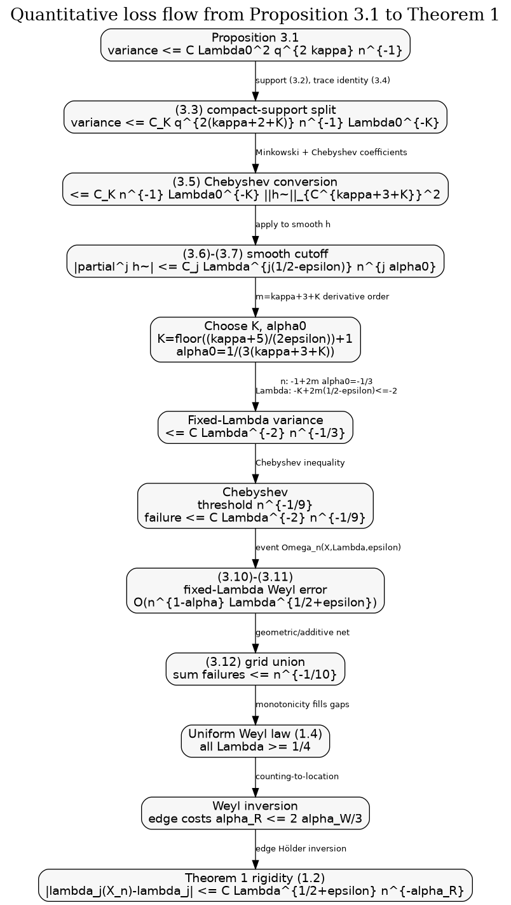

# Theorem 1 Exponent Flow From Proposition 3.1

## Scope

This note reconstructs the quantitative reduction in Kim--Tao §3.1 from Proposition 3.1 to the high-probability Weyl law (1.4). Proposition 3.1 is treated as a black box. Theorem 2, the proof of Proposition 3.1, and external references used to prove imported cutoff/Chebyshev estimates are deferred.

## Starting Point

Proposition 3.1 gives, for a polynomial `h(x)=x \tilde h(x)` of degree `q`,

```text
E | n^{-1} tr((h o f_Lambda0)(sqrt(Delta_Xn - 1/4)))
    - Vol(X_n)/(2 pi n) int_0^infty (h o f_Lambda0)(r) r tanh(pi r) dr |^2
<= C Lambda0^2 q^{2 kappa} n^{-1} ||tilde h||^2.
```

After using the compact Fourier support (3.2), the paper rewrites this as (3.3): for every `K >= 0`,

```text
variance <= C_K q^{2(kappa+2+K)} n^{-1} Lambda0^{-K} ||tilde h||^2.
```

For large `Lambda0`, if the Fourier support is shorter than the shortest geodesic length, the trace formula identity term is exact; this is why (3.3) is declared valid for all `Lambda0 in [1/4, infinity)` after (3.4).

## Smooth Cutoff Passage

Write `tilde h` in Chebyshev polynomials and apply Minkowski plus (3.3). Equation (3.5) says

```text
variance <= C_K n^{-1} Lambda0^{-K}
            (sum_{j=0}^{q-1} (j+1)^{kappa+2+K} |a_j|)^2
         <= C_K n^{-1} Lambda0^{-K} ||tilde h||_{C^{kappa+3+K}}^2.
```

The only property imported from `[CGVTvH26, Corollary 4.5]` is the coefficient-to-derivative control in the second inequality. By polynomial approximation, the same estimate is applied to smooth cutoffs.

Set

```text
K = floor((kappa + 5)/(2 epsilon)) + 1,
m = kappa + 3 + K,
alpha_0 = 1/(3m).
```

The smooth cutoff `h_{Lambda,epsilon}` from (3.6) has transition width

```text
Delta Lambda = Lambda^{1/2 + epsilon} n^{-alpha_0}.
```

The mean-value estimate in (3.7) converts this to

```text
|partial_x^j tilde h_{Lambda,epsilon}(x)|
<= C_j Lambda^{j(1/2 - epsilon)} n^{j alpha_0}.
```

Therefore

```text
||tilde h_{Lambda,epsilon}||_{C^m}^2
<= C Lambda^{2m(1/2 - epsilon)} n^{2m alpha_0}.
```

Inserting this in (3.5) gives the requested intermediate bound:

```text
variance
<= C n^{-1} Lambda0^{-K}
   Lambda^{2m(1/2 - epsilon)} n^{2m alpha_0}.
```

With `alpha_0 = 1/(3m)`, the `n` power is exactly

```text
-1 + 2m alpha_0 = -1 + 2/3 = -1/3.
```

If `Lambda >= C`, then `Lambda0 = Lambda`, and the `Lambda` exponent is

```text
-K + 2m(1/2 - epsilon)
= -K + (kappa + 3 + K)(1 - 2 epsilon)
= kappa + 3 - 2 epsilon(kappa + 3 + K).
```

The choice of `K` implies `2 epsilon K > kappa + 5`, so

```text
kappa + 3 - 2 epsilon(kappa + 3 + K)
< kappa + 3 - (kappa + 5) - 2 epsilon(kappa+3)
< -2.
```

Thus for `Lambda >= C`,

```text
variance <= C Lambda^{-2} n^{-1/3}.
```

If `Lambda in [1/4,C]`, then `Lambda0 = C`. The same `n^{-1/3}` follows, and all powers of `Lambda` and `C` are absorbed into the constant. Since `Lambda >= 1/4`, this is also `<= C' Lambda^{-2} n^{-1/3}` after enlarging `C'`.

## Exponent Ledger

| Source | Input bound | Operation | Lambda power | n power | Role of `K` | Role of `kappa` | Role of `alpha_0` |
|---|---|---|---:|---:|---|---|---|
| Proposition 3.1 | `C Lambda0^2 q^{2 kappa} n^{-1} ||tilde h||^2` | black-box variance estimate | `+2` in `Lambda0` | `-1` | none yet | variance degree loss | none |
| (3.3) | compact support (3.2) | trade support/degree for arbitrary `K` decay | `-K` in `Lambda0` | `-1` | creates summable `Lambda` decay | appears as `kappa+2+K` | none |
| (3.5) | Chebyshev expansion | convert polynomial bound to smooth norm | `-K` | `-1` | raises needed derivative order | derivative order includes `kappa` | none |
| (3.7) | cutoff width | bound `C^m` norm, `m=kappa+3+K` | `2m(1/2-epsilon)` | `2m alpha_0` | increases `m` | increases `m` | controls derivative `n` loss |
| after (3.7) | choose `alpha_0=1/(3m)` | insert derivatives in (3.5) | `-K+2m(1/2-epsilon)` | `-1/3` | must dominate positive `Lambda` power | sets `m` | fixes variance scale |
| after `K` choice | `K=floor((kappa+5)/(2epsilon))+1` | force decay | `<= -2` | `-1/3` | decisive large-energy loss | determines how large `K` must be | no further role |
| (3.8)-(3.9) | Chebyshev threshold `n^{-1/9}` | probability failure | `-2` | `-1/9` | inherited | inherited | inherited |
| (3.10)-(3.11) | cutoff window | convert statistic to counts | `1/2+epsilon` in error | `-alpha_0`, plus `-1/9` | no new role | no new role | deterministic smoothing error |
| (3.12) | geometric/additive grid | union bound | summable in `j` | `0.01 - 1/9 < -1/10` | needs `Lambda^{-2}` | no new role | no new role |
| final sentence | monotone inversion | counts to eigenvalues | `1/2+epsilon` retained after enlarging constants | final alpha may shrink | no new role | no new role | inherited via Weyl law |

## Chebyshev Probability Step

Let the centered normalized statistic be `Z_Lambda`. From the variance bound,

```text
E |Z_Lambda|^2 <= C Lambda^{-2} n^{-1/3}.
```

Chebyshev with threshold `A n^{-1/9}` gives

```text
P(|Z_Lambda| > A n^{-1/9})
<= C A^{-2} Lambda^{-2} n^{-1/3 + 2/9}
= C A^{-2} Lambda^{-2} n^{-1/9}.
```

Writing `A` as a sufficiently large constant and absorbing constants into `(C_1 Lambda)^{-2}` gives (3.8):

```text
P(Omega_n(X,Lambda,epsilon)) >= 1 - (C_1 Lambda)^{-2} n^{-1/9}.
```

## Count Bounds For Fixed Lambda

On `Omega_n(X,Lambda,epsilon)`, (3.9) says the smooth statistic differs from its identity integral by `O(n^{-1/9})` after normalization by `n`. Because `h_{Lambda,epsilon}` is `1` below `Lambda` and `0` above `Lambda + Lambda^{1/2+epsilon} n^{-alpha_0}`, the upper bound is

```text
n^{-1} N_Xn(Lambda)
<= (2g-2) F(Lambda + Lambda^{1/2+epsilon} n^{-alpha_0})
   + C n^{-1/9}.
```

Since `F'(u) = (1/2) tanh(pi sqrt(u-1/4)) <= 1/2`, this becomes

```text
n^{-1} N_Xn(Lambda)
<= (2g-2) F(Lambda) + C Lambda^{1/2+epsilon} n^{-alpha_0} + C n^{-1/9}.
```

For `Lambda <= 1/4 + n^{-alpha_0}`, this upper bound alone gives (1.4), since `F(Lambda)=O((Lambda-1/4)^{3/2})` and `N_Xn(Lambda) >= 0`.

For `Lambda >= 1/4 + n^{-alpha_0}`, the lower cutoff at `Lambda - Lambda^{1/2+epsilon} n^{-alpha_0}` gives (3.11):

```text
n^{-1} N_Xn(Lambda)
>= (2g-2) F(Lambda) - C Lambda^{1/2+epsilon} n^{-alpha_0} - C n^{-1/9}.
```

Combining the two inequalities yields (1.4) for a fixed `Lambda` with any final

```text
alpha <= min(alpha_0, 1/9).
```

## Uniform Lambda Grid

The grid is

```text
Lambda(j) = C 2^j,  j >= 1,    Lambda(0)=C,
Lambda(j,l) = Lambda(j) + l n^{-0.01} Lambda(j)^{1/2},
0 <= l <= L_j = floor(n^{0.01} (Lambda(j+1)-Lambda(j))/Lambda(j)^{1/2}).
```

For each fixed `j`, the number of grid points is

```text
L_j + 1 <= C n^{0.01} Lambda(j)^{1/2} <= C n^{0.01} 2^{j/2}.
```

Using (3.8),

```text
sum_{j,l} P(Omega_n(X,Lambda(j,l),epsilon)^c)
<= sum_j (C_1 Lambda(j))^{-2} C n^{0.01} 2^{j/2} n^{-1/9}.
```

Since `Lambda(j)=C 2^j`, the `j`-sum is bounded by a constant multiple of

```text
sum_j 2^{-2j} 2^{j/2} = sum_j 2^{-3j/2} < infinity.
```

The `n` exponent is

```text
0.01 - 1/9 = 1/100 - 1/9 = -91/900 < -1/10.
```

Thus choosing `C_1` large enough gives (3.12):

```text
P(Omega_n(X,epsilon)) >= 1 - n^{-1/10}.
```

Monotonicity of `N_Xn` and the grid spacing `n^{-0.01} Lambda^{1/2}` extend (1.4) from grid points to all `Lambda`. The deterministic grid-spacing contribution is dominated by the same `Lambda^{1/2+epsilon} n^{-alpha}` error after taking the final `alpha <= 0.01`.

## Diagnostic Outcome

The hypotheses in the research brief are ruled in for §3.1. The smooth cutoff derivative growth fixes `alpha_0` through `2m alpha_0=2/3`; the choice of `K` is exactly what forces the residual large-`Lambda` power below `Lambda^{-2}`; and the final probability is a union-bound artifact once the grid spacing is chosen. The currently dominant visible loss in the proposition-to-theorem passage is the derivative order `m=kappa+3+K`, because `K` grows like `epsilon^{-1}` and `alpha_0=1/(3m)`; the deeper candidate loss remains Proposition 3.1's polynomial/Markov step, deferred to a later proof-ledger cycle.


