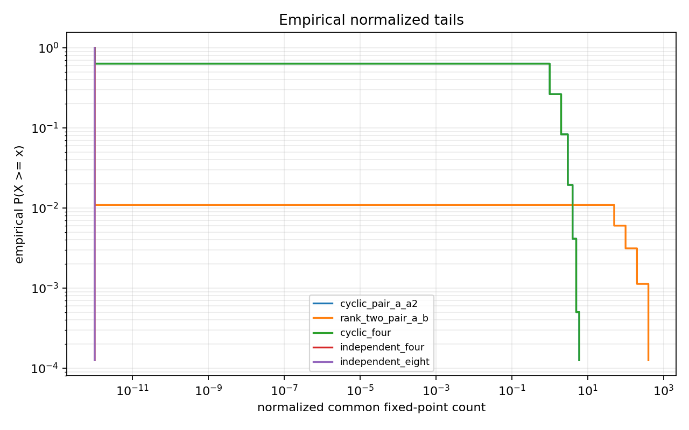

# M3 Common Fixed-Point Probe

## Model

This is a toy random-cover combinatorics probe, not a hyperbolic trace-formula simulation.  For each cover degree `n`, the script samples independent uniform random permutations for free generators and evaluates reduced free words.  The observable is

`fixed_common(w_1,...,w_k) = #{x in {1,...,n}: w_1 x = ... = w_k x = x}`.

The reported `normalized_common` divides by the naive rare-event scale `n^{-s}` when a family is assigned scale power `s`; cyclic/power families use `s=0` because the common fixed set of `a,a^2,...` is governed by the fixed points of the same underlying permutation cycle structure.  The run used `n = 50,100,200,400`, `2000` samples per `n`, and seed `20260515`.

## Word Families and Controls

The controls passed exactly:

| family | intended check | result |
|---|---:|---:|
| `identity_control` | identity fixes all `n` points | means `50,100,200,400` |
| `cancel_control` | `aA` reduces to identity | means `50,100,200,400` |
| `mixed_identity_a` | `(1,a)` equals fixed points of `a` | matches cyclic/single-`a` means |

The main comparison families were:

| family | words | interpretation |
|---|---|---|
| `cyclic_pair_a_a2` | `a`, `aa` | primitive-power diagonal pair |
| `cyclic_four` | `a`, `aa`, `aaa`, `aaaa` | four-word cyclic diagonal analogue |
| `cyclic_eight` | powers `a` through `a^8` | eight-word cyclic diagonal analogue |
| `rank_two_pair_a_b` | `a`, `b` | two independent fixed-point constraints |
| `rank_two_four_a_b_ab_aB` | `a`, `b`, `ab`, `aB` | rank-two words; fixed by `a,b` implies fixed by the composites |
| `rank_two_eight` | eight words in `a,b` | rank-two composite control with dependent constraints |
| `independent_four` | `a`, `b`, `c`, `d` | four independent constraints |
| `independent_eight` | `a` through `h` | eight independent constraints |

The rank-two composite families produced the same counts as `rank_two_pair_a_b`; this is a useful null result, not a bug.  It shows that common fixed-point probes must distinguish word noncyclicity from actual pointwise constraint independence.

## Summary Tables

Mean common fixed-point counts:

| family | n=50 | n=100 | n=200 | n=400 |
|---|---:|---:|---:|---:|
| `cyclic_pair_a_a2` | 0.9555 | 1.0240 | 1.0075 | 1.0175 |
| `cyclic_four` | 0.9555 | 1.0240 | 1.0075 | 1.0175 |
| `cyclic_eight` | 0.9555 | 1.0240 | 1.0075 | 1.0175 |
| `rank_two_pair_a_b` | 0.0195 | 0.0115 | 0.0080 | 0.0040 |
| `rank_two_four_a_b_ab_aB` | 0.0195 | 0.0115 | 0.0080 | 0.0040 |
| `rank_two_eight` | 0.0195 | 0.0115 | 0.0080 | 0.0040 |
| `independent_four` | 0.0000 | 0.0000 | 0.0000 | 0.0000 |
| `independent_eight` | 0.0000 | 0.0000 | 0.0000 | 0.0000 |

Selected tail diagnostics:

| family | n | variance | q90 | q99 | normalized mean |
|---|---:|---:|---:|---:|---:|
| `cyclic_pair_a_a2` | 400 | 0.9947 | 2 | 4 | 1.0175 |
| `rank_two_pair_a_b` | 400 | 0.0040 | 0 | 0 | 1.6000 |
| `independent_four` | 400 | 0.0000 | 0 | 0 | 0.0000 |
| `independent_eight` | 400 | 0.0000 | 0 | 0 | 0.0000 |

## Interpretation

Evidence: cyclic/power families stay at order-one common fixed-point count across `n`; this matches the proof-ledger role of primitive-power diagonal configurations as structured contributions rather than independent rare constraints.

Evidence: the two-generator family `(a,b)` decays near the naive `1/n` scale.  Its normalized means are noisy but order-one: `0.975`, `1.15`, `1.6`, `1.6` for `n=50,100,200,400`.

Null result: adding `ab`, `aB`, and other composite words to the pointwise common fixed set does not create additional constraints once `a` and `b` already fix the point.  Future probes of the eight-word mechanism need observables closer to the paper's folded-graph/common-quotient expansion, not just pointwise intersection of fixed sets.

Evidence with sampling limitation: truly independent four/eight-generator constraints produced all-zero samples.  This is consistent with scales `n^{-3}` and `n^{-7}` for counts, but the event is too rare for ordinary Monte Carlo at these `n` and sample sizes.

## Sufficiency and Limitations

This cycle supports the proof-ledger mechanism behind diagonal subtraction at the level of random-permutation fixed-point heuristics: cyclic primitive-power families retain order-one contributions, while independent or rank-two fixed-point constraints are much smaller.  The reusable benchmark is strongest for identity/cancellation controls, cyclic families, and two-generator rank-two pairs.

The experiment does not model Selberg weights, hyperbolic word-length support, surface-group relations, the full MPvH/Nau/MP23 embedding expansion, or polynomial interpolation.  It should be treated as a calibrated first M3 probe and a warning about naive multiword fixed-point observables, not as evidence for a theorem.
