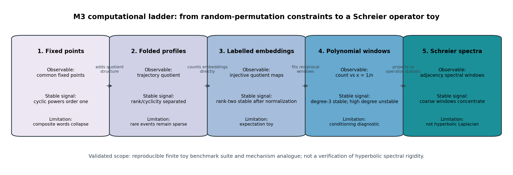

# M3 Computational Probe Synthesis

## Executive Synthesis

M3 built a reproducible toy benchmark suite for the random-cover mechanisms isolated in the M2 proof ledger. The five validated slices do not verify Kim--Tao's hyperbolic estimates, but they do give a coherent finite random-permutation ladder: cyclic/rank-one contributions remain order one; rank-two/noncyclic constraints are suppressed in raw fixed-point and quotient counts; labelled quotient embeddings become stable after the expected constraint-dimension normalization; polynomial-window fits are useful at low degree and unstable at high degree; and coarse Schreier adjacency spectral windows provide a stable operator-level toy observable.

The strongest cross-probe finding is qualitative and structural. The cyclic/rank-two distinction is robust before normalization, while normalized labelled-embedding observables show that much of the raw separation is explained by quotient constraint dimension. The polynomial-window diagnostics then isolate a different bottleneck: high-degree interpolation can amplify derivatives and coefficients even when low-degree reciprocal fits extrapolate accurately. The spectral toy confirms that operator observables can concentrate, but it also gives a useful negative result: degree-3 polynomial-window claims are underdetermined on the four-`n` spectral grid.

M3 now satisfies and exceeds the plan-of-record criterion for `M3-computational-probes`: scripts under `scripts/` generate reproducible CSV data under `data/polynomial_method/` plus named plots comparing concentration and approximation behavior across `n` regimes. I recommend marking `M3-computational-probes` as `validated/high`, with the explicit scope that this validates a computational benchmark suite and mechanism analogue, not a mathematical extension of the paper.

## Slice Ledger

| Cycle | Primary report | Model axis varied | Main finding | Main limitation |
|---:|---|---|---|---|
| 6 | `reports/computational_probes/m3_common_fixed_point_probe.md` | Common fixed points of word families in random permutations | Cyclic/power families stay order one; rank-two common fixed-point counts decay around `1/n`. | Composite word families collapse once base generators are fixed, so naive eight-word intersections are not informative. |
| 7 | `reports/computational_probes/m3_folded_word_graph_probe.md` | Folded labelled trajectory quotient profiles | Quotient invariants distinguish cyclic rank-one families from noncyclic rank-two controls. | Profile observable improves interpretation, but rare fixed-basepoint events remain sparse. |
| 8 | `reports/computational_probes/m3_labelled_graph_embedding_probe.md` | Direct injective labelled quotient-graph embeddings | `eight_word_cyclic_toy` remains order one; `eight_word_rank2_toy` scales like `n^{-1}` and stabilizes after normalization. | The estimator computes finite labelled-template expectations, not hyperbolic trace-polynomial coefficients. |
| 9 | `reports/computational_probes/m3_polynomial_window_diagnostics.md` | Chebyshev-window fits of normalized counts in `x=1/n` | Degree-3 fits extrapolate accurately for the eight-template pair; degree 6/8 fits expose derivative and coefficient amplification. | Measures interpolation conditioning on toy data, not the actual MPvH/MP23 polynomial expansion. |
| 10 | `reports/computational_probes/m3_schreier_spectral_toy.md` | Schreier adjacency operator spectra from two random permutations | Coarse normalized spectral windows concentrate, and centered trace moments decay after subtracting the 4-regular tree baseline. | Graph adjacency spectra are only an operator toy; degree-3 spectral fits need more `n` values. |

The full canonical artifact list is indexed in `data/polynomial_method/m3_probe_artifact_index.csv`.

## Mechanism Ladder

The first step was a raw random-permutation fixed-point baseline. It confirmed the expected diagonal behavior in the simplest observable: primitive-power and cyclic families have order-one common fixed-point counts, while two independent generator constraints are suppressed. The null result was equally important: adding composite words such as `ab` or `aB` to a pointwise common fixed set does not create new constraints after `a` and `b` already fix the point.

The folded trajectory quotient probe repaired the interpretation problem by recording labelled quotient structure rather than only pointwise intersections. It separated cyclic rank-one profiles from rank-two/noncyclic profiles, but did not solve rare-event sparsity. This established that quotient structure is the right axis, while ordinary fixed-basepoint Monte Carlo is the wrong estimator for high-constraint eight-word templates.

The direct labelled-embedding probe made the quotient graph itself the object being counted. This converted sparse realized fixed-point events into estimable expected injective labelled-template counts. The key benchmark pair emerged here: `eight_word_cyclic_toy` is order one, while `eight_word_rank2_toy` is order `n^{-1}` before normalization and approaches a stable normalized value after multiplying by the expected constraint-dimension scale.

The polynomial-window diagnostic then held the benchmark pair fixed and varied the interpolation task. Low-degree Chebyshev-window fits in `x=1/n` predicted the normalized embedding observables well near `x=0`; high-degree unregularized fits produced large derivative and coefficient growth. This is the cleanest M3 analogue of the M2 Markov-loss concern: the instability is tied to degree/window conditioning, not simply to cyclic versus rank-two labels.

The Schreier spectral toy finally projected the mechanism onto an operator. Coarse spectral-window counts such as `window_pos_mid` and `window_pos_edge` were stable and concentrated across `n`, while centered trace moments were more trace-formula-like but noisier. This adds an operator-level bridge and a warning: spectral polynomial-window diagnostics require either more `n` values or lower-degree fits than the deterministic labelled-embedding benchmark.

## Claim Taxonomy

### Proven by Finite Code Identity

- Word reduction, inverse cancellation, and permutation evaluation behavior are directly tested in `tests/test_permutation_word_eval.py`.
- Labelled-embedding exact enumeration and inverse-labelled edge normalization are tested in `tests/test_labelled_graph_embeddings.py`.
- Schreier adjacency construction is symmetric with row sum `4` under the retained loop/multiedge convention, and trace moments match eigenvalue sums in `tests/test_schreier_spectral_toy.py`.
- The 4-regular tree closed-walk moment checks `m_2=4`, `m_4=28`, and `m_6=232` are direct finite tests in the Cycle 10 test file.

### Numerical Evidence

- Cyclic fixed-point families have order-one counts across `n=50,100,200,400`; rank-two pair counts decay at the raw scale.
- Folded quotient invariants separate cyclic rank-one and rank-two/noncyclic word families.
- Direct labelled embeddings support the expected `n^{|V|-|E|}` scale for the canonical eight-template pair.
- Degree-3 Chebyshev-window fits are stable for low-noise normalized labelled embeddings, while degree 6/8 fits expose interpolation instability.
- Schreier spectral-window means stabilize and variances shrink across `n=100,200,400,800`.

### Heuristic Analogy To Kim--Tao

- Cyclic/rank-one toy contributions mirror the diagonal or primitive-power configurations isolated in the proof ledger.
- Rank-two/noncyclic suppression mirrors the role of the MP23 rank-two common-fixed-point input after diagonal removal.
- High-degree polynomial-window instability mirrors the Markov-interpolation loss tracked in M2.
- Centered Schreier trace moments mirror subtracting tree-like/backtracking structure before examining finite-cover fluctuations.

### Explicitly Not Established

- No M3 probe estimates eigenvalues of a hyperbolic random cover or verifies the Selberg trace formula numerically.
- No probe verifies the MPvH expansion, Nau boundedness input, or MP23 rank-two theorem.
- The labelled-embedding estimator is an expectation model over finite templates, not the full paper polynomial.
- Schreier adjacency spectra are not a discretization of the hyperbolic Laplacian.
- High-degree coefficient growth in toy fits is evidence of conditioning fragility, not a proof that Kim--Tao's exponent loss is sharp.

## Recommended Benchmark Suite

Use `eight_word_cyclic_toy` versus `eight_word_rank2_toy` as the default combinatorial benchmark pair. It preserves the cyclic/noncyclic contrast, avoids realized-event sparsity, and has a transparent normalization scale.

Use degree-3 Chebyshev-window fits for low-noise labelled-embedding observables. Keep degree 6/8 fits only as stress tests for Markov-style derivative and coefficient amplification.

Use `window_pos_mid` and `window_pos_edge` as the default Schreier spectral-window observables. They are more stable than high trace moments and closer to an operator statistic than pure embedding counts.

Use centered trace moments as noisy trace-formula analogues, not as the primary predictive benchmark. They remain valuable when the question is about backtracking/tree-like subtraction, but high moments amplify finite-size noise.

## Next Targets

For `M4-formal-certification`, the best focused target is a finite labelled-embedding expectation identity. A second viable target is certification of the 4-regular tree closed-walk recurrence behind the Cycle 10 moment baseline.

For `M5-extension-candidates`, the strongest path is to rank extension ideas around sharpening or replacing the Markov interpolation loss. M3 suggests a concrete conjectural direction: after quotient-dimension normalization, the dominant toy instability is degree/window conditioning rather than the cyclic/rank-two distinction itself.

## Closure Recommendation

Mark `M3-computational-probes` as `validated/high`.

The closure scope is precise: M3 has produced an audit-ready, reproducible computational benchmark suite for finite random-permutation and Schreier-operator analogues of the M2 mechanism ledger. It establishes robust toy evidence and falsifiable diagnostics for future cycles. It does not establish a new theorem about random hyperbolic surfaces.
