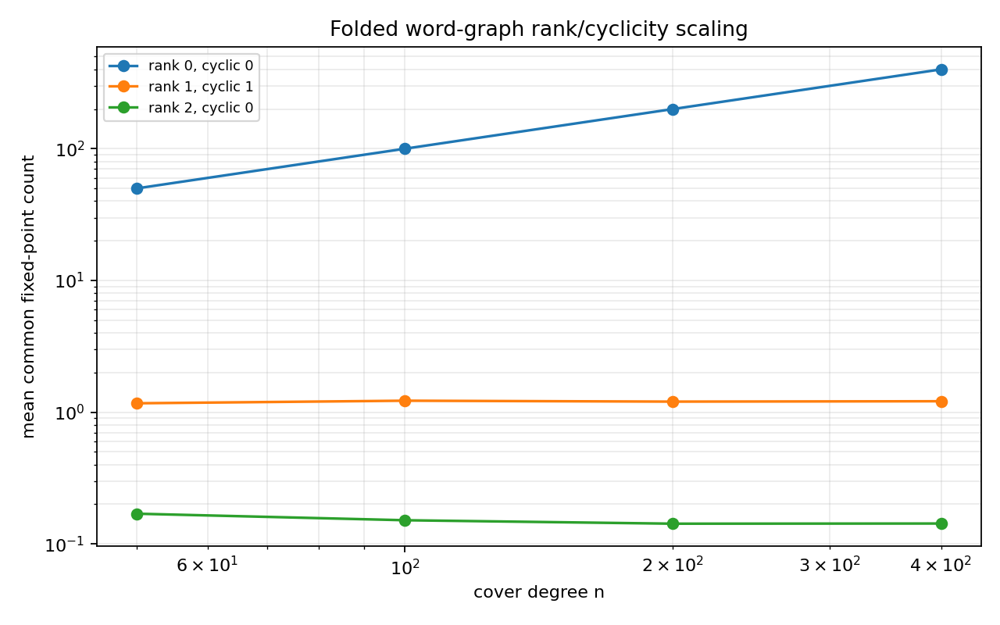
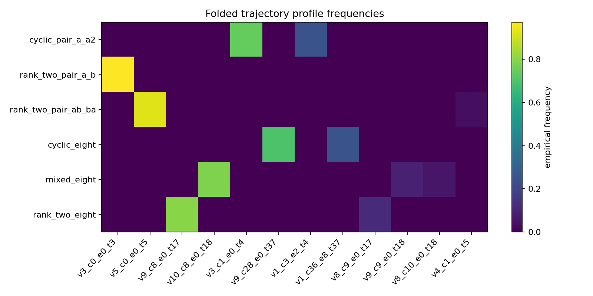

# M3 Folded Word-Graph Probe

## Question

Cycle 6 measured raw common fixed points of word tuples in independent random permutations. That detected the basic cyclic diagonal signal, but it also found a useful failure: once a point is fixed by `a` and `b`, adding composite words such as `ab` and `aB` does not impose new pointwise constraints. This cycle adds a deterministic labelled trajectory quotient and sampled trajectory profiles to test whether quotient-graph structure separates cyclic/rank-one and rank-two/noncyclic families more clearly.

## Construction

For a word tuple `(w_1,...,w_k)`, `scripts/probe_folded_word_graphs.py` first freely reduces each word using the Cycle 6 reducer. From a common symbolic basepoint, it traces each reduced word as a labelled directed path and identifies the terminal point of each nonempty word with the basepoint, because the Monte Carlo observable is a common fixed basepoint. Identical labelled edges are merged, and the resulting simplified labelled trajectory quotient is summarized by vertices, directed edges, undirected labelled edges, connected components, cyclomatic rank, generator rank, and a cyclic-power flag.

This is not full Stallings folding. It does not repeatedly fold all same-label outgoing or incoming edges at every vertex, and it does not enumerate all quotient embeddings. It is a deliberately conservative quotient profile: enough to distinguish rank-one power families from two-generator families, but not a substitute for the MPvH/MP23 folded graph expansion used in the proof ledger.

For each random permutation sample, the script also records:

- `fixed_common`: the raw common fixed-point count from Cycle 6 logic.
- `trajectory_profile`: a compact profile of sampled trajectories from common fixed points when any exist; otherwise from ambient random basepoints.

## Run

Final command:

```bash
python3 scripts/probe_folded_word_graphs.py \
  --n-values 50,100,200,400 \
  --samples 1000 \
  --seed 20260515 \
  --out-csv data/polynomial_method/folded_word_graph_probe.csv \
  --summary-csv data/polynomial_method/folded_word_graph_summary.csv \
  --rank-png reports/figures/m3_folded_graph_rank_scaling.png \
  --heatmap-png reports/figures/m3_folded_graph_profile_heatmap.png
```

Output:

- `data/polynomial_method/folded_word_graph_probe.csv`: 52,000 rows.
- `data/polynomial_method/folded_word_graph_summary.csv`: per-family summaries.
- `reports/figures/m3_folded_graph_rank_scaling.png`: rank/cyclicity scaling figure.
- `reports/figures/m3_folded_graph_profile_heatmap.png`: trajectory-profile heatmap.





## Results

Selected final-run means:

| family | generator rank | cyclic flag | cyclomatic rank | mean n=50 | mean n=100 | mean n=200 | mean n=400 |
|---|---:|---:|---:|---:|---:|---:|---:|
| `cyclic_pair_a_a2` | 1 | 1 | 1 | 0.966 | 1.032 | 0.998 | 1.016 |
| `cyclic_eight` | 1 | 1 | 7 | 0.966 | 1.032 | 0.998 | 1.016 |
| `rank_two_pair_a_b` | 2 | 0 | 2 | 0.014 | 0.008 | 0.002 | 0.000 |
| `rank_two_pair_ab_ba` | 2 | 0 | 2 | 0.027 | 0.017 | 0.006 | 0.006 |
| `rank_two_pair_ab_aB` | 2 | 0 | 2 | 0.038 | 0.015 | 0.005 | 0.003 |
| `mixed_eight` | 2 | 0 | 7 | 0.014 | 0.008 | 0.002 | 0.000 |
| `rank_two_eight` | 2 | 0 | 8 | 0.014 | 0.008 | 0.002 | 0.000 |

Selected n=400 trajectory-profile source counts:

| family | fixed-source profiles | ambient-source profiles |
|---|---:|---:|
| `cyclic_pair_a_a2` | 639 | 361 |
| `cyclic_eight` | 639 | 361 |
| `rank_two_pair_a_b` | 0 | 1000 |
| `rank_two_pair_ab_ba` | 6 | 994 |
| `mixed_eight` | 0 | 1000 |
| `rank_two_eight` | 0 | 1000 |

## What Changed Relative To Cycle 6?

Cycle 6 only knew the final intersection size of fixed sets. This cycle records a deterministic quotient profile before sampling and a trajectory collision profile during sampling. The deterministic profile cleanly separates cyclic power families (`generator_rank=1`, cyclic flag true) from rank-two families (`generator_rank=2`, cyclic flag false), including eight-word families that raw fixed counts often reduce to zero.

The new observable improves interpretation more than estimation. It explains why `cyclic_eight` behaves like `cyclic_pair_a_a2`: both are rank-one power families, even though `cyclic_eight` has a larger trajectory quotient. It also explains why `mixed_eight` and `rank_two_eight` remain numerically sparse: their quotient profiles are noncyclic and rank-two, so ordinary Monte Carlo at these sample sizes sees mostly zero common fixed points.

## Interpretation

Evidence supports the first diagnostic hypothesis: the folded trajectory quotient reliably distinguishes primitive-power/cyclic diagonal families from rank-two/noncyclic controls. It also supports the second hypothesis at this toy level: rank-two/noncyclic profiles correlate with much smaller common fixed-point counts.

The eight-word result is mixed but useful. The cyclic eight-word family remains informative and visibly rank-one. The mixed and rank-two eight-word families are structurally distinguishable in the quotient profile, but their raw common fixed-point counts are still too sparse for ordinary Monte Carlo at `n=400`, so a later probe should importance-sample quotient embeddings rather than sample fixed basepoints directly.

## Limitations

This probe is still not the paper's quotient-embedding expansion. It does not count all folded labelled graph embeddings into a random Schreier graph, does not include hyperbolic length weights, and does not model the full eight-loop graph in Proposition 4.2. Its value is narrower: it turns the Cycle 6 null result into a sharper design constraint for the next M3 probe.

The main next step is an embedding-count probe that samples or enumerates labelled quotient graph maps directly. That would target the proof-ledger mechanism more closely than basepoint fixed-set intersections.
