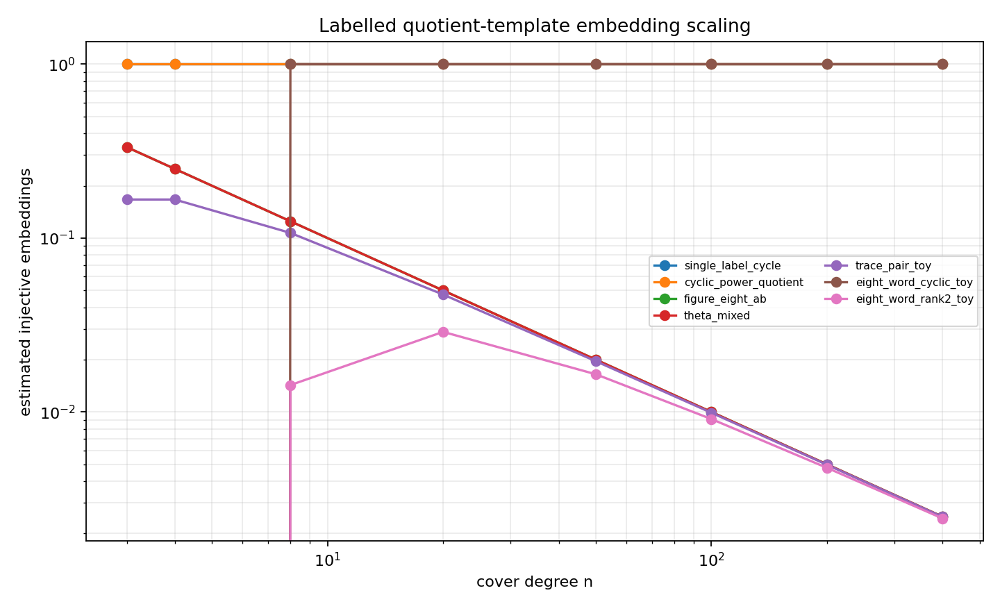
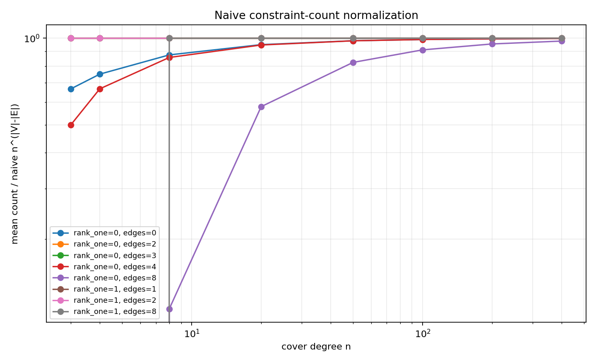

# M3 Labelled Graph Embedding Probe

## Question

Cycles 6 and 7 measured common fixed points and folded trajectory profiles. Those probes identified the cyclic diagonal signal, but fixed-basepoint Monte Carlo was too sparse for eight-word noncyclic families. This cycle changes the observable: for a small labelled directed graph `H`, count injective vertex maps into `[n]` such that every labelled edge constraint `sigma_label(f(u)) = f(v)` is satisfied by independent random permutations.

This is still a toy model. It does not reproduce the MPvH/MP23 expansion, hyperbolic length weights, or the full random-cover trace formula. It is closer to the quotient-embedding mechanism than the earlier fixed-point probes because the graph `H` is the object being embedded, rather than being collapsed to one basepoint.

## Construction

The script `scripts/probe_labelled_graph_embeddings.py` defines labelled quotient templates:

- `single_label_cycle` and `cyclic_power_quotient`: rank-one cyclic controls.
- `figure_eight_ab`, `theta_mixed`, and `trace_pair_toy`: small rank-two/noncyclic controls.
- `eight_word_cyclic_toy`: an eight-edge diagonal cyclic quotient.
- `eight_word_rank2_toy`: two four-edge labelled cycles sharing one vertex.
- `no_edge_control`: injectivity-only control.

The exact mode enumerates all generator permutations for small `n` and at most two labels. The Monte Carlo mode samples injective assignments and averages the exact partial-permutation constraint probability for that assignment. This avoids the rare-event failure mode from Cycle 7 while still estimating the expected number of embeddings into random permutation actions.

Final command:

```bash
python3 scripts/probe_labelled_graph_embeddings.py \
  --n-values 3,4,8,20,50,100,200,400 \
  --samples 5000 \
  --seed 20260515 \
  --exact-max-n 4 \
  --out-csv data/polynomial_method/labelled_graph_embedding_probe.csv \
  --summary-csv data/polynomial_method/labelled_graph_embedding_summary.csv \
  --scaling-png reports/figures/m3_labelled_embedding_scaling.png \
  --normalized-png reports/figures/m3_labelled_embedding_normalized.png
```

Output:

- `data/polynomial_method/labelled_graph_embedding_probe.csv`: 80 rows.
- `data/polynomial_method/labelled_graph_embedding_summary.csv`: same grouped rows for downstream reporting.
- `reports/figures/m3_labelled_embedding_scaling.png`: raw embedding-count scaling.
- `reports/figures/m3_labelled_embedding_normalized.png`: naive-scale normalized counts.





## Calibration

Exact enumeration and the Monte Carlo assignment estimator agree on the small templates at `n=4`:

| template | exact count | MC count | exact probability | MC probability | normalized |
|---|---:|---:|---:|---:|---:|
| `no_edge_control` | 12 | 12 | 1 | 1 | 0.75 |
| `single_label_cycle` | 1 | 1 | 0.25 | 0.25 | 1 |
| `cyclic_power_quotient` | 1 | 1 | 0.0833333 | 0.0833333 | 1 |
| `figure_eight_ab` | 0.25 | 0.25 | 0.0625 | 0.0625 | 1 |
| `theta_mixed` | 0.25 | 0.25 | 0.0208333 | 0.0208333 | 1 |
| `trace_pair_toy` | 0.166667 | 0.166667 | 0.00694444 | 0.00694444 | 0.666667 |

The no-edge control has exactly `n_(|V|)` injective embeddings, so its normalized value is `(n)_2 / n^2`, not 1 at finite `n`.

## Results

Selected Monte Carlo rows:

| template | n | count estimate | success probability | naive power | normalized | rank-one flag | cyclomatic rank |
|---|---:|---:|---:|---:|---:|---:|---:|
| `single_label_cycle` | 400 | 1 | 0.0025 | 0 | 1 | 1 | 1 |
| `cyclic_power_quotient` | 400 | 1 | 0.00000626566 | 0 | 1 | 1 | 1 |
| `eight_word_cyclic_toy` | 400 | 1 | 1.63724e-21 | 0 | 1 | 1 | 1 |
| `figure_eight_ab` | 400 | 0.0025 | 0.00000625 | -1 | 1 | 0 | 2 |
| `theta_mixed` | 400 | 0.0025 | 1.56642e-08 | -1 | 1 | 0 | 2 |
| `trace_pair_toy` | 400 | 0.00249373 | 3.92585e-11 | -1 | 0.997494 | 0 | 2 |
| `eight_word_rank2_toy` | 400 | 0.00244389 | 1.57249e-21 | -1 | 0.977557 | 0 | 2 |

The direct embedding observable succeeds where fixed-basepoint counting failed: the eight-word rank-two template has stable nonzero estimates at `n=400`, with the expected `n^{-1}` raw count scale. The cyclic eight-edge template remains order one, matching the diagonal intuition from Cycles 6-7.

## Interpretation

The naive constraint-count law `n^{|V|-|E|}` is a useful first-order scale for these templates. Normalized counts stabilize near 1 for most nondegenerate templates; finite-size injectivity effects explain the visible deviations at small `n`, especially for `trace_pair_toy` and `eight_word_rank2_toy`.

Rank-one and rank-two templates separate strongly in raw count once graph size and constraints are represented directly: cyclic one-label templates are order one, while figure-eight/rank-two quotient templates with one excess edge are order `n^{-1}`. After normalization, the separation mostly disappears, which is evidence that the primary distinction here is constraint dimension rather than an extra anomalous constant.

The best standard benchmark for later polynomial-window diagnostics is the pair `eight_word_cyclic_toy` versus `eight_word_rank2_toy`. It preserves the Cycle 7 cyclic/noncyclic distinction, is not numerically zero under direct embedding estimation, and has a clean normalized scale to compare against future weighted or polynomial-window observables.

## Limitations

The Monte Carlo estimator averages partial-permutation probabilities for injective assignments; it is an expectation estimator, not a simulation of realized embedding counts in each random action. That is intentional for this cycle because full action sampling would reintroduce the rare-event sparsity that blocked Cycle 7.

The templates are still hand-built toy quotients. They do not enumerate all folded quotient graphs arising from word-pair or eight-word trace expansions. The next M3 step should keep this embedding-count harness as a benchmark while adding polynomial-window or weight tests that mimic the proof-ledger smoothing and Markov-loss mechanisms.
